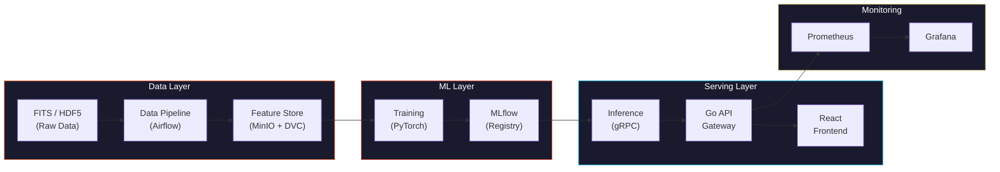
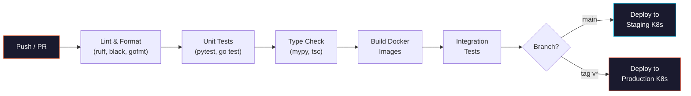
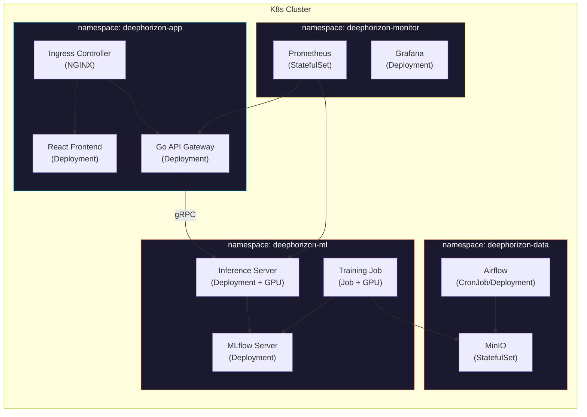

<div align="center">

```
██████╗ ███████╗███████╗██████╗     ██╗  ██╗ ██████╗ ██████╗ ██╗███████╗ ██████╗ ███╗   ██╗
██╔══██╗██╔════╝██╔════╝██╔══██╗    ██║  ██║██╔═══██╗██╔══██╗██║╚══███╔╝██╔═══██╗████╗  ██║
██║  ██║█████╗  █████╗  ██████╔╝    ███████║██║   ██║██████╔╝██║  ███╔╝ ██║   ██║██╔██╗ ██║
██║  ██║██╔══╝  ██╔══╝  ██╔═══╝     ██╔══██║██║   ██║██╔══██╗██║ ███╔╝  ██║   ██║██║╚██╗██║
██████╔╝███████╗███████╗██║         ██║  ██║╚██████╔╝██║  ██║██║███████╗╚██████╔╝██║ ╚████║
╚═════╝ ╚══════╝╚══════╝╚═╝         ╚═╝  ╚═╝ ╚═════╝ ╚═╝  ╚═╝╚═╝╚══════╝ ╚═════╝ ╚═╝  ╚═══╝
```

<br>


<br><br>

**Deep learning-based super-resolution and denoising pipeline**
**for black hole images from radio telescope arrays**

<br>


<br>

**[English]** | [[Turkce]](README_TR.md)

<br>

[Overview](#-overview) · [Architecture](#-architecture) · [ML Pipeline](#-ml-pipeline) · [Scripts](#-scripts) · [K8s Deployment](#-kubernetes-deployment) · [Roadmap](#-roadmap)

</div>

<br>

---

<br>

## 🔭 Overview

Black hole images captured by radio telescope arrays (EHT, etc.) suffer from severe degradation: sparse UV-plane sampling, atmospheric phase corruption, thermal noise, and diffraction-limited resolution. This project applies deep learning-based **super-resolution** and **denoising** techniques to reconstruct physically consistent, high-resolution images from these corrupted observations.

Beyond model development, the project builds an end-to-end **MLOps infrastructure**, **data pipeline**, **Go API gateway**, and **React frontend**.

<br>

<table>
<tr>
<td align="center"><b>Team</b><br><code>5 Interns</code></td>
<td align="center"><b>Duration</b><br><code>12 Weeks</code></td>
<td align="center"><b>GPU</b><br><code>1x NVIDIA L40S (48 GB)</code></td>
</tr>
</table>

<br>

---

<br>

## 🧪 Problem Statement

Black hole images are inherently **corrupted and blurry** due to multiple physical and instrumental factors:

<br>

<details>
<summary><b>Diffraction Limit</b></summary>
<br>

Angular resolution is governed by `theta ~ lambda/D`. EHT observes at **1.3 mm** (230 GHz). Even with an Earth-sized baseline (~10,700 km), resolution is **~20 micro-arcseconds (uas)** — only a few pixels across the event horizon.

</details>

<details>
<summary><b>Sparse UV-Plane Sampling</b></summary>
<br>

In VLBI, each telescope pair samples a single point in Fourier space (UV-plane). With limited telescopes on Earth, most of the UV-plane remains empty. By the Van Cittert-Zernike theorem, the image is the inverse Fourier transform of these visibilities — **missing frequency information** creates artifacts and ambiguity.

</details>

<details>
<summary><b>Point Spread Function (PSF) / Dirty Beam</b></summary>
<br>

The interferometric array's PSF (dirty beam) is far from an ideal Airy disk. The observed image is a convolution of the true sky brightness with this irregular PSF:

```
I_observed(x,y) = I_true(x,y) * PSF(x,y) + noise
```

This convolution suppresses high-frequency detail, causing blurring.

</details>

<details>
<summary><b>Thermal Noise & System Temperature (T_sys)</b></summary>
<br>

Each receiver's system temperature sets the noise floor:

```
SNR ~ S * sqrt(dv * tau) / T_sys
```

`S`: source flux · `dv`: bandwidth · `tau`: integration time

At mm wavelengths, atmospheric water vapor absorption raises T_sys, severely reducing SNR.

</details>

<details>
<summary><b>Atmospheric Phase Corruption</b></summary>
<br>

Turbulent water vapor in the troposphere randomly corrupts the incoming signal's phase at mm wavelengths. These phase errors cause **coherence loss** in visibility data and produce spurious structures when uncalibrated.

</details>

<details>
<summary><b>Baseline Calibration Errors</b></summary>
<br>

Gain differences, clock synchronization errors, and polarization leakage between telescope pairs introduce systematic errors in visibility amplitudes and phases. These directly affect the output of classical reconstruction algorithms (CLEAN, MEM).

</details>

<br>

> **Goal:** From a blurry, noisy input image → produce a **physically consistent, high-resolution** black hole image.

<br>

---

<br>

## 🖼️ Sample Output

<div align="center">


<sub><b>Left:</b> Degraded input (PSF blur + noise + downsample) · <b>Right:</b> Clean target (Ground Truth)</sub>

</div>

<br>

---

<br>

## 🏗️ Architecture



<br>

### Data Flow

| Step | Description |
|:---:|---|
| **1** | Raw telescope data (FITS/HDF5) → Airflow DAGs for ingest and processing |
| **2** | Processed data → DVC versioning → write to MinIO |
| **3** | PyTorch model training → all experiments logged to MLflow |
| **4** | Best model → promote via MLflow Registry |
| **5** | Python gRPC service → load model and serve inference |
| **6** | Go API Gateway → REST API → forward to Python service via gRPC |
| **7** | React frontend → upload images and display results via Go API |
| **8** | Prometheus → collect metrics → visualize with Grafana |

<br>

---

<br>

## 🧠 ML Pipeline

### Model Progression

Training follows a progressive strategy — start simple, increase complexity:

| Phase | Model | Architecture | Purpose |
|:---:|:---|:---|:---|
| **1** | U-Net (baseline) | Encoder-decoder with skip connections | Establish baseline PSNR/SSIM |
| **2** | Pix2Pix | Conditional GAN (U-Net generator + PatchGAN discriminator) | Learn perceptual quality beyond pixel loss |
| **3** | ESRGAN | RRDB generator + relativistic discriminator | High-fidelity super-resolution |
| **4** | Restormer | Transformer-based multi-head attention | SOTA denoising + SR, capture long-range dependencies |

### Loss Functions

| Loss | Weight | Purpose |
|:---|:---:|:---|
| **L1 (pixel)** | 1.0 | Pixel-level reconstruction accuracy |
| **Perceptual (VGG)** | 0.1 | Feature-level similarity for visual quality |
| **Adversarial** | 0.01 | GAN loss for sharp, realistic outputs |
| **Physics-informed** | 0.05 | Ring structure consistency, flux conservation |

### Training Strategy

```
Phase 1: U-Net with L1 loss only (warm-up, ~50 epochs)
Phase 2: Pix2Pix with L1 + adversarial (~100 epochs)
Phase 3: ESRGAN with L1 + perceptual + adversarial (~200 epochs)
Phase 4: Restormer with full loss suite (~300 epochs)

All phases: mixed precision (torch.amp), gradient accumulation (4 steps)
Hyperparameter search: Optuna (50 trials per phase)
```

<br>

---

<br>

## 🎯 Success Criteria

### Image Quality Metrics

| Metric | Target | Baseline (Dirty Image) | Description |
|:---|:---:|:---:|:---|
| **PSNR** | >= 32 dB | ~18 dB | Peak Signal-to-Noise Ratio |
| **SSIM** | >= 0.90 | ~0.35 | Structural Similarity Index |
| **LPIPS** | <= 0.10 | ~0.55 | Learned Perceptual Image Patch Similarity (lower = better) |
| **FID** | <= 30 | ~180 | Frechet Inception Distance (lower = better) |

### Physics Consistency

| Metric | Target | Description |
|:---|:---:|:---|
| **Flux Conservation** | <= 5% error | Total flux before and after must be preserved |
| **Ring Diameter** | <= 2 uas error | Reconstructed ring diameter vs ground truth |
| **Asymmetry Ratio** | <= 10% error | Brightness asymmetry must be preserved |

### System Performance

| Metric | Target | Description |
|:---|:---:|:---|
| **Inference Latency** | <= 500ms | Single 512x512 image (GPU) |
| **API Response Time** | <= 1s | End-to-end including upload and download |
| **Throughput** | >= 10 req/s | Sustained load on inference server |
| **Model Size** | <= 200 MB | ONNX-optimized model |
| **GPU Memory** | <= 8 GB | Inference-time VRAM usage |

### MLOps Maturity

| Criteria | Requirement |
|:---|:---|
| **Experiment Tracking** | All runs logged in MLflow with hyperparams, metrics, artifacts |
| **Model Registry** | Staging → Production promotion with validation gate |
| **Data Versioning** | All datasets versioned with DVC |
| **CI/CD** | Automated lint, test, build, deploy on every PR |
| **Monitoring** | Prometheus metrics + Grafana dashboards + Evidently drift detection |
| **Test Coverage** | >= 80% across data pipeline, ML evaluation, and API |

<br>

---

<br>

## ⚡ Tech Stack

### Data Engineering

| | Technology | Description |
|:---|:---|:---|
| 🔢 | **NumPy, SciPy, OpenCV, scikit-image** | Image manipulation, signal processing |
| 🔭 | **astropy, eht-imaging** | FITS file I/O, VLBI data processing, simulation |
| 📌 | **DVC** | Git-like data versioning |
| ✅ | **Great Expectations** | Automated data validation and profiling |
| 💾 | **MinIO** | S3-compatible local object storage |

### Machine Learning

| | Technology | Description |
|:---|:---|:---|
| 🐍 | **Python 3.11+** | Primary development language |
| 🔥 | **PyTorch 2.x** | Model development and training |
| 📊 | **MLflow** | Experiment tracking, model registry, artifact store |
| 🎯 | **Optuna** | Automated hyperparameter optimization |
| 📡 | **gRPC + protobuf** | Model serving protocol |

### Frontend

| | Technology | Description |
|:---|:---|:---|
| 🖼️ | **React 18+ (TypeScript)** | SPA frontend application |
| 🎨 | **Tailwind CSS** | Utility-first CSS framework |
| 🔄 | **Zustand / React Query** | State management and server cache |
| 🌐 | **Three.js / D3.js** | Interactive black hole visualization |

### API Gateway

| | Technology | Description |
|:---|:---|:---|
| 🏎️ | **Go 1.22+** | API gateway language |
| 🛣️ | **Gin / Echo** | High-performance HTTP framework |
| 📡 | **google.golang.org/grpc** | Connection to Python inference service |
| ✅ | **go-playground/validator** | Request validation |
| 📖 | **Swagger / OpenAPI 3.0** | Auto-generated API documentation |

### MLOps & Infrastructure

| | Technology | Description |
|:---|:---|:---|
| 🎼 | **Apache Airflow** | DAG-based pipeline orchestration |
| 🐳 | **Docker, Docker Compose** | Service isolation, environment consistency |
| ☸️ | **Kubernetes** | Production orchestration, GPU scheduling |
| 🔁 | **GitHub Actions** | Automated test, build, deploy |
| 📉 | **Prometheus + Grafana** | Metrics collection and visualization |
| 🔍 | **Evidently AI** | Data drift and model performance monitoring |

<br>

---

<br>

## 🔌 API Endpoints

| Method | Endpoint | Description |
|:---|:---|:---|
| `GET` | `/health` | Health check, returns service status |
| `GET` | `/models` | List available models with metadata |
| `GET` | `/models/:id` | Get specific model details (architecture, metrics) |
| `POST` | `/enhance` | Upload image, return super-resolved result |
| `POST` | `/enhance/batch` | Batch enhancement (up to 10 images) |
| `GET` | `/enhance/:job_id` | Poll async job status |
| `GET` | `/metrics` | Prometheus metrics endpoint |

### `POST /enhance` — Request

```json
{
  "image": "<base64-encoded FITS/PNG>",
  "model": "restormer-v1",
  "output_format": "png",
  "scale_factor": 4
}
```

### `POST /enhance` — Response

```json
{
  "job_id": "abc-123",
  "status": "completed",
  "result": {
    "image": "<base64-encoded result>",
    "metrics": {
      "psnr": 33.2,
      "ssim": 0.92,
      "inference_time_ms": 312
    },
    "model": "restormer-v1"
  }
}
```

<br>

---

<br>

## 👥 Team Structure

<br>

<table>
<tr>
<td align="center" width="20%">

### Intern 1
**Data Engineer**

</td>
<td>

Owns the data pipeline. Responsible for FITS/HDF5 parsing, synthetic data generation, DVC versioning, and Great Expectations validation suite.

<details>
<summary>Research Topics</summary>

- FITS file format and `astropy` I/O
- `eht-imaging` GRMHD simulation image generation
- PSF modeling and synthetic degradation pipeline design
- Airflow DAG authoring and scheduling
- DVC remote storage configuration (MinIO backend)
- Great Expectations profiling and expectation suites

</details>

</td>
</tr>

<tr>
<td align="center">

### Intern 2
**ML Engineer**
*Model Development*

</td>
<td>

Owns model architecture and training. Responsible for all model development from baseline to SOTA, training loops, and hyperparameter optimization.

<details>
<summary>Research Topics</summary>

- Super-resolution literature: `SRCNN → EDSR → ESRGAN → Real-ESRGAN → Restormer`
- GAN training dynamics (mode collapse, training instability) and solutions
- Physics-informed neural networks and custom loss function design
- Progressive training strategies
- Mixed precision training (`torch.amp`) and gradient accumulation
- Optuna hyperparameter search strategies

</details>

</td>
</tr>

<tr>
<td align="center">

### Intern 3
**ML Engineer**
*Evaluation & Optimization*

</td>
<td>

Owns model quality and inference performance. Responsible for metric implementation, benchmark suite, model optimization (ONNX, TensorRT), and gRPC inference service.

<details>
<summary>Research Topics</summary>

- Image quality metrics: `PSNR`, `SSIM`, `LPIPS`, `FID` — mathematical foundations
- Physics consistency metric design (PSF consistency check)
- ONNX export and TensorRT model optimization
- gRPC + protobuf Python inference service development
- Model profiling and latency analysis (`torch.profiler`)
- MLflow model registry integration and artifact management

</details>

</td>
</tr>

<tr>
<td align="center">

### Intern 4
**MLOps Engineer**

</td>
<td>

Owns automation and infrastructure. Responsible for CI/CD pipelines, Docker environments, Airflow setup, MLflow configuration, and K8s deployment.

<details>
<summary>Research Topics</summary>

- Docker multi-stage builds and image optimization
- Docker Compose multi-service orchestration
- GitHub Actions workflow design (matrix builds, caching, secrets)
- MLflow Tracking Server setup (backend store + artifact store)
- Airflow setup and DAG best practices
- MinIO setup and S3-compatible bucket management
- Kubernetes GPU scheduling and Sealed Secrets

</details>

</td>
</tr>

<tr>
<td align="center">

### Intern 5
**Frontend & API Gateway**

</td>
<td>

Owns all user-facing layers. Responsible for Go API gateway, React frontend, Prometheus/Grafana monitoring, and Evidently AI drift detection.

<details>
<summary>Research Topics</summary>

- Go REST API development (Gin / Echo framework)
- Go gRPC client implementation and connection pooling
- Protobuf schema definition (`.proto` files)
- React + TypeScript SPA development
- File upload/download handling (multipart form, streaming)
- Prometheus client library custom metric definition
- Grafana dashboard provisioning (JSON model)
- Evidently AI data drift and model performance reporting

</details>

</td>
</tr>
</table>

<br>

---

<br>

## 📁 Repo Structure

```
deephorizon/
│
├── README.md                              # English documentation
├── README_TR.md                           # Turkish documentation
├── requirements.txt                       # Python dependencies
├── .gitignore
│
├── assets/
│   └── sample_degradation.png
│
└── scripts/
    ├── download_eht_data.py               # EHT UVFITS downloader (7 datasets, 88 files)
    ├── generate_synthetic_data.py          # eht-imaging synthetic generator (128x128)
    ├── generate_training_data.py           # Training data generator (512x512, 10K pairs)
    └── visualize_samples.py               # Data visualization (PNG output)
```

<br>

---

<br>

## 🚀 Getting Started

### Prerequisites

| Tool | Version |
|:---|:---|
| Python | `3.11+` |
| Git | Latest |

### Quick Start

```bash
# Clone the repo
git clone https://github.com/Octapull/deephorizon.git
cd deephorizon

# Create virtual environment
python -m venv .venv
source .venv/bin/activate   # Windows: .venv\Scripts\activate

# Install dependencies
pip install -r requirements.txt
```

<br>

---

<br>

## 🔧 Scripts

### `download_eht_data.py` — EHT Observation Downloader

Downloads all publicly released calibrated UVFITS visibility data from the EHT collaboration.

| Dataset | Source | Files |
|:---|:---|:---:|
| `m87_2017` | M87* — first black hole image | 8 |
| `3c279_2017` | 3C279 quasar | 8 |
| `sgra_2017` | Sgr A* — Milky Way center | 20 |
| `m87_2018` | M87* — second year observation | 24 |
| `cena_2017` | Centaurus A | 4 |
| `m87_2017_pol` | M87* polarized data | 16 |
| `sgra_2017_pol` | Sgr A* polarized data | 8 |

```bash
# Download all datasets (88 UVFITS files)
python scripts/download_eht_data.py

# Download specific datasets only
python scripts/download_eht_data.py --datasets m87_2017 sgra_2017

# Output: data/raw/eht/
```

<br>

### `generate_synthetic_data.py` — Synthetic Data Generator (eht-imaging)

Generates physically realistic black hole models using the `eht-imaging` library. 128x128 resolution for rapid prototyping.

- **Crescent** model — M87*-like asymmetric brightness
- **Ring** model — symmetric ring structure
- 4 degradation levels: `light`, `medium`, `heavy`, `extreme`

```bash
python scripts/generate_synthetic_data.py

# Output: data/raw/simulated/
#   clean/     → clean images (.npy)
#   degraded/  → degraded images (.npy)
#   pairs/     → visual comparisons (.png)
```

<br>

### `generate_training_data.py` — Training Data Generator (512x512)

Generates **10,000 clean/degraded pairs** for model training at 512x512 resolution with 3 model types:

| Model | Ratio | Description |
|:---|:---:|:---|
| Crescent | 60% | Asymmetric brightness ring (M87*-like) |
| Ring | 25% | Symmetric ring |
| Double Ring | 15% | Inner + outer ring (jet structure simulation) |

Degradation levels (x2500 pairs each):

| Level | PSF Blur | Noise | Downsample |
|:---|:---:|:---:|:---:|
| `light` | 3.0 | 2% | 1x |
| `medium` | 5.0 | 5% | 2x |
| `heavy` | 8.0 | 10% | 2x |
| `extreme` | 12.0 | 15% | 4x |

```bash
python scripts/generate_training_data.py

# Output: data/training/
#   clean/     → 10,000 clean images (.npy, float32)
#   degraded/  → 10,000 degraded images (.npy, float32)
# Estimated size: ~2.5 GB
```

<br>

### `visualize_samples.py` — Data Visualization

Renders EHT real observations as dirty images and generates high-quality PNG comparisons for synthetic pairs.

```bash
python scripts/visualize_samples.py

# Output: data/visualizations/
#   eht/        → dirty image PNGs
#   synthetic/  → comparison and grid images
```

<br>

---

<br>

## 🔁 CI/CD Pipeline



| Workflow | Trigger | Actions |
|:---|:---|:---|
| `ci.yml` | Every push & PR | Lint, type check, unit tests, coverage report |
| `build.yml` | PR to `main` | Build Docker images, push to registry |
| `deploy-staging.yml` | Merge to `main` | Deploy to staging K8s namespace |
| `deploy-prod.yml` | Tag `v*` | Deploy to production K8s namespace |
| `train.yml` | Manual / schedule | Launch training job on GPU node |

<br>

---

<br>

## ☸️ Kubernetes Deployment

All services deploy on Kubernetes. GPU workloads use the NVIDIA device plugin.

### Cluster Architecture



### Namespaces

| Namespace | Services | Description |
|:---|:---|:---|
| `deephorizon-data` | Airflow, MinIO | Data pipeline and object storage |
| `deephorizon-ml` | Training Jobs, MLflow, Inference | Model training, registry, serving |
| `deephorizon-app` | Go API, React Frontend, Ingress | User-facing services |
| `deephorizon-monitor` | Prometheus, Grafana | Metrics collection and visualization |

### GPU Workload Configuration

```yaml
# Training Job — NVIDIA L40S (48 GB)
resources:
  requests:
    nvidia.com/gpu: 1
    memory: "32Gi"
    cpu: "8"
  limits:
    nvidia.com/gpu: 1
    memory: "48Gi"
    cpu: "16"

# Inference Server — lower resources
resources:
  requests:
    nvidia.com/gpu: 1
    memory: "8Gi"
    cpu: "4"
  limits:
    nvidia.com/gpu: 1
    memory: "16Gi"
    cpu: "8"
```

### Deployment Commands

```bash
# Create namespaces
kubectl apply -f infra/k8s/namespaces.yaml

# Deploy all services
kubectl apply -k infra/k8s/

# Check GPU nodes
kubectl get nodes -l nvidia.com/gpu.present=true

# Launch training job
kubectl apply -f infra/k8s/ml/training-job.yaml

# Watch pod status
kubectl get pods -A -l app.kubernetes.io/part-of=deephorizon
```

<br>

---

<br>

## 🔐 Secret Management

All sensitive data (API keys, credentials, connection strings) are managed via **Kubernetes Secrets** and **Sealed Secrets**. No secrets exist in source code or environment files.

### Secret Flow

```
Developer → kubeseal encrypt → SealedSecret (committed to Git)
                                     ↓
                             Sealed Secrets Controller
                                     ↓
                             Kubernetes Secret (cluster-internal)
                                     ↓
                             Pod env vars / volume mounts
```

### Secret Inventory

| Secret | Namespace | Usage |
|:---|:---|:---|
| `minio-credentials` | `deephorizon-data` | MinIO access/secret key |
| `mlflow-db-credentials` | `deephorizon-ml` | MLflow PostgreSQL connection |
| `mlflow-s3-credentials` | `deephorizon-ml` | MLflow artifact store (MinIO) |
| `inference-api-key` | `deephorizon-ml` | gRPC inference auth token |
| `grafana-admin` | `deephorizon-monitor` | Grafana admin password |
| `github-registry` | `deephorizon-app` | Container image pull secret |

### Sealed Secrets Usage

```bash
# Install Sealed Secrets controller
helm install sealed-secrets sealed-secrets/sealed-secrets \
  -n kube-system

# Create and encrypt a secret
kubectl create secret generic minio-credentials \
  --from-literal=access-key=CHANGEME \
  --from-literal=secret-key=CHANGEME \
  --dry-run=client -o yaml | \
  kubeseal --format yaml > infra/k8s/secrets/minio-sealed.yaml

# Safe to commit (encrypted)
git add infra/k8s/secrets/minio-sealed.yaml
```

### Rules

- `.env` files are in `.gitignore` and **never committed**
- Secret rotation every 90 days
- Production secrets accessible only by cluster admin
- All secret access is audit-logged
- Development uses `kubectl create secret` for local secrets

<br>

---

<br>

## 📅 Roadmap

| Week | Focus | Deliverables |
|:---:|:---|:---|
| **1-2** | Setup & Data | Repo structure, dev environment, EHT data download, synthetic data pipeline |
| **3-4** | Baseline Model | U-Net training, MLflow tracking, evaluation metrics (PSNR/SSIM) |
| **5-6** | GAN Models | Pix2Pix and ESRGAN training, hyperparameter search with Optuna |
| **7-8** | SOTA + Serving | Restormer training, ONNX optimization, gRPC inference server |
| **9-10** | API + Frontend | Go API gateway, React frontend, image upload/download flow |
| **11** | Infrastructure | K8s deployment, CI/CD pipelines, Prometheus/Grafana monitoring |
| **12** | Polish & Demo | End-to-end testing, documentation, final presentation |

<br>

---

<br>

## 📐 Development Guidelines

### Git Workflow

| Rule | Detail |
|:---|:---|
| **Main branch** | `main` — protected, merge via PR only |
| **Branch naming** | `feature/<intern-name>/<short-description>` |
| **Review** | Every PR requires at least 1 review |
| **PR description** | What was done + how it was tested |

### Commit Convention

```
<type>(<scope>): <description>
```

| Type | Scope |
|:---|:---|
| `feat` · `fix` · `refactor` · `docs` · `test` · `ci` · `chore` | `data` · `ml` · `api` · `frontend` · `infra` · `docs` |

### Code Review

- You cannot merge your own PR
- Does it work? Are there tests? Is documentation updated?
- Reviews must be completed within 24 hours

### Documentation

- Each module must have its own `README.md`
- Public functions must have docstrings
- API endpoints documented via Swagger/OpenAPI
- Architectural decisions recorded as ADRs in `docs/`

<br>

---

<br>

## 📚 References

### EHT Papers
- [First M87* Results (Paper I-VI)](https://iopscience.iop.org/journal/2041-8205/page/Focus_on_EHT) — The Astrophysical Journal Letters, 2019
- [First Sgr A* Results (Paper I-VIII)](https://iopscience.iop.org/journal/2041-8205/page/Focus_on_First_Sgr_A_Results) — The Astrophysical Journal Letters, 2022

### Super-Resolution Models
- [ESRGAN: Enhanced Super-Resolution GANs](https://arxiv.org/abs/1809.00219) — Wang et al., 2018
- [Real-ESRGAN](https://arxiv.org/abs/2107.10833) — Wang et al., 2021
- [Restormer: Efficient Transformer for High-Resolution Image Restoration](https://arxiv.org/abs/2111.09881) — Zamir et al., 2022

### Black Hole ML
- [Deep Horizon: ML from GRMHD simulations](https://www.aanda.org/articles/aa/full_html/2020/04/aa37014-19/aa37014-19.html) — A&A, 2020
- [eht-imaging: Interferometric Imaging Library](https://github.com/achael/eht-imaging) — Chael et al.

<br>

---

<br>

<div align="center">

**Built with 🔭 by Octapull Interns**

<sub>Deep learning to unlock the secrets of black holes</sub>

<br>


</div>
