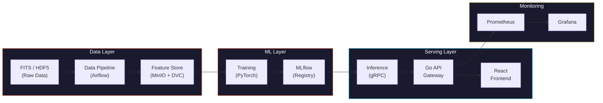
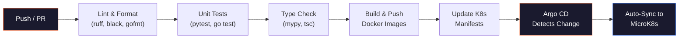
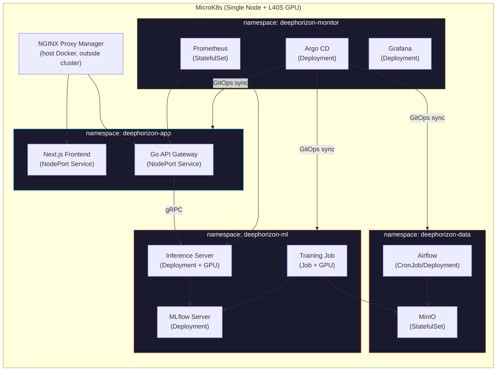

<div align="center">

```
██████╗ ███████╗███████╗██████╗     ██╗  ██╗ ██████╗ ██████╗ ██╗███████╗ ██████╗ ███╗   ██╗
██╔══██╗██╔════╝██╔════╝██╔══██╗    ██║  ██║██╔═══██╗██╔══██╗██║╚══███╔╝██╔═══██╗████╗  ██║
██║  ██║█████╗  █████╗  ██████╔╝    ███████║██║   ██║██████╔╝██║  ███╔╝ ██║   ██║██╔██╗ ██║
██║  ██║██╔══╝  ██╔══╝  ██╔═══╝     ██╔══██║██║   ██║██╔══██╗██║ ███╔╝  ██║   ██║██║╚██╗██║
██████╔╝███████╗███████╗██║         ██║  ██║╚██████╔╝██║  ██║██║███████╗╚██████╔╝██║ ╚████║
╚═════╝ ╚══════╝╚══════╝╚═╝         ╚═╝  ╚═╝ ╚═════╝ ╚═╝  ╚═╝╚═╝╚══════╝ ╚═════╝ ╚═╝  ╚═══╝
```

<br>


<br><br>

**Deep learning-based super-resolution and denoising pipeline**
**for black hole images from radio telescope arrays**

<br>


<br>

**[English]** | [[Turkce]](README_TR.md)

<br>

[Overview](#-overview) · [Architecture](#-architecture) · [ML Pipeline](#-ml-pipeline) · [Success Criteria](#-success-criteria) · [Tech Stack](#-tech-stack) · [API Endpoints](#-api-endpoints) · [Scripts](#-scripts) · [CI/CD](#-cicd-pipeline) · [K8s Deployment](#-kubernetes-deployment) · [Secrets](#-secret-management) · [Roadmap](#-roadmap) · [References](#-references) · [📖 Glossary](docs/SOZLUK.md)

</div>

<br>

---

<br>

## 🔭 Overview

Black hole images captured by radio telescope arrays (EHT, etc.) suffer from severe degradation: sparse UV-plane sampling, atmospheric phase corruption, thermal noise, and diffraction-limited resolution. This project applies deep learning-based **super-resolution** and **denoising** techniques to reconstruct physically consistent, high-resolution images from these corrupted observations.

Beyond model development, the project builds an end-to-end **MLOps infrastructure**, **data pipeline**, **Go API gateway**, and **Next.js frontend**.

<br>

<table>
<tr>
<td align="center"><b>Team</b><br><code>7 Interns</code></td>
<td align="center"><b>Duration</b><br><code>12 Weeks</code></td>
<td align="center"><b>GPU</b><br><code>1x NVIDIA L40S (48 GB)</code></td>
</tr>
</table>

<br>

---

<br>

## 🧪 Problem Statement

Black hole images are inherently **corrupted and blurry** due to multiple physical and instrumental factors:

<br>

<details>
<summary><b>Diffraction Limit</b></summary>
<br>

Angular resolution is governed by `theta ~ lambda/D`. EHT observes at **1.3 mm** (230 GHz). Even with an Earth-sized baseline (~10,700 km), resolution is **~20 micro-arcseconds (uas)** — only a few pixels across the event horizon.

</details>

<details>
<summary><b>Sparse UV-Plane Sampling</b></summary>
<br>

In VLBI, each telescope pair samples a single point in Fourier space (UV-plane). With limited telescopes on Earth, most of the UV-plane remains empty. By the Van Cittert-Zernike theorem, the image is the inverse Fourier transform of these visibilities — **missing frequency information** creates artifacts and ambiguity.

</details>

<details>
<summary><b>Point Spread Function (PSF) / Dirty Beam</b></summary>
<br>

The interferometric array's PSF (dirty beam) is far from an ideal Airy disk. The observed image is a convolution of the true sky brightness with this irregular PSF:

```
I_observed(x,y) = I_true(x,y) * PSF(x,y) + noise
```

This convolution suppresses high-frequency detail, causing blurring.

</details>

<details>
<summary><b>Thermal Noise & System Temperature (T_sys)</b></summary>
<br>

Each receiver's system temperature sets the noise floor:

```
SNR ~ S * sqrt(dv * tau) / T_sys
```

`S`: source flux · `dv`: bandwidth · `tau`: integration time

At mm wavelengths, atmospheric water vapor absorption raises T_sys, severely reducing SNR.

</details>

<details>
<summary><b>Atmospheric Phase Corruption</b></summary>
<br>

Turbulent water vapor in the troposphere randomly corrupts the incoming signal's phase at mm wavelengths. These phase errors cause **coherence loss** in visibility data and produce spurious structures when uncalibrated.

</details>

<details>
<summary><b>Baseline Calibration Errors</b></summary>
<br>

Gain differences, clock synchronization errors, and polarization leakage between telescope pairs introduce systematic errors in visibility amplitudes and phases. These directly affect the output of classical reconstruction algorithms (CLEAN, MEM).

</details>

<br>

> **Goal:** From a blurry, noisy input image → produce a **physically consistent, high-resolution** black hole image.

<br>

---

<br>

## 🖼️ Sample Output

<div align="center">


<sub><b>Left:</b> Degraded input (PSF blur + noise + downsample) · <b>Right:</b> Clean target (Ground Truth)</sub>

</div>

<br>

---

<br>

## 🏗️ Architecture



<br>

### Data Flow

| Step | Description |
|:---:|---|
| **1** | Raw telescope data (FITS/HDF5) → Airflow DAGs for ingest and processing |
| **2** | Processed data → DVC versioning → write to MinIO |
| **3** | PyTorch model training → all experiments logged to MLflow |
| **4** | Best model → promote via MLflow Registry |
| **5** | Python gRPC service → load model and serve inference |
| **6** | Go API Gateway → REST API → forward to Python service via gRPC |
| **7** | React frontend → upload images and display results via Go API |
| **8** | Prometheus → collect metrics → visualize with Grafana |

<br>

---

<br>

## 🧠 ML Pipeline

### Model Progression

Training follows a progressive strategy — start simple, increase complexity:

| Phase | Model | Architecture | Purpose |
|:---:|:---|:---|:---|
| **1** | U-Net (baseline) | Encoder-decoder with skip connections | Establish baseline PSNR/SSIM |
| **2** | Pix2Pix | Conditional GAN (U-Net generator + PatchGAN discriminator) | Learn perceptual quality beyond pixel loss |
| **3** | ESRGAN | RRDB generator + relativistic discriminator | High-fidelity super-resolution |
| **4** | Restormer | Transformer-based multi-head attention | SOTA denoising + SR, capture long-range dependencies |

### Loss Functions

| Loss | Weight | Purpose |
|:---|:---:|:---|
| **L1 (pixel)** | 1.0 | Pixel-level reconstruction accuracy |
| **Perceptual (VGG)** | 0.1 | Feature-level similarity for visual quality |
| **Adversarial** | 0.01 | GAN loss for sharp, realistic outputs |
| **Physics-informed** | 0.05 | Ring structure consistency, flux conservation |

> **Physics-Informed Loss (formal definition).** Let `I_hat` be the predicted image and `I_gt` the ground truth. The physics loss combines three terms:
>
> ```
> L_phys = lambda_flux * | sum(I_hat) - sum(I_gt) | / sum(I_gt)        # flux conservation
>        + lambda_ring * | D_ring(I_hat) - D_ring(I_gt) |               # ring diameter (uas)
>        + lambda_sym  * | A(I_hat) - A(I_gt) |                          # asymmetry ratio
> ```
>
> `D_ring(.)` extracts ring diameter via radial brightness profile peak detection, `A(.)` is the brightness asymmetry ratio (max/min along the ring). Defaults: `lambda_flux = 0.5`, `lambda_ring = 0.3`, `lambda_sym = 0.2`. Defined in `services/ml/losses/physics.py`.

### Training Strategy

```
Phase 1: U-Net with L1 loss only (warm-up, ~50 epochs)         [MUST]
Phase 2: Pix2Pix with L1 + adversarial (~100 epochs)            [MUST]
Phase 3: ESRGAN with L1 + perceptual + adversarial (~200 epochs) [TARGET]
Phase 4: Restormer with full loss suite (~300 epochs)            [STRETCH]

All phases: mixed precision (torch.amp), gradient accumulation (4 steps)
Hyperparameter search: Optuna (20 trials per MUST phase, 50 for TARGET/STRETCH)
```

> **Scope note.** Phases 1–3 are committed deliverables; Phase 4 (Restormer) is a stretch goal contingent on Phase 3 hitting the SSIM target by Week 8. A single L40S running 300-epoch Restormer + 50-trial Optuna sweep alone consumes ~2 weeks of GPU time, so Phase 4 enters the schedule only after a Week 8 go/no-go review.

<br>

---

<br>

## 🎯 Success Criteria

### Image Quality Metrics

| Metric | Target | Baseline (Dirty Image) | Description |
|:---|:---:|:---:|:---|
| **PSNR** | >= 32 dB | ~18 dB | Peak Signal-to-Noise Ratio |
| **SSIM** | >= 0.90 | ~0.35 | Structural Similarity Index |
| **LPIPS** | <= 0.10 | ~0.55 | Learned Perceptual Image Patch Similarity (lower = better) |
| **FID** | <= 30 | ~180 | Frechet Inception Distance (lower = better) |

> **Baseline measurement.** "Baseline (Dirty Image)" numbers are measured on the synthetic `medium` degradation split (PSF 5.0 + 5% noise + 2x downsample, 2,500 pairs) using bicubic upsampling as the no-ML reference. Real EHT data has no ground truth and is excluded from these metrics. Reproduce via `scripts/eval_baseline.py` (to be added in Week 3).

### Physics Consistency

| Metric | Target | Description |
|:---|:---:|:---|
| **Flux Conservation** | <= 5% error | Total flux before and after must be preserved |
| **Ring Diameter** | <= 2 uas error | Reconstructed ring diameter vs ground truth |
| **Asymmetry Ratio** | <= 10% error | Brightness asymmetry must be preserved |

### System Performance

| Metric | Target | Description |
|:---|:---:|:---|
| **Inference Latency** | <= 500ms | Single 512x512 image (GPU) |
| **API Response Time** | <= 1s | End-to-end including upload and download |
| **Throughput** | >= 10 req/s | Sustained load on inference server |
| **Model Size** | <= 200 MB | ONNX-optimized model |
| **GPU Memory** | <= 8 GB | Inference-time VRAM usage |

### MLOps Maturity

| Criteria | Requirement |
|:---|:---|
| **Experiment Tracking** | All runs logged in MLflow with hyperparams, metrics, artifacts |
| **Model Registry** | Staging → Production promotion with validation gate |
| **Data Versioning** | All datasets versioned with DVC |
| **CI/CD** | Automated lint, test, build, deploy on every PR |
| **Monitoring** | Prometheus metrics + Grafana dashboards + Evidently drift detection |
| **Test Coverage** | >= 80% across data pipeline, ML evaluation, and API |

<br>

---

<br>

## ⚡ Tech Stack

### Data Engineering

| | Technology | Description |
|:---|:---|:---|
| 🔢 | **NumPy, SciPy, OpenCV, scikit-image** | Image manipulation, signal processing |
| 🔭 | **astropy, eht-imaging** | FITS file I/O, VLBI data processing, simulation |
| 📌 | **DVC** | Git-like data versioning |
| ✅ | **Great Expectations** | Automated data validation and profiling |
| 💾 | **MinIO** | S3-compatible local object storage |

### Machine Learning

| | Technology | Description |
|:---|:---|:---|
| 🐍 | **Python 3.13+** | Primary development language |
| 🔥 | **PyTorch 2.6+** | Model development and training |
| 📊 | **MLflow** | Experiment tracking, model registry, artifact store |
| 🎯 | **Optuna** | Automated hyperparameter optimization |
| 📡 | **gRPC + protobuf** | Model serving protocol |

### Frontend

| | Technology | Description |
|:---|:---|:---|
| ⚛️ | **Next.js 15 (App Router, TypeScript)** | Full-stack React framework — internal tool, no SEO, no SSR data fetching |
| 🎨 | **Tailwind CSS 3** | Utility-first CSS framework (v3 — v4 plugin churn avoided) |
| 🔄 | **Zustand / TanStack Query** | Client state + server cache |
| 🌐 | **Three.js / D3.js** | Interactive black hole visualization |

### API Gateway

| | Technology | Description |
|:---|:---|:---|
| 🏎️ | **Go 1.24+** | API gateway language |
| 🛣️ | **Gin / Echo** | High-performance HTTP framework |
| 📡 | **google.golang.org/grpc** | Connection to Python inference service |
| ✅ | **go-playground/validator** | Request validation |
| 📖 | **Swagger / OpenAPI 3.0** | Auto-generated API documentation |

### MLOps & Infrastructure

| | Technology | Description |
|:---|:---|:---|
| 🎼 | **Apache Airflow** | DAG-based pipeline orchestration |
| 🐳 | **Docker, Docker Compose** | Service isolation, environment consistency |
| ☸️ | **MicroK8s** | Lightweight Kubernetes for single-node / small cluster GPU deployment |
| 🔁 | **GitHub Actions** | CI: lint, test, build, push images |
| 🚀 | **Argo CD** | CD: GitOps-based continuous deployment to MicroK8s |
| 📉 | **Prometheus + Grafana** | Metrics collection and visualization |
| 🔍 | **Evidently AI** | Data drift and model performance monitoring |

<br>

---

<br>

## 🔌 API Endpoints

| Method | Endpoint | Description |
|:---|:---|:---|
| `GET` | `/health` | Health check, returns service status |
| `GET` | `/models` | List available models with metadata |
| `GET` | `/models/:id` | Get specific model details (architecture, metrics) |
| `POST` | `/enhance` | Upload image, return super-resolved result |
| `POST` | `/enhance/batch` | Batch enhancement (up to 10 images) |
| `GET` | `/enhance/:job_id` | Poll async job status |
| `GET` | `/metrics` | Prometheus metrics endpoint |

### `POST /enhance` — Request

```json
{
  "image": "<base64-encoded FITS/PNG>",
  "model": "restormer-v1",
  "output_format": "png",
  "scale_factor": 4
}
```

### `POST /enhance` — Response

```json
{
  "job_id": "abc-123",
  "status": "completed",
  "result": {
    "image": "<base64-encoded result>",
    "metrics": {
      "psnr": 33.2,
      "ssim": 0.92,
      "inference_time_ms": 312
    },
    "model": "restormer-v1"
  }
}
```

<br>

---

<br>

## 👥 Team Structure

7 interns, organized into **3 squads**: Data, ML, Platform. Each intern owns one primary area but pairs with at least one other intern for cross-review.

<br>

<table>
<tr>
<td align="center" width="22%">

### Intern 1
**Data Engineer**
*Squad: Data*

</td>
<td>

Owns the data pipeline. Responsible for FITS/HDF5 parsing, EHT data ingestion, DVC versioning, and Great Expectations validation suite.

<details>
<summary>Research Topics</summary>

- FITS file format and `astropy` I/O
- EHT UVFITS visibility data structure and calibration
- Airflow DAG authoring and scheduling
- DVC remote storage configuration (MinIO backend)
- Great Expectations profiling and expectation suites
- Data cataloging and lineage tracking

</details>

**Pairs with:** Intern 2 (degradation pipeline contract)

</td>
</tr>

<tr>
<td align="center">

### Intern 2
**Simulation & Synthetic Data**
*Squad: Data*

</td>
<td>

Owns the synthetic data generator. Responsible for `eht-imaging` GRMHD simulations, PSF modeling, the degradation pipeline, and the 10K training-pair generator.

<details>
<summary>Research Topics</summary>

- `eht-imaging` library, GRMHD source models
- Physical PSF / dirty-beam modeling for VLBI arrays
- Realistic noise injection (thermal + atmospheric phase)
- Crescent / ring / double-ring source modeling
- Data augmentation strategies for radio astronomy
- Class-balance and stratified sampling for degradation levels

</details>

**Pairs with:** Intern 1 (data schema), Intern 3 (training data spec)

</td>
</tr>

<tr>
<td align="center">

### Intern 3
**ML Engineer — Baseline & GAN**
*Squad: ML*

</td>
<td>

Owns Phase 1–2 models. Responsible for U-Net baseline, Pix2Pix conditional GAN, training loop scaffolding, and the shared `services/ml/` training package.

<details>
<summary>Research Topics</summary>

- U-Net architecture for image-to-image translation
- Conditional GAN (Pix2Pix) training dynamics
- Mode collapse, gradient penalty, spectral normalization
- Mixed precision training (`torch.amp`) and gradient accumulation
- Training loop abstractions and configuration management (Hydra)
- MLflow experiment tracking integration

</details>

**Pairs with:** Intern 4 (loss + eval contract)

</td>
</tr>

<tr>
<td align="center">

### Intern 4
**ML Engineer — SOTA & Physics Loss**
*Squad: ML*

</td>
<td>

Owns Phase 3–4 models and physics-informed loss. Responsible for ESRGAN, Restormer (stretch), the physics-informed loss module, and Optuna hyperparameter search.

<details>
<summary>Research Topics</summary>

- ESRGAN: RRDB blocks, relativistic discriminator
- Restormer transformer-based architecture, MDTA / GDFN blocks
- Physics-informed neural networks for astrophysics
- Custom loss function design (flux conservation, ring geometry)
- Optuna search strategies (TPE, multi-objective)
- VGG perceptual loss configuration

</details>

**Pairs with:** Intern 3 (shared training code), Intern 5 (evaluation hand-off)

</td>
</tr>

<tr>
<td align="center">

### Intern 5
**ML Engineer — Evaluation & Inference**
*Squad: ML*

</td>
<td>

Owns model quality and inference serving. Responsible for the metric suite (PSNR/SSIM/LPIPS/FID + physics), ONNX/TensorRT optimization, and the Python gRPC inference service.

<details>
<summary>Research Topics</summary>

- Image quality metrics: `PSNR`, `SSIM`, `LPIPS`, `FID` math
- Physics consistency metrics: ring diameter extraction, flux integrals
- ONNX export, ONNX Runtime, TensorRT optimization
- gRPC + protobuf Python service development (`grpcio`)
- Model profiling (`torch.profiler`, Nsight)
- MLflow model registry and staging→production promotion gate

</details>

**Pairs with:** Intern 4 (model hand-off), Intern 6 (proto contract)

</td>
</tr>

<tr>
<td align="center">

### Intern 6
**Backend & API Gateway**
*Squad: Platform*

</td>
<td>

Owns the Go API gateway and the shared protobuf contract. Responsible for REST endpoints, gRPC client to the inference service, async job handling, and OpenAPI documentation.

<details>
<summary>Research Topics</summary>

- Go REST API development (Gin / Echo framework)
- Protobuf schema design (`buf` tooling, breaking-change detection)
- Go gRPC client, connection pooling, retries with backoff
- Async job queue patterns (Redis / NATS)
- File upload streaming (multipart form, S3 multipart upload)
- OpenAPI 3.0 generation from Go (`swaggo/swag`)
- Request validation (`go-playground/validator`)

</details>

**Pairs with:** Intern 5 (proto schema owner), Intern 7 (API ↔ frontend contract)

</td>
</tr>

<tr>
<td align="center">

### Intern 7
**Frontend & Observability**
*Squad: Platform*

</td>
<td>

Owns the user-facing layer and monitoring. Responsible for the React+TypeScript SPA, image upload/visualization, Prometheus/Grafana dashboards, and Evidently drift reports.

<details>
<summary>Research Topics</summary>

- Next.js 15 App Router + TypeScript
- Zustand / TanStack Query for client state and server cache
- Tailwind CSS 3 — utility-first styling, design tokens via `tailwind.config.ts`
- Three.js / D3.js for interactive image visualization
- File upload UX (progress, chunking, cancellation)
- Prometheus client library, custom metric definition
- Grafana dashboard provisioning (JSON model, as-code)
- Evidently AI data drift and model performance reporting

</details>

**Pairs with:** Intern 6 (API contract)

</td>
</tr>

<tr>
<td align="center">

### Floating Role
**MLOps / Platform**
*Shared across squad leads*

</td>
<td>

CI/CD, MicroK8s setup, Argo CD bootstrap, Sealed Secrets, and MLflow infrastructure are **co-owned** by Interns 1, 5, and 6 with mentor support. No single intern is dedicated to infra — instead, each squad lead delivers the infra for their own services (Data → Airflow/MinIO, ML → MLflow/Inference, Platform → NodePort/Gateway + off-cluster NGINX Proxy Manager).

This avoids the bus-factor risk of a single "infra intern" and forces each squad to own its deployment.

</td>
</tr>
</table>

<br>

---

<br>

## 📁 Repo Structure

> **Status legend:** ✅ exists · 🚧 scaffolded in Week 1–2 · ⏳ planned (later weeks).
> The structure below is the **target layout**; only items marked ✅ are currently in the repo.

```
deephorizon/
│
├── README.md                              # English documentation ✅
├── README_TR.md                           # Turkish documentation ✅
├── .gitignore                             # ✅
│
├── requirements/                          # Per-container Python deps (local dev uses pyproject extras) 🚧
│   ├── base.txt                           #   numpy, scipy, opencv, scikit-image
│   ├── data.txt                           #   astropy, eht-imaging, dvc, great-expectations
│   ├── ml.txt                             #   torch, torchvision, mlflow, optuna, lpips
│   └── serving.txt                        #   grpcio, onnxruntime, prometheus-client
│
├── pyproject.toml                         # uv / poetry config, ruff, mypy 🚧
├── go.mod / go.sum                        # Go module (services/api) ⏳
│
├── assets/
│   └── sample_degradation.png             # ✅
│
├── proto/                                 # SHARED contract between Go and Python 🚧
│   ├── buf.yaml                           #   buf lint + breaking-change detection
│   ├── buf.gen.yaml                       #   generates Go + Python stubs
│   └── deephorizon/v1/
│       ├── inference.proto                #   Enhance(), Health(), ListModels()
│       └── common.proto                   #   ImagePayload, Metrics, JobStatus
│
├── services/                              # All deployable services live here ⏳
│   ├── ml/                                # Owned by Interns 3, 4, 5
│   │   ├── models/                        #   unet/, pix2pix/, esrgan/, restormer/
│   │   ├── losses/                        #   physics.py, perceptual.py, gan.py
│   │   ├── data/                          #   datasets, dataloaders, transforms
│   │   ├── training/                      #   train_loop.py, optuna_runner.py
│   │   ├── evaluation/                    #   metrics.py, benchmark.py
│   │   └── inference_server/              #   gRPC server impl
│   ├── api/                               # Owned by Intern 6 (Go gateway)
│   │   ├── cmd/server/                    #   main.go
│   │   ├── internal/handlers/             #   /enhance, /models, /health
│   │   ├── internal/grpc_client/          #   inference service client
│   │   └── api/openapi.yaml               #   generated OpenAPI 3.0
│   └── frontend/                          # Owned by Intern 7 — Next.js 15 + Tailwind 3
│       ├── app/                           #   App Router pages, layouts, route handlers
│       ├── components/                    #   Reusable UI primitives
│       ├── lib/                           #   API client (typed against Go gateway), utils
│       ├── public/                        #   Static assets
│       ├── tailwind.config.ts
│       └── package.json
│
├── pipelines/                             # Airflow DAGs ⏳
│   ├── dags/
│   │   ├── eht_ingest.py
│   │   ├── synthetic_generation.py
│   │   └── training_data_build.py
│   └── plugins/
│
├── infra/                                 # All deployment artifacts ⏳
│   ├── k8s/
│   │   ├── app-of-apps.yaml               #   Root Argo CD Application
│   │   ├── data/                          #   Airflow, MinIO manifests (kustomize)
│   │   ├── ml/                            #   MLflow, training Job, inference Deployment
│   │   ├── app/                           #   Go API + Next.js (NodePort Services; NGINX Proxy Manager handles TLS off-cluster)
│   │   ├── monitor/                       #   Prometheus, Grafana, Argo CD
│   │   └── secrets/                       #   SealedSecret manifests (safe to commit)
│   ├── docker/                            #   Dockerfiles (multi-stage)
│   │   ├── ml.Dockerfile
│   │   ├── api.Dockerfile
│   │   └── frontend.Dockerfile
│   └── docker-compose.dev.yaml            #   Local dev stack (MinIO, MLflow, Postgres)
│
├── .github/workflows/                     # CI ⏳
│   ├── ci.yml                             #   lint, test, type-check
│   ├── build.yml                          #   docker build + push
│   └── train.yml                          #   manual/scheduled GPU training
│
├── docs/                                  # ADRs and module docs ⏳
│   ├── adr/                               #   architecture decision records
│   └── runbooks/                          #   on-call playbooks
│
└── scripts/                               # Standalone scripts (kept thin) ✅
    ├── download_eht_data.py               # EHT UVFITS downloader (7 datasets, 88 files)
    ├── generate_synthetic_data.py         # eht-imaging synthetic generator (128x128)
    ├── generate_training_data.py          # Training data generator (512x512, 10K pairs)
    ├── visualize_samples.py               # Data visualization (PNG output)
    └── eval_baseline.py                   # No-ML baseline metrics (bicubic) ⏳
```

<br>

---

<br>

## 🚀 Getting Started

### Prerequisites

| Tool | Version |
|:---|:---|
| Python | `3.13+` |
| Git | Latest |

### Quick Start

```bash
# Clone the repo
git clone https://github.com/Octapull/deephorizon.git
cd deephorizon

# Create virtual environment
python -m venv .venv
source .venv/bin/activate   # Windows: .venv\Scripts\activate

# Install dependencies — single venv, both extras (recommended for dev)
uv sync --extra data --extra ml --extra dev

# Or with pip (extras still composable in one env)
pip install -e ".[data,ml,dev]"
```

> **Why both extras in one venv?** Verified on 2026-05-25 with Python 3.13.13 + uv 0.11: `data` (ehtim 1.2.10, astropy 7.2) and `ml` (torch 2.12, numpy 2.4) coexist cleanly. Earlier docs warned of an ehtim ↔ torch conflict — uv's resolver finds a numpy 2.x that satisfies both.
>
> **The split still matters for containers, not local dev.** Production inference images should NOT ship `ehtim`/`astropy` (200+ MB of unused code). Each Dockerfile installs only its slice: training pod → `[ml]`, data pipeline pod → `[data]`, inference pod → `[serving]`. See `infra/docker/`.

### Known caveats (ehtim on Python 3.13)

- **NFFT missing.** ehtim warns `No NFFT installed!` — some interferometric features need it. If Stajyer 2 hits this, install via `brew install nfft` then `pip install pynfft2`.
- **`pkg_resources` deprecation.** ehtim still uses `pkg_resources`; setuptools may drop it post-2025-11-30. Currently pinned-safe with `setuptools<82`. Long-term: upstream ehtim PR or fork.
- **No `ehtim.__version__`.** Use `importlib.metadata.version("ehtim")` for logging.
- **SyntaxWarnings.** ehtim has a handful of `\m`/`\c` escape sequence warnings on 3.13. Cosmetic now; may become `SyntaxError` on 3.14.

<br>

---

<br>

## 🔧 Scripts

### `download_eht_data.py` — EHT Observation Downloader

Downloads all publicly released calibrated UVFITS visibility data from the EHT collaboration.

| Dataset | Source | Files |
|:---|:---|:---:|
| `m87_2017` | M87* — first black hole image | 8 |
| `3c279_2017` | 3C279 quasar | 8 |
| `sgra_2017` | Sgr A* — Milky Way center | 20 |
| `m87_2018` | M87* — second year observation | 24 |
| `cena_2017` | Centaurus A | 4 |
| `m87_2017_pol` | M87* polarized data | 16 |
| `sgra_2017_pol` | Sgr A* polarized data | 8 |

```bash
# Download all datasets (88 UVFITS files)
python scripts/download_eht_data.py

# Download specific datasets only
python scripts/download_eht_data.py --datasets m87_2017 sgra_2017

# Output: data/raw/eht/
```

<br>

### `generate_synthetic_data.py` — Synthetic Data Generator (eht-imaging)

Generates physically realistic black hole models using the `eht-imaging` library. 128x128 resolution for rapid prototyping.

- **Crescent** model — M87*-like asymmetric brightness
- **Ring** model — symmetric ring structure
- 4 degradation levels: `light`, `medium`, `heavy`, `extreme`

```bash
python scripts/generate_synthetic_data.py

# Output: data/raw/simulated/
#   clean/     → clean images (.npy)
#   degraded/  → degraded images (.npy)
#   pairs/     → visual comparisons (.png)
```

<br>

### `generate_training_data.py` — Training Data Generator (512x512)

Generates **10,000 clean/degraded pairs** for model training at 512x512 resolution with 3 model types:

| Model | Ratio | Description |
|:---|:---:|:---|
| Crescent | 60% | Asymmetric brightness ring (M87*-like) |
| Ring | 25% | Symmetric ring |
| Double Ring | 15% | Inner + outer ring (jet structure simulation) |

Degradation levels (x2500 pairs each):

| Level | PSF Blur | Noise | Downsample |
|:---|:---:|:---:|:---:|
| `light` | 3.0 | 2% | 1x |
| `medium` | 5.0 | 5% | 2x |
| `heavy` | 8.0 | 10% | 2x |
| `extreme` | 12.0 | 15% | 4x |

```bash
python scripts/generate_training_data.py

# Output: data/training/
#   clean/     → 10,000 clean images (.npy, float32)
#   degraded/  → 10,000 degraded images (.npy, float32)
# Measured size: ~20 GiB (1 MiB per 512x512 float32 image x 20,000 files)
```

<br>

### `visualize_samples.py` — Data Visualization

Renders EHT real observations as dirty images and generates high-quality PNG comparisons for synthetic pairs.

```bash
python scripts/visualize_samples.py

# Output: data/visualizations/
#   eht/        → dirty image PNGs
#   synthetic/  → comparison and grid images
```

<br>

---

<br>

## 🔁 CI/CD Pipeline

CI runs on **GitHub Actions**, CD runs on **Argo CD** (GitOps). Argo CD watches the `infra/k8s/` directory and auto-syncs changes to MicroK8s.



### CI — GitHub Actions

| Workflow | Trigger | Actions |
|:---|:---|:---|
| `ci.yml` | Every push & PR | Lint, type check, unit tests, coverage report |
| `build.yml` | Merge to `main` | Build Docker images, push to container registry |
| `train.yml` | Manual / schedule | Launch training job on GPU node |

### CD — Argo CD (GitOps)

| Application | Source Path | Namespace | Sync Policy |
|:---|:---|:---|:---|
| `deephorizon-data` | `infra/k8s/data/` | `deephorizon-data` | Auto-sync |
| `deephorizon-ml` | `infra/k8s/ml/` | `deephorizon-ml` | Auto-sync |
| `deephorizon-app` | `infra/k8s/app/` | `deephorizon-app` | Auto-sync |
| `deephorizon-monitor` | `infra/k8s/monitor/` | `deephorizon-monitor` | Auto-sync |

Argo CD watches this repo's `infra/k8s/` directory and auto-syncs on every push to `main`. No manual `kubectl apply` is part of the deploy flow — if a manifest changes in Git, it changes in the cluster.

<br>

---

<br>

## ☸️ Kubernetes Deployment

All services run on **MicroK8s** — a lightweight, single-node Kubernetes distribution ideal for GPU workloads. Deployments are managed by **Argo CD** via GitOps.

> **Setup is intern homework.** This README documents the **target architecture** and the **technologies in play**, not click-by-click install steps. Each squad lead is expected to research and bring up the infra components they own (MicroK8s, GPU operator, Argo CD bootstrap, Sealed Secrets controller, host-level NGINX Proxy Manager). The official docs for each tool are linked in [References](#-references) — getting through them is part of the learning outcome.
>
> **No cluster Ingress.** We do **not** run a Kubernetes Ingress controller. The server's network constraints push TLS termination and host-based routing to **NGINX Proxy Manager running on the host (outside MicroK8s)**. Services are exposed as `NodePort`; NPM reverse-proxies into them. See the Glossary for details.

### Cluster Architecture



### Namespaces

| Namespace | Services | Description |
|:---|:---|:---|
| `deephorizon-data` | Airflow, MinIO | Data pipeline and object storage |
| `deephorizon-ml` | Training Jobs, MLflow, Inference | Model training, registry, serving |
| `deephorizon-app` | Go API, Next.js Frontend (NodePort) | User-facing services. TLS + domain routing live **outside** the cluster in NGINX Proxy Manager (see Glossary). |
| `deephorizon-monitor` | Prometheus, Grafana, Argo CD | Monitoring and GitOps deployment |

### GPU Workload Configuration

```yaml
# Training Job — NVIDIA L40S (48 GB)
resources:
  requests:
    nvidia.com/gpu: 1
    memory: "32Gi"
    cpu: "8"
  limits:
    nvidia.com/gpu: 1
    memory: "48Gi"
    cpu: "16"

# Inference Server — lower resources
resources:
  requests:
    nvidia.com/gpu: 1
    memory: "8Gi"
    cpu: "4"
  limits:
    nvidia.com/gpu: 1
    memory: "16Gi"
    cpu: "8"
```

> **GPU contention policy.** We have **one L40S** but both the training `Job` and the `inference` `Deployment` request `nvidia.com/gpu: 1`. To avoid one starving the other:
>
> 1. **Default mode** — inference Deployment runs with `replicas: 1`. Training Jobs use `nodeSelector: { workload: training }` and a `PriorityClass: low-priority`; the inference pod is scaled down to 0 before a training run starts (handled by the `train.yml` workflow).
> 2. **Concurrent mode (optional, Week 11+)** — enable NVIDIA MIG (Multi-Instance GPU) on the L40S to partition the card into a `1g.12gb` slice for inference and a `3g.36gb` slice for training. Configured via the `gpu-operator` Helm chart, `migStrategy: mixed`.
>
> Pick **default mode** for the 12-week window — MIG adds setup cost without clear benefit while the inference QPS is low.

### Argo CD Strategy

We use the **app-of-apps** pattern: a single root `Application` (`infra/k8s/app-of-apps.yaml`) tracks all four squad-level Applications. Adding a new service = adding one manifest, not running `argocd app create`. Auto-sync is enabled on every git push to `main`.

Technologies the team will use here: **Argo CD CLI**, **`kustomize`** for per-environment overlays, **Helm** for third-party charts (Sealed Secrets, gpu-operator).

<br>

---

<br>

## 🔐 Secret Management

All sensitive data (API keys, credentials, connection strings) are managed via **Kubernetes Secrets** and **Sealed Secrets**. No secrets exist in source code or environment files.

### Secret Flow

```
Developer → kubeseal encrypt → SealedSecret (committed to Git)
                                     ↓
                             Sealed Secrets Controller
                                     ↓
                             Kubernetes Secret (cluster-internal)
                                     ↓
                             Pod env vars / volume mounts
```

### Secret Inventory

| Secret | Namespace | Usage |
|:---|:---|:---|
| `minio-credentials` | `deephorizon-data` | MinIO access/secret key |
| `mlflow-db-credentials` | `deephorizon-ml` | MLflow PostgreSQL connection |
| `mlflow-s3-credentials` | `deephorizon-ml` | MLflow artifact store (MinIO) |
| `inference-api-key` | `deephorizon-ml` | gRPC inference auth token |
| `grafana-admin` | `deephorizon-monitor` | Grafana admin password |
| `github-registry` | `deephorizon-app` | Container image pull secret |

### Tooling

The team will work with:

- **Sealed Secrets** (Bitnami) — controller installed via Helm; `kubeseal` CLI used locally to encrypt manifests before commit.
- **`kubectl create secret --dry-run=client`** to draft plain Secrets that get piped into `kubeseal`.
- **Helm** for installing the controller.

Concrete install / encrypt commands are intentionally omitted — see the Sealed Secrets docs in [References](#-references).

### Rules

- `.env` files are in `.gitignore` and **never committed**
- Secret rotation every 90 days
- Production secrets accessible only by cluster admin
- All secret access is audit-logged
- Development uses `kubectl create secret` for local secrets

<br>

---

<br>

## 📅 Roadmap

| Week | Focus | Deliverables | Squad Lead |
|:---:|:---|:---|:---|
| **1** | Bootstrap | Repo scaffolding (`services/`, `proto/`, `infra/`), `pyproject.toml`, CI skeleton, `proto/` v1 frozen | All |
| **2** | Data + Proto contract | EHT download, synthetic generator (128x128), training pairs (512x512), `inference.proto` reviewed and merged | Data, Platform |
| **3** | Baseline + Eval harness | U-Net training, MLflow up, metric suite (PSNR/SSIM/LPIPS/FID), `eval_baseline.py` | ML |
| **4** | GAN Phase | Pix2Pix training, physics loss v1, Optuna runner | ML |
| **5** | ESRGAN | ESRGAN training (Phase 3 [TARGET]), perceptual loss tuning | ML |
| **6** | Inference + Go API skeleton | ONNX export, gRPC inference server, Go gateway `/health` + `/enhance` (mock) | ML, Platform |
| **7** | End-to-end wire-up | Real gRPC call from Go → Python, async job flow, OpenAPI spec | Platform |
| **8** | **Go/no-go gate** + Frontend | Phase 3 metrics review → decide on Restormer (Phase 4 [STRETCH]). React SPA MVP | All |
| **9** | Restormer (if go) / Polish (if no-go) | Restormer training OR ESRGAN refinement + frontend feature-complete | ML, Platform |
| **10** | K8s + Argo CD | MicroK8s deploy, Sealed Secrets, app-of-apps bootstrap, training Job manifest | All squads |
| **11** | Observability + Hardening | Prometheus metrics, Grafana dashboards, Evidently drift report, load test | Platform |
| **12** | Demo | E2E test, runbooks, ADRs, final presentation | All |

> **Week 8 go/no-go gate.** If Phase 3 (ESRGAN) hits **SSIM ≥ 0.85** on the `medium` split by Friday of Week 8, the team commits to Phase 4 (Restormer) in Weeks 9–10. Otherwise, Weeks 9–10 are spent hardening ESRGAN and the serving stack. This decision is made jointly by ML squad and project mentor.

<br>

---

<br>

## 📐 Development Guidelines

### Git Workflow

| Rule | Detail |
|:---|:---|
| **Main branch** | `main` — protected, merge via PR only |
| **Branch naming** | `feature/<intern-name>/<short-description>` |
| **Review** | Every PR requires at least 1 review |
| **PR description** | What was done + how it was tested |

### Commit Convention

```
<type>(<scope>): <description>
```

| Type | Scope |
|:---|:---|
| `feat` · `fix` · `refactor` · `docs` · `test` · `ci` · `chore` | `data` · `ml` · `api` · `frontend` · `infra` · `docs` |

### Code Review

- You cannot merge your own PR
- Does it work? Are there tests? Is documentation updated?
- Reviews must be completed within 24 hours

### Documentation

- Each module must have its own `README.md`
- Public functions must have docstrings
- API endpoints documented via Swagger/OpenAPI
- Architectural decisions recorded as ADRs in `docs/`

<br>

---

<br>

## 📚 References

### EHT Papers
- [First M87* Results (Paper I-VI)](https://iopscience.iop.org/journal/2041-8205/page/Focus_on_EHT) — The Astrophysical Journal Letters, 2019
- [First Sgr A* Results (Paper I-VIII)](https://iopscience.iop.org/journal/2041-8205/page/Focus_on_First_Sgr_A_Results) — The Astrophysical Journal Letters, 2022

### Super-Resolution Models
- [ESRGAN: Enhanced Super-Resolution GANs](https://arxiv.org/abs/1809.00219) — Wang et al., 2018
- [Real-ESRGAN](https://arxiv.org/abs/2107.10833) — Wang et al., 2021
- [Restormer: Efficient Transformer for High-Resolution Image Restoration](https://arxiv.org/abs/2111.09881) — Zamir et al., 2022

### Black Hole ML
- [Deep Horizon: ML from GRMHD simulations](https://www.aanda.org/articles/aa/full_html/2020/04/aa37014-19/aa37014-19.html) — A&A, 2020
- [eht-imaging: Interferometric Imaging Library](https://github.com/achael/eht-imaging) — Chael et al.

### Infrastructure & MLOps Docs (intern self-study)
- [MicroK8s docs](https://microk8s.io/docs) — install, addons, GPU enablement
- [NVIDIA GPU Operator](https://docs.nvidia.com/datacenter/cloud-native/gpu-operator/latest/index.html) — device plugin, MIG configuration
- [Argo CD docs](https://argo-cd.readthedocs.io/) — bootstrap, app-of-apps pattern
- [Sealed Secrets](https://github.com/bitnami-labs/sealed-secrets) — controller install and `kubeseal` usage
- [Kustomize](https://kustomize.io/) — overlay-based manifest management
- [MLflow docs](https://mlflow.org/docs/latest/index.html) — tracking server, model registry
- [Apache Airflow](https://airflow.apache.org/docs/) — DAG authoring, providers
- [DVC docs](https://dvc.org/doc) — data versioning with S3-compatible remotes
- [buf docs](https://buf.build/docs) — protobuf linting and breaking-change detection

<br>

---

<br>

<div align="center">

**Built with 🔭 by Octapull Interns — 7 builders, 3 squads, 1 black hole**

<sub>Deep learning to unlock the secrets of black holes</sub>

<br>


</div>
