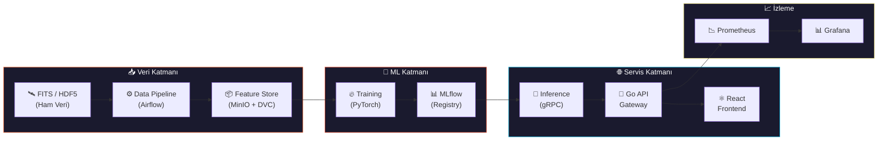

<div align="center">

```
██████╗ ███████╗███████╗██████╗     ██╗  ██╗ ██████╗ ██████╗ ██╗███████╗ ██████╗ ███╗   ██╗
██╔══██╗██╔════╝██╔════╝██╔══██╗    ██║  ██║██╔═══██╗██╔══██╗██║╚══███╔╝██╔═══██╗████╗  ██║
██║  ██║█████╗  █████╗  ██████╔╝    ███████║██║   ██║██████╔╝██║  ███╔╝ ██║   ██║██╔██╗ ██║
██║  ██║██╔══╝  ██╔══╝  ██╔═══╝     ██╔══██║██║   ██║██╔══██╗██║ ███╔╝  ██║   ██║██║╚██╗██║
██████╔╝███████╗███████╗██║         ██║  ██║╚██████╔╝██║  ██║██║███████╗╚██████╔╝██║ ╚████║
╚═════╝ ╚══════╝╚══════╝╚═╝         ╚═╝  ╚═╝ ╚═════╝ ╚═╝  ╚═╝╚═╝╚══════╝ ╚═════╝ ╚═╝  ╚═══╝
```

<br>


<br><br>

**Radyo teleskop dizilerinden elde edilen kara delik görüntülerinin**
**derin öğrenme ile süper-rezolüsyon ve gürültü giderimi**

<br>


<br>

[Kurulum](#-kurulum) · [Mimari](#-mimari-genel-bakış) · [Tech Stack](#-tech-stack) · [Ekip](#-ekip-yapısı) · [Geliştirme](#-geliştirme-kuralları)

</div>

<br>

---

<br>

## 🔭 Proje Özeti

Radyo teleskop dizilerinden (EHT vb.) elde edilen **düşük çözünürlüklü ve bulanık** kara delik görüntülerinin, derin öğrenme tabanlı **süper-rezolüsyon** ve **gürültü giderimi** teknikleriyle netleştirilmesi.

Proje, model geliştirmenin yanı sıra uçtan uca bir **MLOps altyapısı**, **veri pipeline'ı**, **Go tabanlı API gateway** ve **React frontend** arayüzü kurmayı kapsar.

<br>

<table>
<tr>
<td align="center"><b>👥 Ekip</b><br><code>5 Stajyer</code></td>
<td align="center"><b>📅 Süre</b><br><code>12 Hafta</code></td>
<td align="center"><b>🖥️ GPU</b><br><code>1x NVIDIA L40S (48 GB)</code></td>
</tr>
</table>

<br>

---

<br>

## 🧪 Problem Tanımı

Kara delik görüntüleri birden fazla fiziksel ve enstrümantal nedenden dolayı **bozuk ve bulanık** elde edilir:

<br>

<details>
<summary><b>🔬 Kırınım Limiti (Diffraction Limit)</b></summary>
<br>

Bir teleskopun açısal çözünürlüğü `θ ≈ λ/D` formülüyle belirlenir. EHT, **1.3 mm** dalga boyunda (230 GHz) gözlem yapar. Dünya çapında bir baz hattı (~10.700 km) ile bile açısal çözünürlük **~20 mikro-arcsaniye (μas)** düzeyinde kalır — bu da kara deliğin olay ufku ölçeğinde yalnızca birkaç piksellik bir görüntüye karşılık gelir.

</details>

<details>
<summary><b>📡 Seyrek UV-Düzlemi Örneklemesi (Sparse UV-Coverage)</b></summary>
<br>

VLBI tekniğinde her teleskop çifti, Fourier uzayında (UV-düzlemi) yalnızca tek bir noktayı örnekler. Yer yüzeyindeki sınırlı teleskop sayısı nedeniyle UV-düzleminin büyük bölümü boş kalır. Van Cittert-Zernike teoremine göre görüntü, bu visibilite verilerinin ters Fourier dönüşümüyle elde edilir; **eksik frekans bilgisi** doğrudan görüntüde artifact ve belirsizlik yaratır.

</details>

<details>
<summary><b>🌀 Point Spread Function (PSF) / Dirty Beam</b></summary>
<br>

Eksik UV-coverage'ın doğal sonucu olarak, interferometrik dizinin PSF'i (dirty beam) ideal bir Airy diskinden çok uzaktır. Gözlenen görüntü, gerçek gökyüzü parlaklık dağılımının bu düzensiz PSF ile konvolüsyonudur:

```
I_observed(x,y) = I_true(x,y) * PSF(x,y) + noise
```

Bu konvolüsyon yüksek frekanslı detayları bastırarak bulanıklığa yol açar.

</details>

<details>
<summary><b>🌡️ Termal Gürültü ve Sistem Sıcaklığı (T_sys)</b></summary>
<br>

Her alıcının sistem sıcaklığı (T_sys), termal gürültünün alt sınırını belirler:

```
SNR ∝ S · √(Δν · τ) / T_sys
```

`S`: kaynak akısı · `Δν`: bant genişliği · `τ`: integrasyon süresi

Milimetre dalga boylarında atmosferik su buharı emilimi T_sys'i yükselterek SNR'yi ciddi şekilde düşürür.

</details>

<details>
<summary><b>🌊 Atmosferik Faz Bozulmaları (Tropospheric Phase Corruption)</b></summary>
<br>

Milimetre dalga boylarında troposferdeki türbülanslı su buharı, gelen sinyalin fazını rastgele bozar. Bu faz hataları visibilite verilerinde **koherans kaybına** neden olur ve kalibre edilmediğinde görüntüde sahte yapılar (spurious structures) oluşturur.

</details>

<details>
<summary><b>⚙️ Baz Hattı Kalibrasyonu (Baseline Calibration Errors)</b></summary>
<br>

Her teleskop çifti arasındaki kazanç (gain) farkları, saat senkronizasyon hataları ve polarizasyon sızıntıları, visibilite genliklerinde ve fazlarında sistematik hatalara yol açar. Bu hatalar, CLEAN veya MEM gibi klasik görüntü rekonstrüksiyon algoritmalarının çıktısını doğrudan etkiler.

</details>

<br>

> **🎯 Amaç:** Bulanık ve gürültülü girdi görüntüsünden → **fiziksel olarak tutarlı, yüksek çözünürlüklü** kara delik görüntüsü üretmek.

<br>

---

<br>

## 🏗️ Mimari Genel Bakış



<br>

### 📋 Veri Akış Sırası

| Adım | Açıklama |
|:---:|---|
| **1** | Ham teleskop verileri (FITS/HDF5) → Airflow DAG'ları ile ingest ve işleme |
| **2** | İşlenmiş veriler → DVC ile versiyonlama → MinIO'ya yazma |
| **3** | PyTorch ile model eğitimi → tüm deneyler MLflow'a loglama |
| **4** | En iyi model → MLflow Registry üzerinden promote |
| **5** | Python gRPC servisi → modeli yükleme ve inference |
| **6** | Go API Gateway → REST API → gRPC ile Python servisine iletme |
| **7** | React frontend → Go API üzerinden görüntü yükleme ve sonuç görüntüleme |
| **8** | Prometheus → metrik toplama → Grafana ile görselleştirme |

<br>

---

<br>

## ⚡ Tech Stack

### 🗄️ Veri (Data Engineering)

| | Teknoloji | Açıklama |
|:---|:---|:---|
| 🔢 | **NumPy, SciPy, OpenCV, scikit-image** | Görüntü manipülasyonu, sinyal işleme |
| 🔭 | **astropy, eht-imaging** | FITS dosya okuma, VLBI veri işleme, simülasyon |
| 📌 | **DVC** | Veri setlerinin Git-benzeri versiyonlanması |
| ✅ | **Great Expectations** | Otomatik veri doğrulama ve profiling |
| 💾 | **MinIO** | S3-uyumlu lokal depolama |

### 🧠 ML (Machine Learning)

| | Teknoloji | Açıklama |
|:---|:---|:---|
| 🐍 | **Python 3.11+** | Ana geliştirme dili |
| 🔥 | **PyTorch 2.x** | Model geliştirme ve eğitim |
| 📊 | **MLflow** | Experiment tracking, model registry, artifact store |
| 🎯 | **Optuna** | Otomatik hiperparametre optimizasyonu |
| 📡 | **gRPC + protobuf** | Model servis iletişim protokolü |

### ⚛️ Frontend

| | Teknoloji | Açıklama |
|:---|:---|:---|
| 🖼️ | **React 18+ (TypeScript)** | SPA frontend uygulaması |
| 🎨 | **Tailwind CSS** | Utility-first CSS framework |
| 🔄 | **Zustand / React Query** | Sunucu state yönetimi ve caching |
| 🌐 | **Three.js / D3.js** | Kara delik görüntülerinin interaktif görselleştirmesi |

### 🔷 API Gateway

| | Teknoloji | Açıklama |
|:---|:---|:---|
| 🏎️ | **Go 1.22+** | API gateway geliştirme dili |
| 🛣️ | **Gin / Echo** | Yüksek performanslı HTTP framework |
| 📡 | **google.golang.org/grpc** | Python inference servisine bağlantı |
| ✅ | **go-playground/validator** | Request validation |
| 📖 | **Swagger / OpenAPI 3.0** | Otomatik API dokümantasyonu |

### 🔧 MLOps

| | Teknoloji | Açıklama |
|:---|:---|:---|
| 🎼 | **Apache Airflow** | DAG tabanlı pipeline yönetimi |
| 🐳 | **Docker, Docker Compose** | Servis izolasyonu ve ortam tutarlılığı |
| 🔁 | **GitHub Actions** | Otomatik test, build, deploy |
| 🌿 | **Git + GitHub** | Kod versiyonlama ve code review |

### 📈 Monitoring

| | Teknoloji | Açıklama |
|:---|:---|:---|
| 📉 | **Prometheus** | Zaman serisi metrik toplama |
| 📊 | **Grafana** | Metrik görselleştirme ve alerting |
| 🔍 | **Evidently AI** | Data drift ve model performance monitoring |

<br>

---

<br>

## 👥 Ekip Yapısı

<br>

<table>
<tr>
<td align="center" width="20%">

### 🗄️ Stajyer 1
**Data Engineer**

</td>
<td>

Veri pipeline'ının sahibi. FITS/HDF5 dosyalarının parse edilmesinden sentetik veri üretimine, DVC versiyonlamadan Great Expectations validation suite'ine kadar tüm veri akışından sorumlu.

<details>
<summary>📚 Araştırma Konuları</summary>

- FITS dosya formatı ve `astropy` ile okuma/yazma
- `eht-imaging` ile GRMHD simülasyonlarından görüntü üretimi
- PSF modelleme ve sentetik degradation pipeline tasarımı
- Airflow DAG yazımı ve scheduling
- DVC remote storage konfigürasyonu (MinIO backend)
- Great Expectations ile veri profiling ve expectation suite

</details>

</td>
</tr>

<tr>
<td align="center">

### 🧠 Stajyer 2
**ML Engineer**
*Model Geliştirme*

</td>
<td>

Model mimarisinin ve eğitim sürecinin sahibi. Baseline'dan SOTA modellere kadar tüm model geliştirme, eğitim ve hiperparametre optimizasyonundan sorumlu.

<details>
<summary>📚 Araştırma Konuları</summary>

- Super-resolution literatürü: `SRCNN → EDSR → ESRGAN → Real-ESRGAN → Restormer`
- GAN eğitim dinamikleri (mode collapse, training instability) ve çözümler
- Physics-informed neural networks ve custom loss function tasarımı
- Progressive training stratejileri
- Mixed precision training (`torch.amp`) ve gradient accumulation
- Optuna ile hiperparametre arama stratejileri

</details>

</td>
</tr>

<tr>
<td align="center">

### 📊 Stajyer 3
**ML Engineer**
*Değerlendirme & Optimizasyon*

</td>
<td>

Model kalitesinin ve inference performansının sahibi. Metrik implementasyonu, benchmark suite, model optimizasyonu (ONNX, TensorRT) ve gRPC inference servisinden sorumlu.

<details>
<summary>📚 Araştırma Konuları</summary>

- Görüntü kalite metrikleri: `PSNR`, `SSIM`, `LPIPS`, `FID` — matematiksel temeller
- Fiziksel tutarlılık metriği tasarımı (PSF consistency check)
- ONNX export ve TensorRT ile model optimizasyonu
- gRPC + protobuf ile Python inference servisi geliştirme
- Model profiling ve latency analizi (`torch.profiler`)
- MLflow model registry entegrasyonu ve artifact yönetimi

</details>

</td>
</tr>

<tr>
<td align="center">

### 🔧 Stajyer 4
**MLOps Engineer**

</td>
<td>

Otomasyon ve altyapının sahibi. CI/CD pipeline'ları, Docker ortamları, Airflow kurulumu, MLflow konfigürasyonu ve deployment süreçlerinden sorumlu.

<details>
<summary>📚 Araştırma Konuları</summary>

- Docker multi-stage build ve image optimizasyonu
- Docker Compose ile multi-service orkestrasyon
- GitHub Actions workflow tasarımı (matrix builds, caching, secrets)
- MLflow Tracking Server kurulumu (backend store + artifact store)
- Airflow kurulumu ve DAG best practices
- MinIO kurulumu ve S3-uyumlu bucket yönetimi
- Otomatik model validation ve staging → production promotion

</details>

</td>
</tr>

<tr>
<td align="center">

### 🌐 Stajyer 5
**Frontend & API Gateway**

</td>
<td>

Kullanıcıya dokunan tüm katmanların sahibi. Go API gateway, React frontend, Prometheus/Grafana monitoring ve Evidently AI drift detection'dan sorumlu.

<details>
<summary>📚 Araştırma Konuları</summary>

- Go ile REST API geliştirme (Gin / Echo framework)
- Go gRPC client implementasyonu ve connection pooling
- Protobuf schema tanımlama (`.proto` dosyaları)
- React + TypeScript ile SPA geliştirme
- Dosya upload/download handling (multipart form, streaming)
- Prometheus client library ile custom metrik tanımlama
- Grafana dashboard provisioning (JSON model)
- Evidently AI ile data drift ve model performance raporu

</details>

</td>
</tr>
</table>

<br>

---

<br>

## 📁 Repo Yapısı

```
deephorizon/
│
├── 📄 README.md
├── 🐳 docker-compose.yml
├── ⚙️ Makefile
├── 🔁 .github/workflows/
│   ├── ci.yml
│   ├── train.yml
│   └── deploy.yml
│
├── 🗄️ data-pipeline/                    ← Stajyer 1
│   ├── dags/                             # Airflow DAG'ları
│   ├── src/
│   │   ├── fits_parser.py
│   │   ├── synthetic_generator.py
│   │   ├── psf_model.py
│   │   ├── augmentation.py
│   │   └── validation/                   # Great Expectations
│   ├── dvc.yaml
│   └── requirements.txt
│
├── 🧠 ml/                               ← Stajyer 2 + 3
│   ├── src/
│   │   ├── models/
│   │   │   ├── unet.py
│   │   │   ├── pix2pix.py
│   │   │   ├── esrgan.py
│   │   │   └── restormer.py
│   │   ├── training/
│   │   │   ├── train.py
│   │   │   ├── config.py
│   │   │   └── losses.py
│   │   ├── evaluation/
│   │   │   ├── metrics.py
│   │   │   ├── physics_check.py
│   │   │   └── benchmark.py
│   │   └── serving/
│   │       ├── inference_server.py       # gRPC server
│   │       └── proto/
│   │           └── inference.proto
│   ├── notebooks/
│   ├── configs/                          # Hydra/YAML configs
│   └── requirements.txt
│
├── 🔷 api/                              ← Stajyer 5 (Go)
│   ├── cmd/server/main.go
│   ├── internal/
│   │   ├── handler/                      # HTTP handlers
│   │   ├── middleware/                    # Auth, CORS, logging
│   │   ├── grpc/                         # gRPC client
│   │   └── model/                        # Request/response structs
│   ├── proto/inference.proto
│   ├── go.mod
│   └── go.sum
│
├── ⚛️ frontend/                         ← Stajyer 5
│   ├── src/
│   │   ├── components/
│   │   ├── pages/
│   │   ├── hooks/
│   │   ├── services/                     # API client
│   │   └── App.tsx
│   ├── package.json
│   └── tsconfig.json
│
├── 🔧 infra/                            ← Stajyer 4
│   ├── docker/
│   │   ├── Dockerfile.data-pipeline
│   │   ├── Dockerfile.ml-train
│   │   ├── Dockerfile.ml-serve
│   │   ├── Dockerfile.api
│   │   └── Dockerfile.frontend
│   ├── prometheus/prometheus.yml
│   ├── grafana/dashboards/
│   └── airflow/airflow.cfg
│
├── 📖 docs/
│   ├── data_card.md
│   ├── model_card.md
│   ├── api_guide.md
│   └── runbook.md
│
└── 🧪 tests/
    ├── data-pipeline/
    ├── ml/
    └── api/
```

<br>

---

<br>

## 🚀 Kurulum

### Gereksinimler

| Araç | Versiyon |
|:---|:---|
| Docker & Docker Compose | Latest |
| NVIDIA Driver + CUDA Toolkit | GPU eğitim için |
| Python | `3.11+` |
| Go | `1.22+` |
| Node.js | `20+` |
| Git | Latest |

### ⚡ Hızlı Başlangıç

```bash
# Repo'yu klonla
git clone https://github.com/Octapull/deephorizon.git
cd deephorizon

# Tüm servisleri ayağa kaldır
docker compose up -d
```

<br>

<table>
<tr>
<th>Servis</th>
<th>URL</th>
<th>Port</th>
</tr>
<tr><td>⚛️ Frontend</td><td><code>http://localhost:3000</code></td><td><code>3000</code></td></tr>
<tr><td>🔷 Go API</td><td><code>http://localhost:8080</code></td><td><code>8080</code></td></tr>
<tr><td>📊 MLflow</td><td><code>http://localhost:5000</code></td><td><code>5000</code></td></tr>
<tr><td>🎼 Airflow</td><td><code>http://localhost:8081</code></td><td><code>8081</code></td></tr>
<tr><td>📈 Grafana</td><td><code>http://localhost:3001</code></td><td><code>3001</code></td></tr>
<tr><td>💾 MinIO</td><td><code>http://localhost:9001</code></td><td><code>9001</code></td></tr>
<tr><td>📉 Prometheus</td><td><code>http://localhost:9090</code></td><td><code>9090</code></td></tr>
</table>

<br>

### 🔨 Servis Bazlı Geliştirme

```bash
# 🗄️ Data Pipeline
cd data-pipeline && pip install -r requirements.txt

# 🧠 ML
cd ml && pip install -r requirements.txt

# 🔷 API (Go)
cd api && go mod download && go run cmd/server/main.go

# ⚛️ Frontend
cd frontend && npm install && npm run dev
```

<br>

---

<br>

## 📐 Geliştirme Kuralları

### 🌿 Git Workflow

| Kural | Detay |
|:---|:---|
| **Ana branch** | `main` — protected, merge sadece PR ile |
| **Branch adı** | `feature/<stajyer-adı>/<kısa-açıklama>` |
| **Review** | Her PR en az 1 review almalı |
| **PR açıklaması** | Ne yapıldığı + nasıl test edildiği |

### 📝 Commit Convention

```
<type>(<scope>): <açıklama>
```

| Type | Scope |
|:---|:---|
| `feat` · `fix` · `refactor` · `docs` · `test` · `ci` · `chore` | `data` · `ml` · `api` · `frontend` · `infra` · `docs` |

**Örnekler:**

```bash
feat(data): add FITS parser with astropy
fix(ml): resolve CUDA OOM in ESRGAN training
feat(api): implement /enhance endpoint with gRPC client
docs(ml): add model card for pix2pix v1
ci(infra): add Docker build caching to GitHub Actions
```

### 🔍 Code Review

- ❌ Kendi PR'ını kendin merge edemezsin
- ✅ Çalışıyor mu? Test var mı? Dokümantasyon güncellendi mi?
- ⏰ Review 24 saat içinde yapılmalı

### 📖 Dokümantasyon

- Her modül kendi `README.md` dosyasına sahip olmalı
- Public fonksiyonlar docstring ile belgelenmeli
- API endpoint'leri Swagger/OpenAPI ile otomatik dokümante edilmeli
- Mimari kararlar `docs/` altında **ADR** formatında tutulmalı

<br>

---

<br>

<div align="center">

**Built with 🔭 by Octapull Interns**

<sub>Kara deliklerin sırlarını çözmek için derin öğrenme</sub>

<br>


</div>
