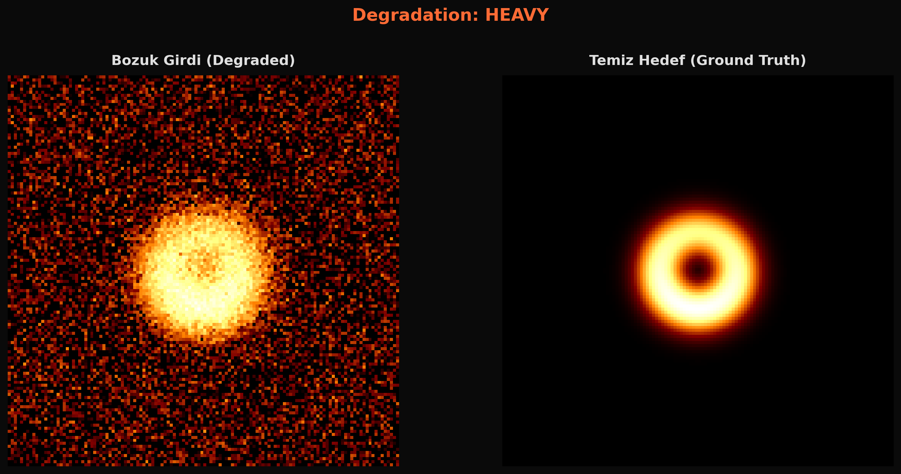
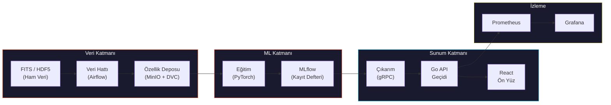
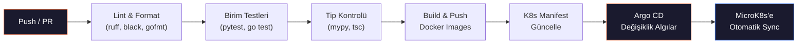

<div align="center">

```
██████╗ ███████╗███████╗██████╗     ██╗  ██╗ ██████╗ ██████╗ ██╗███████╗ ██████╗ ███╗   ██╗
██╔══██╗██╔════╝██╔════╝██╔══██╗    ██║  ██║██╔═══██╗██╔══██╗██║╚══███╔╝██╔═══██╗████╗  ██║
██║  ██║█████╗  █████╗  ██████╔╝    ███████║██║   ██║██████╔╝██║  ███╔╝ ██║   ██║██╔██╗ ██║
██║  ██║██╔══╝  ██╔══╝  ██╔═══╝     ██╔══██║██║   ██║██╔══██╗██║ ███╔╝  ██║   ██║██║╚██╗██║
██████╔╝███████╗███████╗██║         ██║  ██║╚██████╔╝██║  ██║██║███████╗╚██████╔╝██║ ╚████║
╚═════╝ ╚══════╝╚══════╝╚═╝         ╚═╝  ╚═╝ ╚═════╝ ╚═╝  ╚═╝╚═╝╚══════╝ ╚═════╝ ╚═╝  ╚═══╝
```

<br>


<br><br>

**Radyo teleskop dizilerinden elde edilen kara delik görüntüleri için**
**derin öğrenme tabanlı süper-çözünürlük ve gürültü giderme hattı**

<br>


<br>

[[English]](README.md) | **[Türkçe]**

<br>

[Genel Bakış](#-genel-bakış) · [Mimari](#%EF%B8%8F-mimari) · [ML Hattı](#-ml-hattı) · [Başarı Kriterleri](#-başarı-kriterleri) · [Teknoloji](#-teknoloji-yığını) · [API Uç Noktaları](#-api-uç-noktaları) · [Scriptler](#-scriptler) · [CI/CD](#-cicd-hattı) · [K8s Dağıtımı](#%EF%B8%8F-kubernetes-dağıtımı) · [Secret Yönetimi](#-gizli-anahtar-yönetimi) · [Yol Haritası](#-yol-haritası) · [Kaynaklar](#-referanslar)

</div>

<br>

---

<br>

## 🔭 Genel Bakış

Radyo teleskop dizileri (EHT vb.) tarafından yakalanan kara delik görüntüleri ciddi bozulmalardan muzdariptir: seyrek UV-düzlemi örneklemesi, atmosferik faz bozulması, termal gürültü ve kırınıma bağlı çözünürlük sınırı. Bu proje, bu bozulmuş gözlemlerden fiziksel olarak tutarlı, yüksek çözünürlüklü görüntüleri yeniden oluşturmak için derin öğrenme tabanlı **süper-çözünürlük** ve **gürültü giderme** tekniklerini uygulamaktadır.

Model geliştirmenin ötesinde, proje uçtan uca bir **MLOps altyapısı**, **veri hattı**, **Go API geçidi** ve **React ön yüz** inşa etmektedir.

<br>

<table>
<tr>
<td align="center"><b>Takım</b><br><code>7 Stajyer</code></td>
<td align="center"><b>Süre</b><br><code>12 Hafta</code></td>
<td align="center"><b>GPU</b><br><code>1x NVIDIA L40S (48 GB)</code></td>
</tr>
</table>

<br>

---

<br>

## 🧪 Problem Tanımı

Kara delik görüntüleri, birden fazla fiziksel ve aletsel faktör nedeniyle doğal olarak **bozuk ve bulanık**tır:

<br>

<details>
<summary><b>Kırınım Sınırı</b></summary>
<br>

Açısal çözünürlük `theta ~ lambda/D` ile belirlenir. EHT **1,3 mm** (230 GHz) dalga boyunda gözlem yapar. Dünya boyutunda bir baz çizgisi (~10.700 km) ile bile çözünürlük **~20 mikro-yay saniyesi (uas)** olup, olay ufku boyunca yalnızca birkaç piksel elde edilir.

</details>

<details>
<summary><b>Seyrek UV-Düzlemi Örneklemesi</b></summary>
<br>

VLBI'da her teleskop çifti, Fourier uzayında (UV-düzlemi) tek bir nokta örnekler. Dünya üzerindeki sınırlı teleskop sayısı ile UV-düzleminin büyük bölümü boş kalmaktadır. Van Cittert-Zernike teoremine göre, görüntü bu görünürlük değerlerinin ters Fourier dönüşümüdür — **eksik frekans bilgisi** yapay öğeler ve belirsizlik oluşturur.

</details>

<details>
<summary><b>Nokta Yayılım Fonksiyonu (PSF) / Kirli Hüzme</b></summary>
<br>

İnterferometrik dizinin PSF'i (kirli hüzme), ideal bir Airy diskinden çok uzaktır. Gözlenen görüntü, gerçek gökyüzü parlaklığının bu düzensiz PSF ile konvolüsyonudur:

```
I_gözlenen(x,y) = I_gerçek(x,y) * PSF(x,y) + gürültü
```

Bu konvolüsyon yüksek frekanslı detayları bastırarak bulanıklaşmaya neden olur.

</details>

<details>
<summary><b>Termal Gürültü ve Sistem Sıcaklığı (T_sys)</b></summary>
<br>

Her alıcının sistem sıcaklığı gürültü tabanını belirler:

```
SNR ~ S * sqrt(dv * tau) / T_sys
```

`S`: kaynak akısı · `dv`: bant genişliği · `tau`: entegrasyon süresi

mm dalga boylarında atmosferik su buharı emilimi T_sys'i yükseltir ve SNR'yi ciddi olarak düşürür.

</details>

<details>
<summary><b>Atmosferik Faz Bozulması</b></summary>
<br>

Troposferdeki türbülanslı su buharı, mm dalga boylarında gelen sinyalin fazını rastgele bozar. Bu faz hataları görünürlük verilerinde **koherans kaybı**na neden olur ve kalibre edilmediğinde sahte yapılar oluşturur.

</details>

<details>
<summary><b>Baz Çizgisi Kalibrasyon Hataları</b></summary>
<br>

Teleskop çiftleri arasındaki kazanç farklılıkları, saat senkronizasyon hataları ve polarizasyon kaçağı, görünürlük genlikleri ve fazlarında sistematik hatalara yol açar. Bunlar klasik yeniden oluşturma algoritmalarının (CLEAN, MEM) çıktısını doğrudan etkiler.

</details>

<br>

> **Hedef:** Bulanık, gürültülü bir giriş görüntüsünden → **fiziksel olarak tutarlı, yüksek çözünürlüklü** bir kara delik görüntüsü üretmek.

<br>

---

<br>

## 🖼️ Örnek Çıktı

<div align="center">



<sub><b>Sol:</b> Bozulmuş giriş (PSF bulanıklık + gürültü + alt örnekleme) · <b>Sağ:</b> Temiz hedef (Temel Gerçeklik)</sub>

</div>

<br>

---

<br>

## 🏗️ Mimari



<br>

### Veri Akışı

| Adım | Açıklama |
|:---:|---|
| **1** | Ham teleskop verisi (FITS/HDF5) → Airflow DAG'ları ile alma ve işleme |
| **2** | İşlenmiş veri → DVC versiyonlama → MinIO'ya yazma |
| **3** | PyTorch model eğitimi → tüm deneyler MLflow'a kaydedilir |
| **4** | En iyi model → MLflow Registry üzerinden terfi ettirilir |
| **5** | Python gRPC servisi → modeli yükle ve çıkarım sun |
| **6** | Go API Geçidi → REST API → gRPC üzerinden Python servisine yönlendir |
| **7** | React ön yüz → görüntü yükle ve sonuçları Go API üzerinden görüntüle |
| **8** | Prometheus → metrikleri topla → Grafana ile görselleştir |

<br>

---

<br>

## 🧠 ML Hattı

### Model İlerleme Süreci

Eğitim ilerlemeli bir strateji izler — basitten başla, karmaşıklığı artır:

| Aşama | Model | Mimari | Amaç |
|:---:|:---|:---|:---|
| **1** | U-Net (temel) | Atlama bağlantılı kodlayıcı-kod çözücü | Temel PSNR/SSIM değerlerini belirle |
| **2** | Pix2Pix | Koşullu GAN (U-Net üretici + PatchGAN ayırt edici) | Piksel kaybının ötesinde algısal kalite öğren |
| **3** | ESRGAN | RRDB üretici + göreceli ayırt edici | Yüksek sadakatli süper-çözünürlük |
| **4** | Restormer | Transformer tabanlı çok başlıklı dikkat | SOTA gürültü giderme + SR, uzun menzilli bağımlılıkları yakala |

### Kayıp Fonksiyonları

| Kayıp | Ağırlık | Amaç |
|:---|:---:|:---|
| **L1 (piksel)** | 1.0 | Piksel düzeyinde yeniden oluşturma doğruluğu |
| **Algısal (VGG)** | 0.1 | Görsel kalite için özellik düzeyinde benzerlik |
| **Çekişmel** | 0.01 | Keskin, gerçekçi çıktılar için GAN kaybı |
| **Fizik bilgili** | 0.05 | Halka yapısı tutarlılığı, akı korunumu |

> **Fizik bilgili kayıp (formel tanım).** `I_hat` tahmin edilen görüntü, `I_gt` temel gerçeklik olsun. Fizik kaybı üç terimi birleştirir:
>
> ```
> L_phys = lambda_flux * | sum(I_hat) - sum(I_gt) | / sum(I_gt)        # akı korunumu
>        + lambda_ring * | D_ring(I_hat) - D_ring(I_gt) |               # halka çapı (uas)
>        + lambda_sym  * | A(I_hat) - A(I_gt) |                          # asimetri oranı
> ```
>
> `D_ring(.)` radyal parlaklık profilinin tepe noktasından halka çapını çıkartır, `A(.)` halka boyunca parlaklık asimetri oranıdır (max/min). Varsayılanlar: `lambda_flux = 0.5`, `lambda_ring = 0.3`, `lambda_sym = 0.2`. `services/ml/losses/physics.py` içinde tanımlanır.

### Eğitim Stratejisi

```
Aşama 1: Yalnızca L1 kayıplı U-Net (ısınma, ~50 epoch)               [ZORUNLU]
Aşama 2: L1 + çekişmel kayıplı Pix2Pix (~100 epoch)                   [ZORUNLU]
Aşama 3: L1 + algısal + çekişmel kayıplı ESRGAN (~200 epoch)          [HEDEF]
Aşama 4: Tam kayıp takımlı Restormer (~300 epoch)                      [GENİŞLEME]

Tüm aşamalar: karışık hassasiyet (torch.amp), gradyan biriktirme (4 adım)
Hiperparametre arama: Optuna (ZORUNLU aşamalar için 20, HEDEF/GENİŞLEME için 50 deneme)
```

> **Kapsam notu.** Aşama 1–3 taahhüt edilen çıktılar; Aşama 4 (Restormer) yalnızca Aşama 3'ün 8. hafta sonuna kadar SSIM hedefini tutturması durumunda devreye girer. Tek bir L40S'te 300-epoch Restormer + 50-deneme Optuna araması tek başına ~2 hafta GPU zamanı harcar; bu yüzden Aşama 4 sadece 8. haftadaki go/no-go incelemesinden sonra planlanır.

<br>

---

<br>

## 🎯 Başarı Kriterleri

### Görüntü Kalitesi Metrikleri

| Metrik | Hedef | Temel (Kirli Görüntü) | Açıklama |
|:---|:---:|:---:|:---|
| **PSNR** | >= 32 dB | ~18 dB | Tepe Sinyal-Gürültü Oranı |
| **SSIM** | >= 0.90 | ~0.35 | Yapısal Benzerlik İndeksi |
| **LPIPS** | <= 0.10 | ~0.55 | Öğrenilmiş Algısal Görüntü Yama Benzerliği (düşük = daha iyi) |
| **FID** | <= 30 | ~180 | Fréchet Başlangıç Mesafesi (düşük = daha iyi) |

> **Temel ölçümü.** "Temel (Kirli Görüntü)" rakamları sentetik `medium` bozulma kümesinde (PSF 5.0 + %5 gürültü + 2x alt örnekleme, 2.500 çift) bikübik upsample ile no-ML referans olarak ölçülmüştür. Gerçek EHT verisinde temel gerçeklik olmadığı için bu metrikler dahil edilmemiştir. `scripts/eval_baseline.py` ile reprodüse edilir (3. hafta eklenecek).

### Fizik Tutarlılığı

| Metrik | Hedef | Açıklama |
|:---|:---:|:---|
| **Akı Korunumu** | <= %5 hata | Önceki ve sonraki toplam akı korunmalıdır |
| **Halka Çapı** | <= 2 uas hata | Yeniden oluşan halka çapı ile temel gerçeklik karşılaştırması |
| **Asimetri Oranı** | <= %10 hata | Parlaklık asimetrisi korunmalıdır |

### Sistem Performansı

| Metrik | Hedef | Açıklama |
|:---|:---:|:---|
| **Çıkarım Gecikmesi** | <= 500ms | Tek 512x512 görüntü (GPU) |
| **API Yanıt Süresi** | <= 1s | Yükleme ve indirme dahil uçtan uca |
| **İş Hacmi** | >= 10 istek/s | Çıkarım sunucusunda sürekli yük |
| **Model Boyutu** | <= 200 MB | ONNX ile optimize edilmiş model |
| **GPU Bellek** | <= 8 GB | Çıkarım zamanı VRAM kullanımı |

### MLOps Olgunluğu

| Kriter | Gereksinim |
|:---|:---|
| **Deney Takibi** | Tüm çalıştırmalar hiperparametre, metrik ve artifaktlarla MLflow'a kaydedilir |
| **Model Kayıt Defteri** | Doğrulama kapısı ile Staging → Production terfisi |
| **Veri Versiyonlama** | Tüm veri setleri DVC ile versiyonlanır |
| **CI/CD** | Her PR'de otomatik lint, test, build, deploy |
| **İzleme** | Prometheus metrikleri + Grafana panoları + Evidently kayma tespiti |
| **Test Kapsamı** | Veri hattı, ML değerlendirmesi ve API genelinde >= %80 |

<br>

---

<br>

## ⚡ Teknoloji Yığını

### Veri Mühendisliği

| | Teknoloji | Açıklama |
|:---|:---|:---|
| 🔢 | **NumPy, SciPy, OpenCV, scikit-image** | Görüntü işleme, sinyal işleme |
| 🔭 | **astropy, eht-imaging** | FITS dosya I/O, VLBI veri işleme, simülasyon |
| 📌 | **DVC** | Git benzeri veri versiyonlama |
| ✅ | **Great Expectations** | Otomatik veri doğrulama ve profilleme |
| 💾 | **MinIO** | S3 uyumlu yerel nesne depolama |

### Makine Öğrenimi

| | Teknoloji | Açıklama |
|:---|:---|:---|
| 🐍 | **Python 3.13+** | Birincil geliştirme dili |
| 🔥 | **PyTorch 2.6+** | Model geliştirme ve eğitim |
| 📊 | **MLflow** | Deney takibi, model kayıt defteri, artifakt deposu |
| 🎯 | **Optuna** | Otomatik hiperparametre optimizasyonu |
| 📡 | **gRPC + protobuf** | Model sunum protokolü |

### Ön Yüz

| | Teknoloji | Açıklama |
|:---|:---|:---|
| 🖼️ | **React 19+ (TypeScript)** | SPA ön yüz uygulaması |
| 🎨 | **Tailwind CSS** | Yardımcı sınıf öncelikli CSS çerçevesi |
| 🔄 | **Zustand / React Query** | Durum yönetimi ve sunucu önbelleği |
| 🌐 | **Three.js / D3.js** | Etkileşimli kara delik görselleştirmesi |

### API Geçidi

| | Teknoloji | Açıklama |
|:---|:---|:---|
| 🏎️ | **Go 1.24+** | API geçidi dili |
| 🛣️ | **Gin / Echo** | Yüksek performanslı HTTP çerçevesi |
| 📡 | **google.golang.org/grpc** | Python çıkarım servisine bağlantı |
| ✅ | **go-playground/validator** | İstek doğrulama |
| 📖 | **Swagger / OpenAPI 3.0** | Otomatik oluşturulan API dokümantasyonu |

### MLOps ve Altyapı

| | Teknoloji | Açıklama |
|:---|:---|:---|
| 🎼 | **Apache Airflow** | DAG tabanlı hat orkestrasyon |
| 🐳 | **Docker, Docker Compose** | Servis izolasyonu, ortam tutarlılığı |
| ☸️ | **MicroK8s** | Tek node / küçük cluster GPU dağıtımı için hafif Kubernetes |
| 🔁 | **GitHub Actions** | CI: lint, test, build, image push |
| 🚀 | **Argo CD** | CD: GitOps tabanlı MicroK8s'e sürekli dağıtım |
| 📉 | **Prometheus + Grafana** | Metrik toplama ve görselleştirme |
| 🔍 | **Evidently AI** | Veri kayması ve model performansı izleme |

<br>

---

<br>

## 🔌 API Uç Noktaları

| Metot | Uç Nokta | Açıklama |
|:---|:---|:---|
| `GET` | `/health` | Sağlık kontrolü, servis durumunu döndürür |
| `GET` | `/models` | Mevcut modelleri meta verileriyle listeler |
| `GET` | `/models/:id` | Belirli model detaylarını getirir (mimari, metrikler) |
| `POST` | `/enhance` | Görüntü yükle, süper-çözünürlük sonucunu döndür |
| `POST` | `/enhance/batch` | Toplu iyileştirme (en fazla 10 görüntü) |
| `GET` | `/enhance/:job_id` | Asenkron iş durumunu sorgula |
| `GET` | `/metrics` | Prometheus metrik uç noktası |

### `POST /enhance` — İstek

```json
{
  "image": "<base64-kodlanmış FITS/PNG>",
  "model": "restormer-v1",
  "output_format": "png",
  "scale_factor": 4
}
```

### `POST /enhance` — Yanıt

```json
{
  "job_id": "abc-123",
  "status": "completed",
  "result": {
    "image": "<base64-kodlanmış sonuç>",
    "metrics": {
      "psnr": 33.2,
      "ssim": 0.92,
      "inference_time_ms": 312
    },
    "model": "restormer-v1"
  }
}
```

<br>

---

<br>

## 👥 Takım Yapısı

7 stajyer, **3 squad** halinde organize edilir: Data, ML, Platform. Her stajyer bir birincil alana sahiptir ancak çapraz inceleme için en az bir diğer stajyer ile eşleşir.

<br>

<table>
<tr>
<td align="center" width="22%">

### Stajyer 1
**Veri Mühendisi**
*Squad: Data*

</td>
<td>

Veri hattının sahibidir. FITS/HDF5 ayrıştırma, EHT veri alma, DVC versiyonlama ve Great Expectations doğrulama paketinden sorumludur.

<details>
<summary>Araştırma Konuları</summary>

- FITS dosya formatı ve `astropy` I/O
- EHT UVFITS görünürlük verisi yapısı ve kalibrasyon
- Airflow DAG yazımı ve zamanlama
- DVC uzak depolama yapılandırması (MinIO arka ucu)
- Great Expectations profilleme ve beklenti paketleri
- Veri kataloğu ve soy zinciri takibi

</details>

**Eşleşir:** Stajyer 2 (bozulma hattı kontratı)

</td>
</tr>

<tr>
<td align="center">

### Stajyer 2
**Simülasyon ve Sentetik Veri**
*Squad: Data*

</td>
<td>

Sentetik veri üreticisinin sahibidir. `eht-imaging` GRMHD simülasyonları, PSF modelleme, bozulma hattı ve 10K eğitim çifti üreticisinden sorumludur.

<details>
<summary>Araştırma Konuları</summary>

- `eht-imaging` kütüphanesi, GRMHD kaynak modelleri
- VLBI dizileri için fiziksel PSF / kirli hüzme modelleme
- Gerçekçi gürültü enjeksiyonu (termal + atmosferik faz)
- Crescent / ring / double-ring kaynak modelleme
- Radyo astronomi için veri artırma stratejileri
- Bozulma seviyeleri için sınıf dengesi ve katmanlı örnekleme

</details>

**Eşleşir:** Stajyer 1 (veri şeması), Stajyer 3 (eğitim verisi şartnamesi)

</td>
</tr>

<tr>
<td align="center">

### Stajyer 3
**ML Mühendisi — Temel ve GAN**
*Squad: ML*

</td>
<td>

Aşama 1–2 modellerinin sahibidir. U-Net temel, Pix2Pix koşullu GAN, eğitim döngüsü iskeleti ve paylaşılan `services/ml/` eğitim paketinden sorumludur.

<details>
<summary>Araştırma Konuları</summary>

- Görüntü-görüntü çevirisi için U-Net mimarisi
- Koşullu GAN (Pix2Pix) eğitim dinamikleri
- Mod çöküşü, gradyan cezası, spektral normalizasyon
- Karışık hassasiyet eğitimi (`torch.amp`) ve gradyan biriktirme
- Eğitim döngüsü soyutlamaları ve yapılandırma yönetimi (Hydra)
- MLflow deney takibi entegrasyonu

</details>

**Eşleşir:** Stajyer 4 (kayıp + değerlendirme kontratı)

</td>
</tr>

<tr>
<td align="center">

### Stajyer 4
**ML Mühendisi — SOTA ve Fizik Kaybı**
*Squad: ML*

</td>
<td>

Aşama 3–4 modellerinin ve fizik bilgili kaybın sahibidir. ESRGAN, Restormer (genişleme), fizik bilgili kayıp modülü ve Optuna hiperparametre aramasından sorumludur.

<details>
<summary>Araştırma Konuları</summary>

- ESRGAN: RRDB blokları, göreceli ayırt edici
- Restormer transformer mimarisi, MDTA / GDFN blokları
- Astrofizik için fizik bilgili sinir ağları
- Özel kayıp tasarımı (akı korunumu, halka geometrisi)
- Optuna arama stratejileri (TPE, çok amaçlı)
- VGG algısal kayıp yapılandırması

</details>

**Eşleşir:** Stajyer 3 (ortak eğitim kodu), Stajyer 5 (değerlendirme devri)

</td>
</tr>

<tr>
<td align="center">

### Stajyer 5
**ML Mühendisi — Değerlendirme ve Çıkarım**
*Squad: ML*

</td>
<td>

Model kalitesi ve çıkarım sunumunun sahibidir. Metrik paketi (PSNR/SSIM/LPIPS/FID + fizik), ONNX/TensorRT optimizasyonu ve Python gRPC çıkarım servisinden sorumludur.

<details>
<summary>Araştırma Konuları</summary>

- Görüntü kalitesi metrikleri: `PSNR`, `SSIM`, `LPIPS`, `FID` matematiği
- Fizik tutarlılık metrikleri: halka çapı çıkartma, akı integralleri
- ONNX dışarı aktarma, ONNX Runtime, TensorRT optimizasyonu
- gRPC + protobuf Python servis geliştirme (`grpcio`)
- Model profilleme (`torch.profiler`, Nsight)
- MLflow model kayıt defteri ve staging→production terfi kapısı

</details>

**Eşleşir:** Stajyer 4 (model devri), Stajyer 6 (proto kontratı)

</td>
</tr>

<tr>
<td align="center">

### Stajyer 6
**Backend ve API Geçidi**
*Squad: Platform*

</td>
<td>

Go API geçidi ve paylaşılan protobuf kontratının sahibidir. REST endpoint'leri, çıkarım servisine gRPC istemcisi, asenkron iş yönetimi ve OpenAPI dokümantasyonundan sorumludur.

<details>
<summary>Araştırma Konuları</summary>

- Go REST API geliştirme (Gin / Echo çerçevesi)
- Protobuf şema tasarımı (`buf` araçları, kırıcı değişiklik tespiti)
- Go gRPC istemcisi, bağlantı havuzlama, geri çekilmeli yeniden deneme
- Asenkron iş kuyruğu desenleri (Redis / NATS)
- Dosya yükleme streaming (multipart form, S3 multipart upload)
- Go'dan OpenAPI 3.0 üretimi (`swaggo/swag`)
- İstek doğrulama (`go-playground/validator`)

</details>

**Eşleşir:** Stajyer 5 (proto şema sahibi), Stajyer 7 (API ↔ ön yüz kontratı)

</td>
</tr>

<tr>
<td align="center">

### Stajyer 7
**Ön Yüz ve Gözlemlenebilirlik**
*Squad: Platform*

</td>
<td>

Kullanıcıya yönelik katman ve izlemenin sahibidir. React+TypeScript SPA, görüntü yükleme/görselleştirme, Prometheus/Grafana panoları ve Evidently kayma raporlarından sorumludur.

<details>
<summary>Araştırma Konuları</summary>

- React 19 + TypeScript SPA mimarisi
- Durum ve sunucu önbelleği için Zustand / React Query
- Etkileşimli görüntü görselleştirme için Three.js / D3.js
- Dosya yükleme UX (ilerleme, parçalama, iptal)
- Prometheus istemci kütüphanesi, özel metrik tanımı
- Grafana pano sağlama (JSON modeli, kod-olarak)
- Evidently AI veri kayması ve model performansı raporlaması

</details>

**Eşleşir:** Stajyer 6 (API kontratı)

</td>
</tr>

<tr>
<td align="center">

### Yüzen Rol
**MLOps / Platform**
*Squad lider'leri arasında paylaşılır*

</td>
<td>

CI/CD, MicroK8s kurulumu, Argo CD bootstrap, Sealed Secrets ve MLflow altyapısı **Stajyer 1, 5 ve 6** tarafından mentor desteği ile **ortak sahiplenilir**. Tek bir stajyer altyapıya adanmaz — bunun yerine her squad lideri kendi servislerinin altyapısını teslim eder (Data → Airflow/MinIO, ML → MLflow/Çıkarım, Platform → Ingress/Gateway).

Bu, tek bir "altyapı stajyeri" bus-factor riskini ortadan kaldırır ve her squad'ı kendi dağıtımını sahiplenmeye zorlar.

</td>
</tr>
</table>

<br>

---

<br>

## 📁 Depo Yapısı

> **Durum göstergeleri:** ✅ mevcut · 🚧 1–2. haftada iskeletlenecek · ⏳ planlı (sonraki haftalar).
> Aşağıdaki yapı **hedef düzendir**; şu anda repo'da yalnızca ✅ işaretli olanlar var.

```
deephorizon/
│
├── README.md                              # İngilizce dokümantasyon ✅
├── README_TR.md                           # Türkçe dokümantasyon ✅
├── .gitignore                             # ✅
│
├── requirements/                          # Container başına Python bağımlılıkları (yerel dev pyproject extras kullanır) 🚧
│   ├── base.txt                           #   numpy, scipy, opencv, scikit-image
│   ├── data.txt                           #   astropy, eht-imaging, dvc, great-expectations
│   ├── ml.txt                             #   torch, torchvision, mlflow, optuna, lpips
│   └── serving.txt                        #   grpcio, onnxruntime, prometheus-client
│
├── pyproject.toml                         # uv / poetry config, ruff, mypy 🚧
├── go.mod / go.sum                        # Go modülü (services/api) ⏳
│
├── assets/
│   └── sample_degradation.png             # ✅
│
├── proto/                                 # Go ile Python arasında PAYLAŞILAN kontrat 🚧
│   ├── buf.yaml                           #   buf lint + kırıcı değişiklik tespiti
│   ├── buf.gen.yaml                       #   Go + Python stub üretir
│   └── deephorizon/v1/
│       ├── inference.proto                #   Enhance(), Health(), ListModels()
│       └── common.proto                   #   ImagePayload, Metrics, JobStatus
│
├── services/                              # Tüm dağıtılabilir servisler burada ⏳
│   ├── ml/                                # Stajyer 3, 4, 5 sahibi
│   │   ├── models/                        #   unet/, pix2pix/, esrgan/, restormer/
│   │   ├── losses/                        #   physics.py, perceptual.py, gan.py
│   │   ├── data/                          #   datasets, dataloaders, transforms
│   │   ├── training/                      #   train_loop.py, optuna_runner.py
│   │   ├── evaluation/                    #   metrics.py, benchmark.py
│   │   └── inference_server/              #   gRPC server uygulaması
│   ├── api/                               # Stajyer 6 sahibi (Go gateway)
│   │   ├── cmd/server/                    #   main.go
│   │   ├── internal/handlers/             #   /enhance, /models, /health
│   │   ├── internal/grpc_client/          #   çıkarım servisi istemcisi
│   │   └── api/openapi.yaml               #   üretilmiş OpenAPI 3.0
│   └── frontend/                          # Stajyer 7 sahibi
│       ├── src/                           #   React 19 + TypeScript
│       ├── public/
│       └── package.json
│
├── pipelines/                             # Airflow DAG'ları ⏳
│   ├── dags/
│   │   ├── eht_ingest.py
│   │   ├── synthetic_generation.py
│   │   └── training_data_build.py
│   └── plugins/
│
├── infra/                                 # Tüm dağıtım artifaktları ⏳
│   ├── k8s/
│   │   ├── app-of-apps.yaml               #   Kök Argo CD Application
│   │   ├── data/                          #   Airflow, MinIO manifest'leri (kustomize)
│   │   ├── ml/                            #   MLflow, eğitim Job, çıkarım Deployment
│   │   ├── app/                           #   Go API, React ön yüz, Ingress
│   │   ├── monitor/                       #   Prometheus, Grafana, Argo CD
│   │   └── secrets/                       #   SealedSecret manifest'leri (commit güvenli)
│   ├── docker/                            #   Dockerfile'lar (çok aşamalı)
│   │   ├── ml.Dockerfile
│   │   ├── api.Dockerfile
│   │   └── frontend.Dockerfile
│   └── docker-compose.dev.yaml            #   Yerel dev stack (MinIO, MLflow, Postgres)
│
├── .github/workflows/                     # CI ⏳
│   ├── ci.yml                             #   lint, test, tip kontrolü
│   ├── build.yml                          #   docker build + push
│   └── train.yml                          #   manuel/zamanlanmış GPU eğitimi
│
├── docs/                                  # ADR'lar ve modül dokümantasyonu ⏳
│   ├── adr/                               #   mimari karar kayıtları
│   └── runbooks/                          #   on-call kılavuzları
│
└── scripts/                               # Bağımsız scriptler (ince tutulur) ✅
    ├── download_eht_data.py               # EHT UVFITS indirici (7 veri seti, 88 dosya)
    ├── generate_synthetic_data.py         # eht-imaging sentetik üretici (128x128)
    ├── generate_training_data.py          # Eğitim verisi üreticisi (512x512, 10K çift)
    ├── visualize_samples.py               # Veri görselleştirme (PNG çıktı)
    └── eval_baseline.py                   # No-ML temel metrikleri (bikübik) ⏳
```

<br>

---

<br>

## 🚀 Kurulum

### Ön Koşullar

| Araç | Versiyon |
|:---|:---|
| Python | `3.13+` |
| Git | En güncel |

### Hızlı Başlangıç

```bash
# Depoyu klonla
git clone https://github.com/Octapull/deephorizon.git
cd deephorizon

# Sanal ortam oluştur
python -m venv .venv
source .venv/bin/activate   # Windows: .venv\Scripts\activate

# Bağımlılıkları yükle — tek venv, iki extras (geliştirme için önerilen)
uv sync --extra data --extra ml --extra dev

# Veya pip ile (extras hâlâ aynı ortamda birleşebilir)
pip install -e ".[data,ml,dev]"
```

> **Neden tek venv'de iki extras?** 2026-05-25'te Python 3.13.13 + uv 0.11 ile doğrulandı: `data` (ehtim 1.2.10, astropy 7.2) ve `ml` (torch 2.12, numpy 2.4) tek venv'de sorunsuz yaşıyor. Eski uyarımız "ehtim ↔ torch çatışır" idi — uv'nin resolver'ı her ikisini de tatmin eden numpy 2.x'i buluyor.
>
> **Bölünme hâlâ container'lar için önemli, yerel geliştirme için değil.** Production inference imajları `ehtim`/`astropy`'yi taşımamalı (200+ MB kullanılmayan kod). Her Dockerfile sadece kendi diliminden kurar: training pod → `[ml]`, veri pipeline pod → `[data]`, inference pod → `[serving]`. `infra/docker/`'a bak.

### Bilinen sorunlar (Python 3.13'te ehtim)

- **NFFT eksik.** ehtim `No NFFT installed!` uyarısı veriyor — bazı interferometrik özellikler buna ihtiyaç duyar. Stajyer 2 takılırsa `brew install nfft` sonra `pip install pynfft2` ile kur.
- **`pkg_resources` deprecation.** ehtim hâlâ `pkg_resources` kullanıyor; setuptools 2025-11-30+ kaldırabilir. Şu an `setuptools<82` ile güvenli. Uzun vadeli: upstream ehtim PR'ı veya fork.
- **`ehtim.__version__` yok.** Loglama için `importlib.metadata.version("ehtim")` kullan.
- **SyntaxWarning'ler.** ehtim'in birkaç `\m`/`\c` escape sequence'i 3.13'te uyarı çıkartır. Şimdilik kozmetik; 3.14'te `SyntaxError` olabilir.

<br>

---

<br>

## 🔧 Scriptler

### `download_eht_data.py` — EHT Gözlem İndirici

EHT işbirliği tarafından kamuya açılan tüm kalibre edilmiş UVFITS görünürlük verilerini indirir.

| Veri Seti | Kaynak | Dosya |
|:---|:---|:---:|
| `m87_2017` | M87* — ilk kara delik görüntüsü | 8 |
| `3c279_2017` | 3C279 kuazar | 8 |
| `sgra_2017` | Sgr A* — Samanyolu merkezi | 20 |
| `m87_2018` | M87* — ikinci yıl gözlemi | 24 |
| `cena_2017` | Centaurus A | 4 |
| `m87_2017_pol` | M87* polarize veri | 16 |
| `sgra_2017_pol` | Sgr A* polarize veri | 8 |

```bash
# Tüm veri setlerini indir (88 UVFITS dosya)
python scripts/download_eht_data.py

# Yalnızca belirli veri setlerini indir
python scripts/download_eht_data.py --datasets m87_2017 sgra_2017

# Çıktı: data/raw/eht/
```

<br>

### `generate_synthetic_data.py` — Sentetik Veri Üreticisi (eht-imaging)

`eht-imaging` kütüphanesini kullanarak fiziksel olarak gerçekçi kara delik modelleri üretir. Hızlı prototipleme için 128x128 çözünürlük.

- **Crescent** modeli — M87* benzeri asimetrik parlaklık
- **Ring** modeli — simetrik halka yapısı
- 4 bozulma seviyesi: `light`, `medium`, `heavy`, `extreme`

```bash
python scripts/generate_synthetic_data.py

# Çıktı: data/raw/simulated/
#   clean/     → temiz görüntüler (.npy)
#   degraded/  → bozulmuş görüntüler (.npy)
#   pairs/     → görsel karşılaştırmalar (.png)
```

<br>

### `generate_training_data.py` — Eğitim Verisi Üreticisi (512x512)

3 model tipi ile 512x512 çözünürlükte model eğitimi için **10.000 temiz/bozulmuş çift** üretir:

| Model | Oran | Açıklama |
|:---|:---:|:---|
| Crescent | %60 | Asimetrik parlaklık halkası (M87* benzeri) |
| Ring | %25 | Simetrik halka |
| Double Ring | %15 | İç + dış halka (jet yapısı simülasyonu) |

Bozulma seviyeleri (her biri x2500 çift):

| Seviye | PSF Bulanıklık | Gürültü | Alt Örnekleme |
|:---|:---:|:---:|:---:|
| `light` | 3.0 | %2 | 1x |
| `medium` | 5.0 | %5 | 2x |
| `heavy` | 8.0 | %10 | 2x |
| `extreme` | 12.0 | %15 | 4x |

```bash
python scripts/generate_training_data.py

# Çıktı: data/training/
#   clean/     → 10.000 temiz görüntü (.npy, float32)
#   degraded/  → 10.000 bozulmuş görüntü (.npy, float32)
# Tahmini boyut: ~2,5 GB
```

<br>

### `visualize_samples.py` — Veri Görselleştirme

EHT gerçek gözlemlerini kirli görüntü olarak render eder ve sentetik çiftler için yüksek kaliteli PNG karşılaştırmaları üretir.

```bash
python scripts/visualize_samples.py

# Çıktı: data/visualizations/
#   eht/        → kirli görüntü PNG'leri
#   synthetic/  → karşılaştırma ve ızgara görüntüleri
```

<br>

---

<br>

## 🔁 CI/CD Hattı

CI **GitHub Actions** üzerinde, CD **Argo CD** (GitOps) üzerinde çalışır. Argo CD, `infra/k8s/` dizinini izler ve değişiklikleri MicroK8s'e otomatik senkronize eder.



### CI — GitHub Actions

| İş Akışı | Tetikleyici | Eylemler |
|:---|:---|:---|
| `ci.yml` | Her push ve PR | Lint, tip kontrolü, birim testleri, kapsam raporu |
| `build.yml` | `main`'e merge | Docker görüntüleri oluştur, container registry'ye gönder |
| `train.yml` | Manuel / zamanlanmış | GPU düğümünde eğitim işini başlat |

### CD — Argo CD (GitOps)

| Uygulama | Kaynak Yolu | Namespace | Sync Politikası |
|:---|:---|:---|:---|
| `deephorizon-data` | `infra/k8s/data/` | `deephorizon-data` | Otomatik sync |
| `deephorizon-ml` | `infra/k8s/ml/` | `deephorizon-ml` | Otomatik sync |
| `deephorizon-app` | `infra/k8s/app/` | `deephorizon-app` | Otomatik sync |
| `deephorizon-monitor` | `infra/k8s/monitor/` | `deephorizon-monitor` | Otomatik sync |

Argo CD bu repo'nun `infra/k8s/` dizinini izler ve `main`'e her push'ta otomatik sync yapar. Dağıtım akışında manuel `kubectl apply` yoktur — Git'te bir manifest değişirse, cluster'da değişir.

<br>

---

<br>

## ☸️ Kubernetes Dağıtımı

Tüm servisler **MicroK8s** üzerinde çalışır — GPU iş yükleri için ideal, hafif, tek node Kubernetes dağıtımı. Dağıtımlar **Argo CD** ile GitOps üzerinden yönetilir.

> **Kurulum stajyer ödevidir.** Bu README **hedef mimariyi** ve **kullanılacak teknolojileri** belgeler, adım adım kurulum talimatlarını değil. Her squad lideri sahibi olduğu altyapı bileşenlerini (MicroK8s, GPU operator, Argo CD bootstrap, Sealed Secrets controller, ingress) araştırıp ayağa kaldırır. Her aracın resmi dokümantasyonu [Kaynaklar](#-referanslar) bölümünde linklidir — bunları okumak öğrenme çıktısının bir parçasıdır.

### Küme Mimarisi


### Namespace'ler

| Namespace | Servisler | Açıklama |
|:---|:---|:---|
| `deephorizon-data` | Airflow, MinIO | Veri hattı ve nesne depolama |
| `deephorizon-ml` | Eğitim İşleri, MLflow, Çıkarım | Model eğitimi, kayıt defteri, sunum |
| `deephorizon-app` | Go API, React Ön Yüz, Ingress | Kullanıcıya yönelik servisler |
| `deephorizon-monitor` | Prometheus, Grafana, Argo CD | İzleme ve GitOps dağıtımı |

### GPU İş Yükü Yapılandırması

```yaml
# Eğitim İşi — NVIDIA L40S (48 GB)
resources:
  requests:
    nvidia.com/gpu: 1
    memory: "32Gi"
    cpu: "8"
  limits:
    nvidia.com/gpu: 1
    memory: "48Gi"
    cpu: "16"

# Çıkarım Sunucusu — daha düşük kaynaklar
resources:
  requests:
    nvidia.com/gpu: 1
    memory: "8Gi"
    cpu: "4"
  limits:
    nvidia.com/gpu: 1
    memory: "16Gi"
    cpu: "8"
```

> **GPU paylaşım politikası.** Tek L40S'imiz var ama hem eğitim `Job`'i hem `inference` `Deployment`'i `nvidia.com/gpu: 1` istiyor. Birinin diğerini açlıktan öldürmemesi için:
>
> 1. **Varsayılan mod** — çıkarım Deployment `replicas: 1` ile çalışır. Eğitim Job'ları `nodeSelector: { workload: training }` ve `PriorityClass: low-priority` kullanır; çıkarım pod'u eğitim başlamadan önce 0'a ölçeklenir (bu `train.yml` workflow'unda ele alınır).
> 2. **Eşzamanlı mod (opsiyonel, 11. hafta+)** — L40S'te NVIDIA MIG (Multi-Instance GPU) etkinleştirip kartı `1g.12gb` çıkarım + `3g.36gb` eğitim olarak bölmek. `gpu-operator` Helm chart'ı, `migStrategy: mixed`.
>
> 12 haftalık pencere için **varsayılan modu** seç — MIG'in çıkarım QPS'i düşükken net faydası olmadan kurulum maliyeti var.

### Argo CD Stratejisi

**App-of-apps** desenini kullanıyoruz: tek bir kök `Application` (`infra/k8s/app-of-apps.yaml`) tüm dört squad-seviyesi Application'ı izler. Yeni servis eklemek = tek bir manifest eklemek, `argocd app create` çalıştırmak değil. `main`'e her push'ta otomatik sync aktiftir.

Takımın burada kullanacağı teknolojiler: **Argo CD CLI**, ortam-başına overlay için **`kustomize`**, üçüncü parti chart'lar için **Helm** (Sealed Secrets, gpu-operator).

<br>

---

<br>

## 🔐 Gizli Anahtar Yönetimi

Tüm hassas veriler (API anahtarları, kimlik bilgileri, bağlantı dizeleri) **Kubernetes Secrets** ve **Sealed Secrets** ile yönetilir. Kaynak kodunda veya ortam dosyalarında hiçbir gizli anahtar bulunmaz.

### Gizli Anahtar Akışı

```
Geliştirici → kubeseal şifrele → SealedSecret (Git'e commit edilir)
                                     ↓
                             Sealed Secrets Controller
                                     ↓
                             Kubernetes Secret (küme-içi)
                                     ↓
                             Pod ortam değişkenleri / volume mount'lar
```

### Gizli Anahtar Envanteri

| Gizli Anahtar | Namespace | Kullanım |
|:---|:---|:---|
| `minio-credentials` | `deephorizon-data` | MinIO erişim/gizli anahtar |
| `mlflow-db-credentials` | `deephorizon-ml` | MLflow PostgreSQL bağlantısı |
| `mlflow-s3-credentials` | `deephorizon-ml` | MLflow artifakt deposu (MinIO) |
| `inference-api-key` | `deephorizon-ml` | gRPC çıkarım yetkilendirme tokeni |
| `grafana-admin` | `deephorizon-monitor` | Grafana yönetici şifresi |
| `github-registry` | `deephorizon-app` | Container görüntü çekme şifresi |

### Araçlar

Takım şu araçlarla çalışacak:

- **Sealed Secrets** (Bitnami) — controller Helm ile kurulur; manifest'leri commit etmeden önce `kubeseal` CLI ile yerel olarak şifrelenir.
- **`kubectl create secret --dry-run=client`** ile düz Secret taslağı oluşturulur ve `kubeseal`'a pipe edilir.
- Controller kurulumu için **Helm**.

Net install / encrypt komutları bilinçli olarak verilmedi — Sealed Secrets dokümantasyonu için [Referanslar](#-referanslar) bölümüne bak.

### Kurallar

- `.env` dosyaları `.gitignore` içindedir ve **asla commit edilmez**
- Gizli anahtar rotasyonu her 90 günde
- Production gizli anahtarlara yalnızca küme yöneticisi erişebilir
- Tüm gizli anahtar erişimi denetim günlüğüne kaydedilir
- Geliştirme ortamı yerel gizli anahtarlar için `kubectl create secret` kullanır

<br>

---

<br>

## 📅 Yol Haritası

| Hafta | Odak | Çıktılar | Squad Lideri |
|:---:|:---|:---|:---|
| **1** | Bootstrap | Repo iskeleti (`services/`, `proto/`, `infra/`), `pyproject.toml`, CI iskeleti, `proto/` v1 dondurulur | Tümü |
| **2** | Veri + Proto kontratı | EHT indirme, sentetik üretici (128x128), eğitim çiftleri (512x512), `inference.proto` incelenip merge edilir | Data, Platform |
| **3** | Temel + Değerlendirme | U-Net eğitimi, MLflow ayakta, metrik paketi (PSNR/SSIM/LPIPS/FID), `eval_baseline.py` | ML |
| **4** | GAN Aşaması | Pix2Pix eğitimi, fizik kaybı v1, Optuna runner | ML |
| **5** | ESRGAN | ESRGAN eğitimi (Aşama 3 [HEDEF]), algısal kayıp ayarlama | ML |
| **6** | Çıkarım + Go API iskeleti | ONNX export, gRPC çıkarım sunucusu, Go gateway `/health` + `/enhance` (mock) | ML, Platform |
| **7** | Uçtan uca bağlantı | Go → Python gerçek gRPC çağrısı, asenkron iş akışı, OpenAPI spec | Platform |
| **8** | **Go/no-go kararı** + Ön Yüz | Aşama 3 metrik incelemesi → Restormer kararı (Aşama 4 [GENİŞLEME]). React SPA MVP | Tümü |
| **9** | Restormer (eğer go) / Cilalama (eğer no-go) | Restormer eğitimi VEYA ESRGAN rafinasyonu + ön yüz feature-complete | ML, Platform |
| **10** | K8s + Argo CD | MicroK8s dağıtım, Sealed Secrets, app-of-apps bootstrap, eğitim Job manifest | Tüm squad'lar |
| **11** | Gözlemlenebilirlik + Sağlamlaştırma | Prometheus metrikleri, Grafana panoları, Evidently kayma raporu, yük testi | Platform |
| **12** | Demo | Uçtan uca test, runbook'lar, ADR'lar, final sunum | Tümü |

> **8. hafta go/no-go kararı.** Aşama 3 (ESRGAN) 8. haftanın Cuma gününe kadar `medium` kümede **SSIM ≥ 0.85** tutturursa, takım 9–10. haftalarda Aşama 4 (Restormer)'a girer. Aksi takdirde 9–10. haftalar ESRGAN ve sunum yığınını sağlamlaştırmak için kullanılır. Bu karar ML squad'ı ve proje mentoru tarafından birlikte verilir.

<br>

---

<br>

## 📐 Geliştirme Kılavuzu

### Git İş Akışı

| Kural | Detay |
|:---|:---|
| **Ana dal** | `main` — korunmalı, yalnızca PR ile merge |
| **Dal adlandırma** | `feature/<stajyer-adi>/<kisa-aciklama>` |
| **İnceleme** | Her PR en az 1 inceleme gerektirir |
| **PR açıklaması** | Ne yapıldı + nasıl test edildi |

### Commit Konvansiyonu

```
<tip>(<kapsam>): <açıklama>
```

| Tip | Kapsam |
|:---|:---|
| `feat` · `fix` · `refactor` · `docs` · `test` · `ci` · `chore` | `data` · `ml` · `api` · `frontend` · `infra` · `docs` |

### Kod İnceleme

- Kendi PR'inizi merge edemezsiniz
- Çalışıyor mu? Testler var mı? Dokümantasyon güncellendi mi?
- İncelemeler 24 saat içinde tamamlanmalıdır

### Dokümantasyon

- Her modülün kendi `README.md`'si olmalıdır
- Public fonksiyonlar docstring içermelidir
- API uç noktaları Swagger/OpenAPI ile dokümante edilmelidir
- Mimari kararlar `docs/` içinde ADR olarak kaydedilir

<br>

---

<br>

## 📚 Referanslar

### EHT Makaleleri
- [İlk M87* Sonuçları (Makale I-VI)](https://iopscience.iop.org/journal/2041-8205/page/Focus_on_EHT) — The Astrophysical Journal Letters, 2019
- [İlk Sgr A* Sonuçları (Makale I-VIII)](https://iopscience.iop.org/journal/2041-8205/page/Focus_on_First_Sgr_A_Results) — The Astrophysical Journal Letters, 2022

### Süper-Çözünürlük Modelleri
- [ESRGAN: Enhanced Super-Resolution GANs](https://arxiv.org/abs/1809.00219) — Wang et al., 2018
- [Real-ESRGAN](https://arxiv.org/abs/2107.10833) — Wang et al., 2021
- [Restormer: Efficient Transformer for High-Resolution Image Restoration](https://arxiv.org/abs/2111.09881) — Zamir et al., 2022

### Kara Delik ML
- [Deep Horizon: ML from GRMHD simulations](https://www.aanda.org/articles/aa/full_html/2020/04/aa37014-19/aa37014-19.html) — A&A, 2020
- [eht-imaging: Interferometric Imaging Library](https://github.com/achael/eht-imaging) — Chael et al.

### Altyapı ve MLOps Dokümantasyonu (stajyer self-study)
- [MicroK8s docs](https://microk8s.io/docs) — kurulum, addon'lar, GPU etkinleştirme
- [NVIDIA GPU Operator](https://docs.nvidia.com/datacenter/cloud-native/gpu-operator/latest/index.html) — device plugin, MIG yapılandırma
- [Argo CD docs](https://argo-cd.readthedocs.io/) — bootstrap, app-of-apps deseni
- [Sealed Secrets](https://github.com/bitnami-labs/sealed-secrets) — controller kurulumu ve `kubeseal` kullanımı
- [Kustomize](https://kustomize.io/) — overlay tabanlı manifest yönetimi
- [MLflow docs](https://mlflow.org/docs/latest/index.html) — tracking server, model registry
- [Apache Airflow](https://airflow.apache.org/docs/) — DAG yazımı, provider'lar
- [DVC docs](https://dvc.org/doc) — S3-uyumlu remote'lar ile veri versiyonlama
- [buf docs](https://buf.build/docs) — protobuf lint ve kırıcı değişiklik tespiti

<br>

---

<br>

<div align="center">

**Octapull Stajyerleri tarafından 🔭 ile inşa edildi — 7 yapıcı, 3 squad, 1 kara delik**

<sub>Kara deliklerin sırlarını açmak için derin öğrenme</sub>

<br>


</div>
