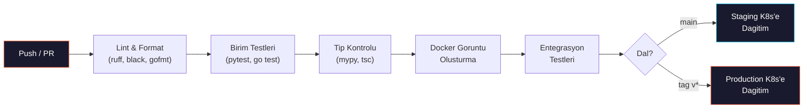
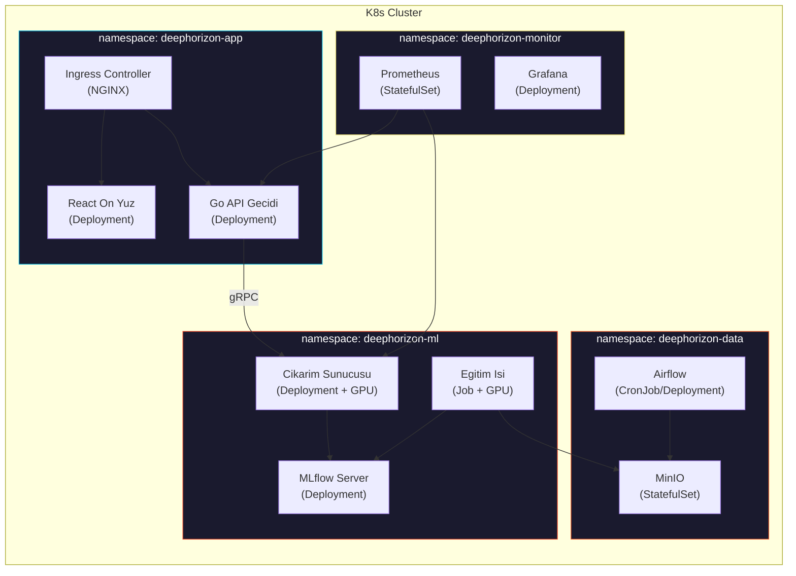

<div align="center">

```
██████╗ ███████╗███████╗██████╗     ██╗  ██╗ ██████╗ ██████╗ ██╗███████╗ ██████╗ ███╗   ██╗
██╔══██╗██╔════╝██╔════╝██╔══██╗    ██║  ██║██╔═══██╗██╔══██╗██║╚══███╔╝██╔═══██╗████╗  ██║
██║  ██║█████╗  █████╗  ██████╔╝    ███████║██║   ██║██████╔╝██║  ███╔╝ ██║   ██║██╔██╗ ██║
██║  ██║██╔══╝  ██╔══╝  ██╔═══╝     ██╔══██║██║   ██║██╔══██╗██║ ███╔╝  ██║   ██║██║╚██╗██║
██████╔╝███████╗███████╗██║         ██║  ██║╚██████╔╝██║  ██║██║███████╗╚██████╔╝██║ ╚████║
╚═════╝ ╚══════╝╚══════╝╚═╝         ╚═╝  ╚═╝ ╚═════╝ ╚═╝  ╚═╝╚═╝╚══════╝ ╚═════╝ ╚═╝  ╚═══╝
```

<br>


<br><br>

**Radyo teleskop dizilerinden elde edilen kara delik goruntuleri icin**
**derin ogrenme tabanli super-cozunurluk ve gurultu giderme hatti**

<br>


<br>

[[English]](README.md) | **[Turkce]**

<br>

[Genel Bakis](#-genel-bakis) · [Mimari](#%EF%B8%8F-mimari) · [ML Hatti](#-ml-hatti) · [Scriptler](#-scriptler) · [K8s Dagitimi](#%EF%B8%8F-kubernetes-dagitimi) · [Yol Haritasi](#-yol-haritasi)

</div>

<br>

---

<br>

## 🔭 Genel Bakis

Radyo teleskop dizileri (EHT vb.) tarafindan yakalanan kara delik goruntuleri ciddi bozulmalardan muzdariptir: seyrek UV-duzlemi orneklemesi, atmosferik faz bozulmasi, termal gurultu ve kirinima bagli cozunurluk siniri. Bu proje, bu bozulmus gozlemlerden fiziksel olarak tutarli, yuksek cozunurluklu goruntuleri yeniden olusturmak icin derin ogrenme tabanli **super-cozunurluk** ve **gurultu giderme** tekniklerini uygulamaktadir.

Model gelistirmenin otesinde, proje uctan uca bir **MLOps altyapisi**, **veri hatti**, **Go API gecidi** ve **React on yuz** insa etmektedir.

<br>

<table>
<tr>
<td align="center"><b>Takim</b><br><code>5 Stajyer</code></td>
<td align="center"><b>Sure</b><br><code>12 Hafta</code></td>
<td align="center"><b>GPU</b><br><code>1x NVIDIA L40S (48 GB)</code></td>
</tr>
</table>

<br>

---

<br>

## 🧪 Problem Tanimi

Kara delik goruntuleri, birden fazla fiziksel ve aletsel faktor nedeniyle dogal olarak **bozuk ve bulanik**tir:

<br>

<details>
<summary><b>Kirinima Siniri</b></summary>
<br>

Acisal cozunurluk `theta ~ lambda/D` ile belirlenir. EHT **1,3 mm** (230 GHz) dalga boyunda gozlem yapar. Dunya boyutunda bir baz cizgisi (~10.700 km) ile bile cozunurluk **~20 mikro-yay saniyesi (uas)** olup, olay ufku boyunca yalnizca birkac piksel elde edilir.

</details>

<details>
<summary><b>Seyrek UV-Duzlemi Orneklemesi</b></summary>
<br>

VLBI'da her teleskop cifti, Fourier uzayinda (UV-duzlemi) tek bir nokta ornekler. Dunya uzerindeki sinirli teleskop sayisi ile UV-duzleminin buyuk bolumu bos kalmaktadir. Van Cittert-Zernike teoremine gore, goruntu bu gorunurluk degerlerinin ters Fourier donusumudur — **eksik frekans bilgisi** yapay ogeler ve belirsizlik olusturur.

</details>

<details>
<summary><b>Nokta Yayilim Fonksiyonu (PSF) / Kirli Huzme</b></summary>
<br>

Interferometrik dizinin PSF'i (kirli huzme), ideal bir Airy diskindan cok uzaktir. Gozlenen goruntu, gercek gokyuzu parlakliginin bu duzensiz PSF ile konvolüsyonudur:

```
I_gozlenen(x,y) = I_gercek(x,y) * PSF(x,y) + gurultu
```

Bu konvolusyon yuksek frekanslı detaylari bastirarak bulaniklasmaxa neden olur.

</details>

<details>
<summary><b>Termal Gurultu ve Sistem Sicakligi (T_sys)</b></summary>
<br>

Her alicinin sistem sicakligi gurultu tabanini belirler:

```
SNR ~ S * sqrt(dv * tau) / T_sys
```

`S`: kaynak akisi · `dv`: bant genisligi · `tau`: entegrasyon suresi

mm dalga boylarinda atmosferik su buhari emilimi T_sys'i yukseltir ve SNR'yi ciddi olarak dusurur.

</details>

<details>
<summary><b>Atmosferik Faz Bozulmasi</b></summary>
<br>

Troposferdeki turbulansli su buhari, mm dalga boylarinda gelen sinyalin fazini rastgele bozar. Bu faz hatalari gorunurluk verilerinde **koherans kaybi**na neden olur ve kalibre edilmediginde sahte yapilar olusturur.

</details>

<details>
<summary><b>Baz Cizgisi Kalibrasyon Hatalari</b></summary>
<br>

Teleskop ciftleri arasindaki kazanc farkliliklari, saat senkronizasyon hatalari ve polarizasyon kacagi, gorunurluk genlikleri ve fazlarinda sistematik hatalara yol acar. Bunlar klasik yeniden olusturma algoritmalarinin (CLEAN, MEM) ciktisini dogrudan etkiler.

</details>

<br>

> **Hedef:** Bulanik, gurultulu bir giris goruntusunden → **fiziksel olarak tutarli, yuksek cozunurluklu** bir kara delik goruntusu uretmek.

<br>

---

<br>

## 🖼️ Ornek Cikti

<div align="center">


<sub><b>Sol:</b> Bozulmus giris (PSF bulaniklik + gurultu + alt ornekleme) · <b>Sag:</b> Temiz hedef (Temel Gerceklik)</sub>

</div>

<br>

---

<br>

## 🏗️ Mimari


<br>

### Veri Akisi

| Adim | Aciklama |
|:---:|---|
| **1** | Ham teleskop verisi (FITS/HDF5) → Airflow DAG'lari ile alma ve isleme |
| **2** | Islenmis veri → DVC versiyonlama → MinIO'ya yazma |
| **3** | PyTorch model egitimi → tum deneyler MLflow'a kaydedilir |
| **4** | En iyi model → MLflow Registry uzerinden terfi ettirilir |
| **5** | Python gRPC servisi → modeli yukle ve cikarim sun |
| **6** | Go API Gecidi → REST API → gRPC uzerinden Python servisine yonlendir |
| **7** | React on yuz → goruntu yukle ve sonuclari Go API uzerinden goruntule |
| **8** | Prometheus → metrikleri topla → Grafana ile gorsellestir |

<br>

---

<br>

## 🧠 ML Hatti

### Model Ilerleme Sureci

Egitim ilerlemeli bir strateji izler — basitten basla, karmasikligi artir:

| Asama | Model | Mimari | Amac |
|:---:|:---|:---|:---|
| **1** | U-Net (temel) | Atlama baglantili kodlayici-kod cozucu | Temel PSNR/SSIM degerlerini belirle |
| **2** | Pix2Pix | Kosullu GAN (U-Net uretici + PatchGAN ayirt edici) | Piksel kaybinin otesinde algisal kalite ogren |
| **3** | ESRGAN | RRDB uretici + goreceli ayirt edici | Yuksek sadakatli super-cozunurluk |
| **4** | Restormer | Transformer tabanli cok baslikli dikkat | SOTA gurultu giderme + SR, uzun menzilli bagimliliklari yakala |

### Kayip Fonksiyonlari

| Kayip | Agirlik | Amac |
|:---|:---:|:---|
| **L1 (piksel)** | 1.0 | Piksel duzeyinde yeniden olusturma dogrulugu |
| **Algisal (VGG)** | 0.1 | Gorsel kalite icin ozellik duzeyinde benzerlik |
| **Cekismel** | 0.01 | Keskin, gercekci ciktilar icin GAN kaybi |
| **Fizik bilgili** | 0.05 | Halka yapisi tutarliligi, aki korunumu |

### Egitim Stratejisi

```
Asama 1: Yalnizca L1 kayipli U-Net (isinma, ~50 epoch)
Asama 2: L1 + cekismel kayipli Pix2Pix (~100 epoch)
Asama 3: L1 + algisal + cekismel kayipli ESRGAN (~200 epoch)
Asama 4: Tam kayip takimli Restormer (~300 epoch)

Tum asamalar: karisik hassasiyet (torch.amp), gradyan biriktirme (4 adim)
Hiperparametre arama: Optuna (asama basina 50 deneme)
```

<br>

---

<br>

## 🎯 Basari Kriterleri

### Goruntu Kalitesi Metrikleri

| Metrik | Hedef | Temel (Kirli Goruntu) | Aciklama |
|:---|:---:|:---:|:---|
| **PSNR** | >= 32 dB | ~18 dB | Tepe Sinyal-Gurultu Orani |
| **SSIM** | >= 0.90 | ~0.35 | Yapisal Benzerlik Indeksi |
| **LPIPS** | <= 0.10 | ~0.55 | Ogrenilmis Algisal Goruntu Yama Benzerligi (dusuk = daha iyi) |
| **FID** | <= 30 | ~180 | Frechet Baslangic Mesafesi (dusuk = daha iyi) |

### Fizik Tutarliligi

| Metrik | Hedef | Aciklama |
|:---|:---:|:---|
| **Aki Korunumu** | <= %5 hata | Onceki ve sonraki toplam aki korunmalidir |
| **Halka Capi** | <= 2 uas hata | Yeniden olusan halka capi ile temel gerceklik karsilastirmasi |
| **Asimetri Orani** | <= %10 hata | Parlaklik asimetrisi korunmalidir |

### Sistem Performansi

| Metrik | Hedef | Aciklama |
|:---|:---:|:---|
| **Cikarim Gecikmesi** | <= 500ms | Tek 512x512 goruntu (GPU) |
| **API Yanit Suresi** | <= 1s | Yukleme ve indirme dahil uctan uca |
| **Is Hacmi** | >= 10 istek/s | Cikarim sunucusunda surekli yuk |
| **Model Boyutu** | <= 200 MB | ONNX ile optimize edilmis model |
| **GPU Bellek** | <= 8 GB | Cikarim zamani VRAM kullanimi |

### MLOps Olgunlugu

| Kriter | Gereksinim |
|:---|:---|
| **Deney Takibi** | Tum calistirmalar hiperparametre, metrik ve artifaktlarla MLflow'a kaydedilir |
| **Model Kayit Defteri** | Dogrulama kapisi ile Staging → Production terfisi |
| **Veri Versiyonlama** | Tum veri setleri DVC ile versiyonlanir |
| **CI/CD** | Her PR'de otomatik lint, test, build, deploy |
| **Izleme** | Prometheus metrikleri + Grafana panolari + Evidently kayma tespiti |
| **Test Kapsami** | Veri hatti, ML degerlendirmesi ve API genelinde >= %80 |

<br>

---

<br>

## ⚡ Teknoloji Yigini

### Veri Muhendisligi

| | Teknoloji | Aciklama |
|:---|:---|:---|
| 🔢 | **NumPy, SciPy, OpenCV, scikit-image** | Goruntu isleme, sinyal isleme |
| 🔭 | **astropy, eht-imaging** | FITS dosya I/O, VLBI veri isleme, simulasyon |
| 📌 | **DVC** | Git benzeri veri versiyonlama |
| ✅ | **Great Expectations** | Otomatik veri dogrulama ve profilleme |
| 💾 | **MinIO** | S3 uyumlu yerel nesne depolama |

### Makine Ogrenimi

| | Teknoloji | Aciklama |
|:---|:---|:---|
| 🐍 | **Python 3.11+** | Birincil gelistirme dili |
| 🔥 | **PyTorch 2.x** | Model gelistirme ve egitim |
| 📊 | **MLflow** | Deney takibi, model kayit defteri, artifakt deposu |
| 🎯 | **Optuna** | Otomatik hiperparametre optimizasyonu |
| 📡 | **gRPC + protobuf** | Model sunum protokolu |

### On Yuz

| | Teknoloji | Aciklama |
|:---|:---|:---|
| 🖼️ | **React 18+ (TypeScript)** | SPA on yuz uygulamasi |
| 🎨 | **Tailwind CSS** | Yardimci sinif oncelikli CSS cercevesi |
| 🔄 | **Zustand / React Query** | Durum yonetimi ve sunucu onbellegi |
| 🌐 | **Three.js / D3.js** | Etkilesimli kara delik gorsellestirmesi |

### API Gecidi

| | Teknoloji | Aciklama |
|:---|:---|:---|
| 🏎️ | **Go 1.22+** | API gecidi dili |
| 🛣️ | **Gin / Echo** | Yuksek performansli HTTP cercevesi |
| 📡 | **google.golang.org/grpc** | Python cikarim servisine baglanti |
| ✅ | **go-playground/validator** | Istek dogrulama |
| 📖 | **Swagger / OpenAPI 3.0** | Otomatik olusturulan API dokumantasyonu |

### MLOps ve Altyapi

| | Teknoloji | Aciklama |
|:---|:---|:---|
| 🎼 | **Apache Airflow** | DAG tabanli hat orkestrasyon |
| 🐳 | **Docker, Docker Compose** | Servis izolasyonu, ortam tutarliligi |
| ☸️ | **Kubernetes** | Uretim orkestrasyonu, GPU zamanlama |
| 🔁 | **GitHub Actions** | Otomatik test, build, deploy |
| 📉 | **Prometheus + Grafana** | Metrik toplama ve gorsellestirme |
| 🔍 | **Evidently AI** | Veri kaymasi ve model performansi izleme |

<br>

---

<br>

## 🔌 API Uç Noktalari

| Metot | Uç Nokta | Aciklama |
|:---|:---|:---|
| `GET` | `/health` | Saglik kontrolu, servis durumunu dondurur |
| `GET` | `/models` | Mevcut modelleri meta verileriyle listeler |
| `GET` | `/models/:id` | Belirli model detaylarini getirir (mimari, metrikler) |
| `POST` | `/enhance` | Goruntu yukle, super-cozunurluk sonucunu dondur |
| `POST` | `/enhance/batch` | Toplu iyilestirme (en fazla 10 goruntu) |
| `GET` | `/enhance/:job_id` | Asenkron is durumunu sorgula |
| `GET` | `/metrics` | Prometheus metrik uç noktasi |

### `POST /enhance` — Istek

```json
{
  "image": "<base64-kodlanmis FITS/PNG>",
  "model": "restormer-v1",
  "output_format": "png",
  "scale_factor": 4
}
```

### `POST /enhance` — Yanit

```json
{
  "job_id": "abc-123",
  "status": "completed",
  "result": {
    "image": "<base64-kodlanmis sonuc>",
    "metrics": {
      "psnr": 33.2,
      "ssim": 0.92,
      "inference_time_ms": 312
    },
    "model": "restormer-v1"
  }
}
```

<br>

---

<br>

## 👥 Takim Yapisi

<br>

<table>
<tr>
<td align="center" width="20%">

### Stajyer 1
**Veri Muhendisi**

</td>
<td>

Veri hattinin sahibidir. FITS/HDF5 ayristirma, sentetik veri uretimi, DVC versiyonlama ve Great Expectations dogrulama paketinden sorumludur.

<details>
<summary>Arastirma Konulari</summary>

- FITS dosya formati ve `astropy` I/O
- `eht-imaging` GRMHD simulasyon goruntu uretimi
- PSF modelleme ve sentetik bozulma hatti tasarimi
- Airflow DAG yazimi ve zamanlama
- DVC uzak depolama yapilandirmasi (MinIO arka ucu)
- Great Expectations profilleme ve beklenti paketleri

</details>

</td>
</tr>

<tr>
<td align="center">

### Stajyer 2
**ML Muhendisi**
*Model Gelistirme*

</td>
<td>

Model mimarisi ve egitimin sahibidir. Temel modelden SOTA'ya kadar tum model gelistirme, egitim dongusu ve hiperparametre optimizasyonundan sorumludur.

<details>
<summary>Arastirma Konulari</summary>

- Super-cozunurluk literaturu: `SRCNN → EDSR → ESRGAN → Real-ESRGAN → Restormer`
- GAN egitim dinamikleri (mod cokusu, egitim kararsizligi) ve cozumleri
- Fizik bilgili sinir aglari ve ozel kayip fonksiyonu tasarimi
- Ilerlemeli egitim stratejileri
- Karisik hassasiyet egitimi (`torch.amp`) ve gradyan biriktirme
- Optuna hiperparametre arama stratejileri

</details>

</td>
</tr>

<tr>
<td align="center">

### Stajyer 3
**ML Muhendisi**
*Degerlendirme ve Optimizasyon*

</td>
<td>

Model kalitesi ve cikarim performansinin sahibidir. Metrik uygulamasi, karsilastirma paketi, model optimizasyonu (ONNX, TensorRT) ve gRPC cikarim servisinden sorumludur.

<details>
<summary>Arastirma Konulari</summary>

- Goruntu kalitesi metrikleri: `PSNR`, `SSIM`, `LPIPS`, `FID` — matematiksel temeller
- Fizik tutarliligi metrik tasarimi (PSF tutarlilik kontrolu)
- ONNX disari aktarma ve TensorRT model optimizasyonu
- gRPC + protobuf Python cikarim servisi gelistirme
- Model profilleme ve gecikme analizi (`torch.profiler`)
- MLflow model kayit defteri entegrasyonu ve artifakt yonetimi

</details>

</td>
</tr>

<tr>
<td align="center">

### Stajyer 4
**MLOps Muhendisi**

</td>
<td>

Otomasyon ve altyapinin sahibidir. CI/CD hatlari, Docker ortamlari, Airflow kurulumu, MLflow yapilandirmasi ve K8s dagitimidan sorumludur.

<details>
<summary>Arastirma Konulari</summary>

- Docker cok asamali build ve goruntu optimizasyonu
- Docker Compose cok servisli orkestrasyon
- GitHub Actions is akisi tasarimi (matris build, onbellekleme, gizli anahtarlar)
- MLflow Tracking Server kurulumu (arka uc depolama + artifakt deposu)
- Airflow kurulumu ve DAG en iyi uygulamalari
- MinIO kurulumu ve S3 uyumlu bucket yonetimi
- Kubernetes GPU zamanlama ve Sealed Secrets

</details>

</td>
</tr>

<tr>
<td align="center">

### Stajyer 5
**On Yuz ve API Gecidi**

</td>
<td>

Tum kullaniciya yonelik katmanlarin sahibidir. Go API gecidi, React on yuz, Prometheus/Grafana izleme ve Evidently AI kayma tespitinden sorumludur.

<details>
<summary>Arastirma Konulari</summary>

- Go REST API gelistirme (Gin / Echo cercevesi)
- Go gRPC istemci uygulamasi ve baglanti havuzlama
- Protobuf sema tanimi (`.proto` dosyalari)
- React + TypeScript SPA gelistirme
- Dosya yukleme/indirme islemleri (multipart form, streaming)
- Prometheus istemci kutuphanesi ozel metrik tanimi
- Grafana pano saglama (JSON modeli)
- Evidently AI veri kaymasi ve model performansi raporlama

</details>

</td>
</tr>
</table>

<br>

---

<br>

## 📁 Depo Yapisi

```
deephorizon/
│
├── README.md                              # Ingilizce dokumantasyon
├── README_TR.md                           # Turkce dokumantasyon
├── requirements.txt                       # Python bagimliliklari
├── .gitignore
│
├── assets/
│   └── sample_degradation.png
│
└── scripts/
    ├── download_eht_data.py               # EHT UVFITS indirici (7 veri seti, 88 dosya)
    ├── generate_synthetic_data.py          # eht-imaging sentetik uretici (128x128)
    ├── generate_training_data.py           # Egitim verisi ureticisi (512x512, 10K cift)
    └── visualize_samples.py               # Veri gorsellestirme (PNG cikti)
```

<br>

---

<br>

## 🚀 Kurulum

### On Kosullar

| Arac | Versiyon |
|:---|:---|
| Python | `3.11+` |
| Git | En guncel |

### Hizli Baslangic

```bash
# Depoyu klonla
git clone https://github.com/Octapull/deephorizon.git
cd deephorizon

# Sanal ortam olustur
python -m venv .venv
source .venv/bin/activate   # Windows: .venv\Scripts\activate

# Bagimliliklari yukle
pip install -r requirements.txt
```

<br>

---

<br>

## 🔧 Scriptler

### `download_eht_data.py` — EHT Gozlem Indirici

EHT isbirligi tarafindan kamuya acilan tum kalibre edilmis UVFITS gorunurluk verilerini indirir.

| Veri Seti | Kaynak | Dosya |
|:---|:---|:---:|
| `m87_2017` | M87* — ilk kara delik goruntusu | 8 |
| `3c279_2017` | 3C279 kuazar | 8 |
| `sgra_2017` | Sgr A* — Samanyolu merkezi | 20 |
| `m87_2018` | M87* — ikinci yil gozlemi | 24 |
| `cena_2017` | Centaurus A | 4 |
| `m87_2017_pol` | M87* polarize veri | 16 |
| `sgra_2017_pol` | Sgr A* polarize veri | 8 |

```bash
# Tum veri setlerini indir (88 UVFITS dosya)
python scripts/download_eht_data.py

# Yalnizca belirli veri setlerini indir
python scripts/download_eht_data.py --datasets m87_2017 sgra_2017

# Cikti: data/raw/eht/
```

<br>

### `generate_synthetic_data.py` — Sentetik Veri Ureticisi (eht-imaging)

`eht-imaging` kutuphanesini kullanarak fiziksel olarak gercekci kara delik modelleri uretir. Hizli prototipleme icin 128x128 cozunurluk.

- **Crescent** modeli — M87* benzeri asimetrik parlaklik
- **Ring** modeli — simetrik halka yapisi
- 4 bozulma seviyesi: `light`, `medium`, `heavy`, `extreme`

```bash
python scripts/generate_synthetic_data.py

# Cikti: data/raw/simulated/
#   clean/     → temiz goruntuler (.npy)
#   degraded/  → bozulmus goruntuler (.npy)
#   pairs/     → gorsel karsilastirmalar (.png)
```

<br>

### `generate_training_data.py` — Egitim Verisi Ureticisi (512x512)

3 model tipi ile 512x512 cozunurlukta model egitimi icin **10.000 temiz/bozulmus cift** uretir:

| Model | Oran | Aciklama |
|:---|:---:|:---|
| Crescent | %60 | Asimetrik parlaklik halkasi (M87* benzeri) |
| Ring | %25 | Simetrik halka |
| Double Ring | %15 | Ic + dis halka (jet yapisi simulasyonu) |

Bozulma seviyeleri (her biri x2500 cift):

| Seviye | PSF Bulaniklik | Gurultu | Alt Ornekleme |
|:---|:---:|:---:|:---:|
| `light` | 3.0 | %2 | 1x |
| `medium` | 5.0 | %5 | 2x |
| `heavy` | 8.0 | %10 | 2x |
| `extreme` | 12.0 | %15 | 4x |

```bash
python scripts/generate_training_data.py

# Cikti: data/training/
#   clean/     → 10.000 temiz goruntu (.npy, float32)
#   degraded/  → 10.000 bozulmus goruntu (.npy, float32)
# Tahmini boyut: ~2,5 GB
```

<br>

### `visualize_samples.py` — Veri Gorsellestirme

EHT gercek gozlemlerini kirli goruntu olarak render eder ve sentetik ciftler icin yuksek kaliteli PNG karsilastirmalari uretir.

```bash
python scripts/visualize_samples.py

# Cikti: data/visualizations/
#   eht/        → kirli goruntu PNG'leri
#   synthetic/  → karsilastirma ve izgara goruntuleri
```

<br>

---

<br>

## 🔁 CI/CD Hatti



| Is Akisi | Tetikleyici | Eylemler |
|:---|:---|:---|
| `ci.yml` | Her push ve PR | Lint, tip kontrolu, birim testleri, kapsam raporu |
| `build.yml` | `main`'e PR | Docker goruntuleri olustur, registry'ye gonder |
| `deploy-staging.yml` | `main`'e merge | Staging K8s namespace'ine dagit |
| `deploy-prod.yml` | `v*` etiketi | Production K8s namespace'ine dagit |
| `train.yml` | Manuel / zamanlanmis | GPU dugumunde egitim isini baslat |

<br>

---

<br>

## ☸️ Kubernetes Dagitimi

Tum servisler Kubernetes uzerinde dagitilir. GPU is yukleri NVIDIA device plugin kullanir.

### Kume Mimarisi



### Namespace'ler

| Namespace | Servisler | Aciklama |
|:---|:---|:---|
| `deephorizon-data` | Airflow, MinIO | Veri hatti ve nesne depolama |
| `deephorizon-ml` | Egitim Isleri, MLflow, Cikarim | Model egitimi, kayit defteri, sunum |
| `deephorizon-app` | Go API, React On Yuz, Ingress | Kullaniciya yonelik servisler |
| `deephorizon-monitor` | Prometheus, Grafana | Metrik toplama ve gorsellestirme |

### GPU Is Yuku Yapilandirmasi

```yaml
# Egitim Isi — NVIDIA L40S (48 GB)
resources:
  requests:
    nvidia.com/gpu: 1
    memory: "32Gi"
    cpu: "8"
  limits:
    nvidia.com/gpu: 1
    memory: "48Gi"
    cpu: "16"

# Cikarim Sunucusu — daha dusuk kaynaklar
resources:
  requests:
    nvidia.com/gpu: 1
    memory: "8Gi"
    cpu: "4"
  limits:
    nvidia.com/gpu: 1
    memory: "16Gi"
    cpu: "8"
```

### Dagitim Komutlari

```bash
# Namespace'leri olustur
kubectl apply -f infra/k8s/namespaces.yaml

# Tum servisleri dagit
kubectl apply -k infra/k8s/

# GPU dugumlerini kontrol et
kubectl get nodes -l nvidia.com/gpu.present=true

# Egitim isini baslat
kubectl apply -f infra/k8s/ml/training-job.yaml

# Pod durumunu izle
kubectl get pods -A -l app.kubernetes.io/part-of=deephorizon
```

<br>

---

<br>

## 🔐 Gizli Anahtar Yonetimi

Tum hassas veriler (API anahtarlari, kimlik bilgileri, baglanti dizeleri) **Kubernetes Secrets** ve **Sealed Secrets** ile yonetilir. Kaynak kodunda veya ortam dosyalarinda hicbir gizli anahtar bulunmaz.

### Gizli Anahtar Akisi

```
Gelistirici → kubeseal sifrele → SealedSecret (Git'e commit edilir)
                                     ↓
                             Sealed Secrets Controller
                                     ↓
                             Kubernetes Secret (kume-ici)
                                     ↓
                             Pod ortam degiskenleri / volume mount'lar
```

### Gizli Anahtar Envanteri

| Gizli Anahtar | Namespace | Kullanim |
|:---|:---|:---|
| `minio-credentials` | `deephorizon-data` | MinIO erisim/gizli anahtar |
| `mlflow-db-credentials` | `deephorizon-ml` | MLflow PostgreSQL baglantisi |
| `mlflow-s3-credentials` | `deephorizon-ml` | MLflow artifakt deposu (MinIO) |
| `inference-api-key` | `deephorizon-ml` | gRPC cikarim yetkilendirme tokeni |
| `grafana-admin` | `deephorizon-monitor` | Grafana yonetici sifresi |
| `github-registry` | `deephorizon-app` | Container goruntu cekme sifresi |

### Sealed Secrets Kullanimi

```bash
# Sealed Secrets controller'i yukle
helm install sealed-secrets sealed-secrets/sealed-secrets \
  -n kube-system

# Gizli anahtar olustur ve sifrele
kubectl create secret generic minio-credentials \
  --from-literal=access-key=CHANGEME \
  --from-literal=secret-key=CHANGEME \
  --dry-run=client -o yaml | \
  kubeseal --format yaml > infra/k8s/secrets/minio-sealed.yaml

# Commit etmek guvenlidir (sifreli)
git add infra/k8s/secrets/minio-sealed.yaml
```

### Kurallar

- `.env` dosyalari `.gitignore` icindedir ve **asla commit edilmez**
- Gizli anahtar rotasyonu her 90 gunde
- Production gizli anahtarlara yalnizca kume yoneticisi erisebilir
- Tum gizli anahtar erisimi denetim gunlugune kaydedilir
- Gelistirme ortami yerel gizli anahtarlar icin `kubectl create secret` kullanir

<br>

---

<br>

## 📅 Yol Haritasi

| Hafta | Odak | Ciktilar |
|:---:|:---|:---|
| **1-2** | Kurulum ve Veri | Depo yapisi, gelistirme ortami, EHT veri indirme, sentetik veri hatti |
| **3-4** | Temel Model | U-Net egitimi, MLflow takibi, degerlendirme metrikleri (PSNR/SSIM) |
| **5-6** | GAN Modelleri | Pix2Pix ve ESRGAN egitimi, Optuna ile hiperparametre arama |
| **7-8** | SOTA + Sunum | Restormer egitimi, ONNX optimizasyonu, gRPC cikarim sunucusu |
| **9-10** | API + On Yuz | Go API gecidi, React on yuz, goruntu yukleme/indirme akisi |
| **11** | Altyapi | K8s dagitimi, CI/CD hatlari, Prometheus/Grafana izleme |
| **12** | Cilalama ve Demo | Uctan uca test, dokumantasyon, final sunumu |

<br>

---

<br>

## 📐 Gelistirme Kilavuzu

### Git Is Akisi

| Kural | Detay |
|:---|:---|
| **Ana dal** | `main` — korunmali, yalnizca PR ile merge |
| **Dal adlandirma** | `feature/<stajyer-adi>/<kisa-aciklama>` |
| **Inceleme** | Her PR en az 1 inceleme gerektirir |
| **PR aciklamasi** | Ne yapildi + nasil test edildi |

### Commit Konvansiyonu

```
<tip>(<kapsam>): <aciklama>
```

| Tip | Kapsam |
|:---|:---|
| `feat` · `fix` · `refactor` · `docs` · `test` · `ci` · `chore` | `data` · `ml` · `api` · `frontend` · `infra` · `docs` |

### Kod Inceleme

- Kendi PR'inizi merge edemezsiniz
- Calisiyor mu? Testler var mi? Dokumantasyon guncellendi mi?
- Incelemeler 24 saat icinde tamamlanmalidir

### Dokumantasyon

- Her modülun kendi `README.md`'si olmalidir
- Public fonksiyonlar docstring icermelidir
- API uç noktalari Swagger/OpenAPI ile dokumante edilmelidir
- Mimari kararlar `docs/` icinde ADR olarak kaydedilir

<br>

---

<br>

## 📚 Referanslar

### EHT Makaleleri
- [Ilk M87* Sonuclari (Makale I-VI)](https://iopscience.iop.org/journal/2041-8205/page/Focus_on_EHT) — The Astrophysical Journal Letters, 2019
- [Ilk Sgr A* Sonuclari (Makale I-VIII)](https://iopscience.iop.org/journal/2041-8205/page/Focus_on_First_Sgr_A_Results) — The Astrophysical Journal Letters, 2022

### Super-Cozunurluk Modelleri
- [ESRGAN: Enhanced Super-Resolution GANs](https://arxiv.org/abs/1809.00219) — Wang et al., 2018
- [Real-ESRGAN](https://arxiv.org/abs/2107.10833) — Wang et al., 2021
- [Restormer: Efficient Transformer for High-Resolution Image Restoration](https://arxiv.org/abs/2111.09881) — Zamir et al., 2022

### Kara Delik ML
- [Deep Horizon: ML from GRMHD simulations](https://www.aanda.org/articles/aa/full_html/2020/04/aa37014-19/aa37014-19.html) — A&A, 2020
- [eht-imaging: Interferometric Imaging Library](https://github.com/achael/eht-imaging) — Chael et al.

<br>

---

<br>

<div align="center">

**Octapull Stajyerleri tarafindan 🔭 ile insa edildi**

<sub>Kara deliklerin sirlarini acmak icin derin ogrenme</sub>

<br>


</div>
