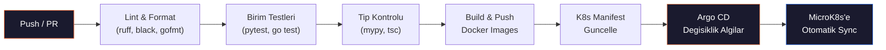
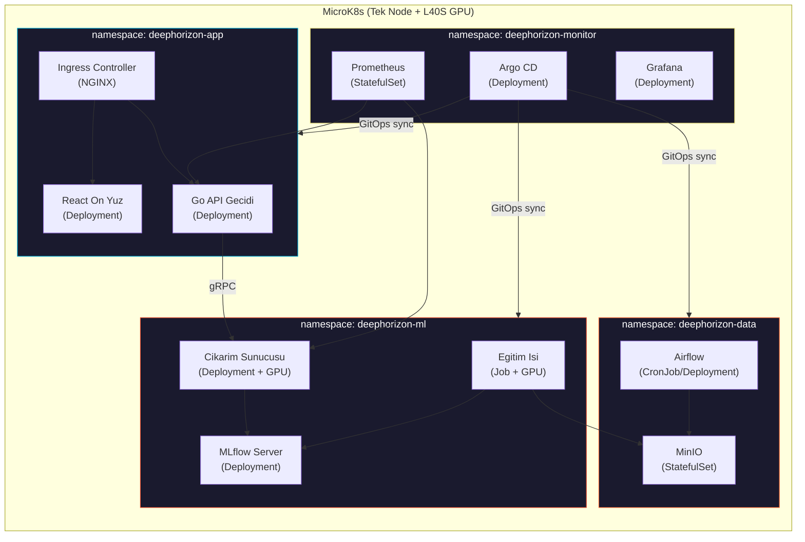

<div align="center">

```
██████╗ ███████╗███████╗██████╗     ██╗  ██╗ ██████╗ ██████╗ ██╗███████╗ ██████╗ ███╗   ██╗
██╔══██╗██╔════╝██╔════╝██╔══██╗    ██║  ██║██╔═══██╗██╔══██╗██║╚══███╔╝██╔═══██╗████╗  ██║
██║  ██║█████╗  █████╗  ██████╔╝    ███████║██║   ██║██████╔╝██║  ███╔╝ ██║   ██║██╔██╗ ██║
██║  ██║██╔══╝  ██╔══╝  ██╔═══╝     ██╔══██║██║   ██║██╔══██╗██║ ███╔╝  ██║   ██║██║╚██╗██║
██████╔╝███████╗███████╗██║         ██║  ██║╚██████╔╝██║  ██║██║███████╗╚██████╔╝██║ ╚████║
╚═════╝ ╚══════╝╚══════╝╚═╝         ╚═╝  ╚═╝ ╚═════╝ ╚═╝  ╚═╝╚═╝╚══════╝ ╚═════╝ ╚═╝  ╚═══╝
```

<br>


<br><br>

**Radyo teleskop dizilerinden elde edilen kara delik goruntuleri icin**
**derin ogrenme tabanli super-cozunurluk ve gurultu giderme hatti**

<br>


<br>

[[English]](README.md) | **[Turkce]**

<br>

[Genel Bakis](#-genel-bakis) · [Mimari](#%EF%B8%8F-mimari) · [ML Hatti](#-ml-hatti) · [Basari Kriterleri](#-basari-kriterleri) · [Teknoloji](#-teknoloji-yigini) · [API Endpoint'leri](#-api-endpointleri) · [Scriptler](#-scriptler) · [CI/CD](#-cicd-hatti) · [K8s Dagitimi](#%EF%B8%8F-kubernetes-dagitimi) · [Secret Yonetimi](#-secret-yonetimi) · [Yol Haritasi](#-yol-haritasi) · [Kaynaklar](#-kaynaklar)

</div>

<br>

---

<br>

## 🔭 Genel Bakis

Radyo teleskop dizileri (EHT vb.) tarafindan yakalanan kara delik goruntuleri ciddi bozulmalardan muzdariptir: seyrek UV-duzlemi orneklemesi, atmosferik faz bozulmasi, termal gurultu ve kirinima bagli cozunurluk siniri. Bu proje, bu bozulmus gozlemlerden fiziksel olarak tutarli, yuksek cozunurluklu goruntuleri yeniden olusturmak icin derin ogrenme tabanli **super-cozunurluk** ve **gurultu giderme** tekniklerini uygulamaktadir.

Model gelistirmenin otesinde, proje uctan uca bir **MLOps altyapisi**, **veri hatti**, **Go API gecidi** ve **React on yuz** insa etmektedir.

<br>

<table>
<tr>
<td align="center"><b>Takim</b><br><code>7 Stajyer</code></td>
<td align="center"><b>Sure</b><br><code>12 Hafta</code></td>
<td align="center"><b>GPU</b><br><code>1x NVIDIA L40S (48 GB)</code></td>
</tr>
</table>

<br>

---

<br>

## 🧪 Problem Tanimi

Kara delik goruntuleri, birden fazla fiziksel ve aletsel faktor nedeniyle dogal olarak **bozuk ve bulanik**tir:

<br>

<details>
<summary><b>Kirinima Siniri</b></summary>
<br>

Acisal cozunurluk `theta ~ lambda/D` ile belirlenir. EHT **1,3 mm** (230 GHz) dalga boyunda gozlem yapar. Dunya boyutunda bir baz cizgisi (~10.700 km) ile bile cozunurluk **~20 mikro-yay saniyesi (uas)** olup, olay ufku boyunca yalnizca birkac piksel elde edilir.

</details>

<details>
<summary><b>Seyrek UV-Duzlemi Orneklemesi</b></summary>
<br>

VLBI'da her teleskop cifti, Fourier uzayinda (UV-duzlemi) tek bir nokta ornekler. Dunya uzerindeki sinirli teleskop sayisi ile UV-duzleminin buyuk bolumu bos kalmaktadir. Van Cittert-Zernike teoremine gore, goruntu bu gorunurluk degerlerinin ters Fourier donusumudur — **eksik frekans bilgisi** yapay ogeler ve belirsizlik olusturur.

</details>

<details>
<summary><b>Nokta Yayilim Fonksiyonu (PSF) / Kirli Huzme</b></summary>
<br>

Interferometrik dizinin PSF'i (kirli huzme), ideal bir Airy diskindan cok uzaktir. Gozlenen goruntu, gercek gokyuzu parlakliginin bu duzensiz PSF ile konvolüsyonudur:

```
I_gozlenen(x,y) = I_gercek(x,y) * PSF(x,y) + gurultu
```

Bu konvolusyon yuksek frekanslı detaylari bastirarak bulaniklasmaxa neden olur.

</details>

<details>
<summary><b>Termal Gurultu ve Sistem Sicakligi (T_sys)</b></summary>
<br>

Her alicinin sistem sicakligi gurultu tabanini belirler:

```
SNR ~ S * sqrt(dv * tau) / T_sys
```

`S`: kaynak akisi · `dv`: bant genisligi · `tau`: entegrasyon suresi

mm dalga boylarinda atmosferik su buhari emilimi T_sys'i yukseltir ve SNR'yi ciddi olarak dusurur.

</details>

<details>
<summary><b>Atmosferik Faz Bozulmasi</b></summary>
<br>

Troposferdeki turbulansli su buhari, mm dalga boylarinda gelen sinyalin fazini rastgele bozar. Bu faz hatalari gorunurluk verilerinde **koherans kaybi**na neden olur ve kalibre edilmediginde sahte yapilar olusturur.

</details>

<details>
<summary><b>Baz Cizgisi Kalibrasyon Hatalari</b></summary>
<br>

Teleskop ciftleri arasindaki kazanc farkliliklari, saat senkronizasyon hatalari ve polarizasyon kacagi, gorunurluk genlikleri ve fazlarinda sistematik hatalara yol acar. Bunlar klasik yeniden olusturma algoritmalarinin (CLEAN, MEM) ciktisini dogrudan etkiler.

</details>

<br>

> **Hedef:** Bulanik, gurultulu bir giris goruntusunden → **fiziksel olarak tutarli, yuksek cozunurluklu** bir kara delik goruntusu uretmek.

<br>

---

<br>

## 🖼️ Ornek Cikti

<div align="center">


<sub><b>Sol:</b> Bozulmus giris (PSF bulaniklik + gurultu + alt ornekleme) · <b>Sag:</b> Temiz hedef (Temel Gerceklik)</sub>

</div>

<br>

---

<br>

## 🏗️ Mimari


<br>

### Veri Akisi

| Adim | Aciklama |
|:---:|---|
| **1** | Ham teleskop verisi (FITS/HDF5) → Airflow DAG'lari ile alma ve isleme |
| **2** | Islenmis veri → DVC versiyonlama → MinIO'ya yazma |
| **3** | PyTorch model egitimi → tum deneyler MLflow'a kaydedilir |
| **4** | En iyi model → MLflow Registry uzerinden terfi ettirilir |
| **5** | Python gRPC servisi → modeli yukle ve cikarim sun |
| **6** | Go API Gecidi → REST API → gRPC uzerinden Python servisine yonlendir |
| **7** | React on yuz → goruntu yukle ve sonuclari Go API uzerinden goruntule |
| **8** | Prometheus → metrikleri topla → Grafana ile gorsellestir |

<br>

---

<br>

## 🧠 ML Hatti

### Model Ilerleme Sureci

Egitim ilerlemeli bir strateji izler — basitten basla, karmasikligi artir:

| Asama | Model | Mimari | Amac |
|:---:|:---|:---|:---|
| **1** | U-Net (temel) | Atlama baglantili kodlayici-kod cozucu | Temel PSNR/SSIM degerlerini belirle |
| **2** | Pix2Pix | Kosullu GAN (U-Net uretici + PatchGAN ayirt edici) | Piksel kaybinin otesinde algisal kalite ogren |
| **3** | ESRGAN | RRDB uretici + goreceli ayirt edici | Yuksek sadakatli super-cozunurluk |
| **4** | Restormer | Transformer tabanli cok baslikli dikkat | SOTA gurultu giderme + SR, uzun menzilli bagimliliklari yakala |

### Kayip Fonksiyonlari

| Kayip | Agirlik | Amac |
|:---|:---:|:---|
| **L1 (piksel)** | 1.0 | Piksel duzeyinde yeniden olusturma dogrulugu |
| **Algisal (VGG)** | 0.1 | Gorsel kalite icin ozellik duzeyinde benzerlik |
| **Cekismel** | 0.01 | Keskin, gercekci ciktilar icin GAN kaybi |
| **Fizik bilgili** | 0.05 | Halka yapisi tutarliligi, aki korunumu |

> **Fizik bilgili kayip (formel tanim).** `I_hat` tahmin edilen goruntu, `I_gt` temel gerceklik olsun. Fizik kaybi uc terimi birlestirir:
>
> ```
> L_phys = lambda_flux * | sum(I_hat) - sum(I_gt) | / sum(I_gt)        # aki korunumu
>        + lambda_ring * | D_ring(I_hat) - D_ring(I_gt) |               # halka capi (uas)
>        + lambda_sym  * | A(I_hat) - A(I_gt) |                          # asimetri orani
> ```
>
> `D_ring(.)` radyal parlaklik profilinin tepe noktasindan halka capini cikartir, `A(.)` halka boyunca parlaklik asimetri oranidir (max/min). Varsayilanlar: `lambda_flux = 0.5`, `lambda_ring = 0.3`, `lambda_sym = 0.2`. `services/ml/losses/physics.py` icinde tanimlanir.

### Egitim Stratejisi

```
Asama 1: Yalnizca L1 kayipli U-Net (isinma, ~50 epoch)               [ZORUNLU]
Asama 2: L1 + cekismel kayipli Pix2Pix (~100 epoch)                   [ZORUNLU]
Asama 3: L1 + algisal + cekismel kayipli ESRGAN (~200 epoch)          [HEDEF]
Asama 4: Tam kayip takimli Restormer (~300 epoch)                      [GENISLEME]

Tum asamalar: karisik hassasiyet (torch.amp), gradyan biriktirme (4 adim)
Hiperparametre arama: Optuna (ZORUNLU asamalar icin 20, HEDEF/GENISLEME icin 50 deneme)
```

> **Kapsam notu.** Asama 1–3 taahhut edilen ciktilar; Asama 4 (Restormer) yalnizca Asama 3'un 8. hafta sonuna kadar SSIM hedefini tutturmasi durumunda devreye girer. Tek bir L40S'te 300-epoch Restormer + 50-deneme Optuna arama tek basina ~2 hafta GPU zamani harcar; bu yuzden Asama 4 sadece 8. haftadaki go/no-go incelemesinden sonra planlanir.

<br>

---

<br>

## 🎯 Basari Kriterleri

### Goruntu Kalitesi Metrikleri

| Metrik | Hedef | Temel (Kirli Goruntu) | Aciklama |
|:---|:---:|:---:|:---|
| **PSNR** | >= 32 dB | ~18 dB | Tepe Sinyal-Gurultu Orani |
| **SSIM** | >= 0.90 | ~0.35 | Yapisal Benzerlik Indeksi |
| **LPIPS** | <= 0.10 | ~0.55 | Ogrenilmis Algisal Goruntu Yama Benzerligi (dusuk = daha iyi) |
| **FID** | <= 30 | ~180 | Frechet Baslangic Mesafesi (dusuk = daha iyi) |

> **Temel olcumu.** "Temel (Kirli Goruntu)" rakamlari sentetik `medium` bozulma kumesinde (PSF 5.0 + %5 gurultu + 2x alt ornekleme, 2.500 cift) bikubik upsample ile no-ML referans olarak olculmustur. Gercek EHT verisinde temel gerceklik olmadigi icin bu metrikler dahil edilmemistir. `scripts/eval_baseline.py` ile reprodukse edilir (3. hafta eklenecek).

### Fizik Tutarliligi

| Metrik | Hedef | Aciklama |
|:---|:---:|:---|
| **Aki Korunumu** | <= %5 hata | Onceki ve sonraki toplam aki korunmalidir |
| **Halka Capi** | <= 2 uas hata | Yeniden olusan halka capi ile temel gerceklik karsilastirmasi |
| **Asimetri Orani** | <= %10 hata | Parlaklik asimetrisi korunmalidir |

### Sistem Performansi

| Metrik | Hedef | Aciklama |
|:---|:---:|:---|
| **Cikarim Gecikmesi** | <= 500ms | Tek 512x512 goruntu (GPU) |
| **API Yanit Suresi** | <= 1s | Yukleme ve indirme dahil uctan uca |
| **Is Hacmi** | >= 10 istek/s | Cikarim sunucusunda surekli yuk |
| **Model Boyutu** | <= 200 MB | ONNX ile optimize edilmis model |
| **GPU Bellek** | <= 8 GB | Cikarim zamani VRAM kullanimi |

### MLOps Olgunlugu

| Kriter | Gereksinim |
|:---|:---|
| **Deney Takibi** | Tum calistirmalar hiperparametre, metrik ve artifaktlarla MLflow'a kaydedilir |
| **Model Kayit Defteri** | Dogrulama kapisi ile Staging → Production terfisi |
| **Veri Versiyonlama** | Tum veri setleri DVC ile versiyonlanir |
| **CI/CD** | Her PR'de otomatik lint, test, build, deploy |
| **Izleme** | Prometheus metrikleri + Grafana panolari + Evidently kayma tespiti |
| **Test Kapsami** | Veri hatti, ML degerlendirmesi ve API genelinde >= %80 |

<br>

---

<br>

## ⚡ Teknoloji Yigini

### Veri Muhendisligi

| | Teknoloji | Aciklama |
|:---|:---|:---|
| 🔢 | **NumPy, SciPy, OpenCV, scikit-image** | Goruntu isleme, sinyal isleme |
| 🔭 | **astropy, eht-imaging** | FITS dosya I/O, VLBI veri isleme, simulasyon |
| 📌 | **DVC** | Git benzeri veri versiyonlama |
| ✅ | **Great Expectations** | Otomatik veri dogrulama ve profilleme |
| 💾 | **MinIO** | S3 uyumlu yerel nesne depolama |

### Makine Ogrenimi

| | Teknoloji | Aciklama |
|:---|:---|:---|
| 🐍 | **Python 3.13+** | Birincil gelistirme dili |
| 🔥 | **PyTorch 2.6+** | Model gelistirme ve egitim |
| 📊 | **MLflow** | Deney takibi, model kayit defteri, artifakt deposu |
| 🎯 | **Optuna** | Otomatik hiperparametre optimizasyonu |
| 📡 | **gRPC + protobuf** | Model sunum protokolu |

### On Yuz

| | Teknoloji | Aciklama |
|:---|:---|:---|
| 🖼️ | **React 19+ (TypeScript)** | SPA on yuz uygulamasi |
| 🎨 | **Tailwind CSS** | Yardimci sinif oncelikli CSS cercevesi |
| 🔄 | **Zustand / React Query** | Durum yonetimi ve sunucu onbellegi |
| 🌐 | **Three.js / D3.js** | Etkilesimli kara delik gorsellestirmesi |

### API Gecidi

| | Teknoloji | Aciklama |
|:---|:---|:---|
| 🏎️ | **Go 1.24+** | API gecidi dili |
| 🛣️ | **Gin / Echo** | Yuksek performansli HTTP cercevesi |
| 📡 | **google.golang.org/grpc** | Python cikarim servisine baglanti |
| ✅ | **go-playground/validator** | Istek dogrulama |
| 📖 | **Swagger / OpenAPI 3.0** | Otomatik olusturulan API dokumantasyonu |

### MLOps ve Altyapi

| | Teknoloji | Aciklama |
|:---|:---|:---|
| 🎼 | **Apache Airflow** | DAG tabanli hat orkestrasyon |
| 🐳 | **Docker, Docker Compose** | Servis izolasyonu, ortam tutarliligi |
| ☸️ | **MicroK8s** | Tek node / kucuk cluster GPU dagitimi icin hafif Kubernetes |
| 🔁 | **GitHub Actions** | CI: lint, test, build, image push |
| 🚀 | **Argo CD** | CD: GitOps tabanli MicroK8s'e surekli dagitim |
| 📉 | **Prometheus + Grafana** | Metrik toplama ve gorsellestirme |
| 🔍 | **Evidently AI** | Veri kaymasi ve model performansi izleme |

<br>

---

<br>

## 🔌 API Uç Noktalari

| Metot | Uç Nokta | Aciklama |
|:---|:---|:---|
| `GET` | `/health` | Saglik kontrolu, servis durumunu dondurur |
| `GET` | `/models` | Mevcut modelleri meta verileriyle listeler |
| `GET` | `/models/:id` | Belirli model detaylarini getirir (mimari, metrikler) |
| `POST` | `/enhance` | Goruntu yukle, super-cozunurluk sonucunu dondur |
| `POST` | `/enhance/batch` | Toplu iyilestirme (en fazla 10 goruntu) |
| `GET` | `/enhance/:job_id` | Asenkron is durumunu sorgula |
| `GET` | `/metrics` | Prometheus metrik uç noktasi |

### `POST /enhance` — Istek

```json
{
  "image": "<base64-kodlanmis FITS/PNG>",
  "model": "restormer-v1",
  "output_format": "png",
  "scale_factor": 4
}
```

### `POST /enhance` — Yanit

```json
{
  "job_id": "abc-123",
  "status": "completed",
  "result": {
    "image": "<base64-kodlanmis sonuc>",
    "metrics": {
      "psnr": 33.2,
      "ssim": 0.92,
      "inference_time_ms": 312
    },
    "model": "restormer-v1"
  }
}
```

<br>

---

<br>

## 👥 Takim Yapisi

7 stajyer, **3 squad** halinde organize edilir: Data, ML, Platform. Her stajyer bir birincil alana sahiptir ancak capraz inceleme icin en az bir diger stajyer ile eslesir.

<br>

<table>
<tr>
<td align="center" width="22%">

### Stajyer 1
**Veri Muhendisi**
*Squad: Data*

</td>
<td>

Veri hattinin sahibidir. FITS/HDF5 ayristirma, EHT veri alma, DVC versiyonlama ve Great Expectations dogrulama paketinden sorumludur.

<details>
<summary>Arastirma Konulari</summary>

- FITS dosya formati ve `astropy` I/O
- EHT UVFITS gorunurluk verisi yapisi ve kalibrasyon
- Airflow DAG yazimi ve zamanlama
- DVC uzak depolama yapilandirmasi (MinIO arka ucu)
- Great Expectations profilleme ve beklenti paketleri
- Veri katalogu ve soy zinciri takibi

</details>

**Eslesir:** Stajyer 2 (bozulma hatti kontrati)

</td>
</tr>

<tr>
<td align="center">

### Stajyer 2
**Simulasyon ve Sentetik Veri**
*Squad: Data*

</td>
<td>

Sentetik veri ureticisinin sahibidir. `eht-imaging` GRMHD simulasyonlari, PSF modelleme, bozulma hatti ve 10K egitim cifti ureticisinden sorumludur.

<details>
<summary>Arastirma Konulari</summary>

- `eht-imaging` kutuphanesi, GRMHD kaynak modelleri
- VLBI dizileri icin fiziksel PSF / kirli huzme modelleme
- Gercekci gurultu enjeksiyonu (termal + atmosferik faz)
- Crescent / ring / double-ring kaynak modelleme
- Radyo astronomi icin veri artirma stratejileri
- Bozulma seviyeleri icin sinif dengesi ve katmanli ornekleme

</details>

**Eslesir:** Stajyer 1 (veri semasi), Stajyer 3 (egitim verisi sartnamesi)

</td>
</tr>

<tr>
<td align="center">

### Stajyer 3
**ML Muhendisi — Temel ve GAN**
*Squad: ML*

</td>
<td>

Asama 1–2 modellerinin sahibidir. U-Net temel, Pix2Pix kosullu GAN, egitim dongusu iskeleti ve paylasilan `services/ml/` egitim paketinden sorumludur.

<details>
<summary>Arastirma Konulari</summary>

- Goruntu-goruntu cevirisi icin U-Net mimarisi
- Kosullu GAN (Pix2Pix) egitim dinamikleri
- Mod cokusu, gradyan cezasi, spektral normalizasyon
- Karisik hassasiyet egitimi (`torch.amp`) ve gradyan biriktirme
- Egitim dongusu soyutlamalari ve yapilandirma yonetimi (Hydra)
- MLflow deney takibi entegrasyonu

</details>

**Eslesir:** Stajyer 4 (kayip + degerlendirme kontrati)

</td>
</tr>

<tr>
<td align="center">

### Stajyer 4
**ML Muhendisi — SOTA ve Fizik Kaybi**
*Squad: ML*

</td>
<td>

Asama 3–4 modellerinin ve fizik bilgili kaybin sahibidir. ESRGAN, Restormer (genisleme), fizik bilgili kayip modulu ve Optuna hiperparametre aramasindan sorumludur.

<details>
<summary>Arastirma Konulari</summary>

- ESRGAN: RRDB bloklari, goreceli ayirt edici
- Restormer transformer mimarisi, MDTA / GDFN bloklari
- Astrofizik icin fizik bilgili sinir aglari
- Ozel kayip tasarimi (aki korunumu, halka geometrisi)
- Optuna arama stratejileri (TPE, cok amacli)
- VGG algisal kayip yapilandirmasi

</details>

**Eslesir:** Stajyer 3 (ortak egitim kodu), Stajyer 5 (degerlendirme devri)

</td>
</tr>

<tr>
<td align="center">

### Stajyer 5
**ML Muhendisi — Degerlendirme ve Cikarim**
*Squad: ML*

</td>
<td>

Model kalitesi ve cikarim sunumunun sahibidir. Metrik paketi (PSNR/SSIM/LPIPS/FID + fizik), ONNX/TensorRT optimizasyonu ve Python gRPC cikarim servisinden sorumludur.

<details>
<summary>Arastirma Konulari</summary>

- Goruntu kalitesi metrikleri: `PSNR`, `SSIM`, `LPIPS`, `FID` matematigi
- Fizik tutarlilik metrikleri: halka capi cikartma, aki integralleri
- ONNX disari aktarma, ONNX Runtime, TensorRT optimizasyonu
- gRPC + protobuf Python servis gelistirme (`grpcio`)
- Model profilleme (`torch.profiler`, Nsight)
- MLflow model kayit defteri ve staging→production terfi kapisi

</details>

**Eslesir:** Stajyer 4 (model devri), Stajyer 6 (proto kontrati)

</td>
</tr>

<tr>
<td align="center">

### Stajyer 6
**Backend ve API Gecidi**
*Squad: Platform*

</td>
<td>

Go API gecidi ve paylasilan protobuf kontratinin sahibidir. REST endpoint'leri, cikarim servisine gRPC istemcisi, asenkron is yonetimi ve OpenAPI dokumantasyonundan sorumludur.

<details>
<summary>Arastirma Konulari</summary>

- Go REST API gelistirme (Gin / Echo cercevesi)
- Protobuf sema tasarimi (`buf` araclari, kirici degisiklik tespiti)
- Go gRPC istemcisi, baglanti havuzlama, geri cekilmeli yeniden deneme
- Asenkron is kuyrugu desenleri (Redis / NATS)
- Dosya yukleme streaming (multipart form, S3 multipart upload)
- Go'dan OpenAPI 3.0 uretimi (`swaggo/swag`)
- Istek dogrulama (`go-playground/validator`)

</details>

**Eslesir:** Stajyer 5 (proto sema sahibi), Stajyer 7 (API ↔ on yuz kontrati)

</td>
</tr>

<tr>
<td align="center">

### Stajyer 7
**On Yuz ve Gozlemlenebilirlik**
*Squad: Platform*

</td>
<td>

Kullaniciya yonelik katman ve izlemenin sahibidir. React+TypeScript SPA, goruntu yukleme/gorsellestirme, Prometheus/Grafana panolari ve Evidently kayma raporlarindan sorumludur.

<details>
<summary>Arastirma Konulari</summary>

- React 19 + TypeScript SPA mimarisi
- Durum ve sunucu onbellegi icin Zustand / React Query
- Etkilesimli goruntu gorsellestirme icin Three.js / D3.js
- Dosya yukleme UX (ilerleme, parcalama, iptal)
- Prometheus istemci kutuphanesi, ozel metrik tanimi
- Grafana pano saglama (JSON modeli, kod-olarak)
- Evidently AI veri kaymasi ve model performansi raporlamasi

</details>

**Eslesir:** Stajyer 6 (API kontrati)

</td>
</tr>

<tr>
<td align="center">

### Yuzen Rol
**MLOps / Platform**
*Squad lider'leri arasinda paylasilir*

</td>
<td>

CI/CD, MicroK8s kurulumu, Argo CD bootstrap, Sealed Secrets ve MLflow altyapisi **Stajyer 1, 5 ve 6** tarafindan mentor destegi ile **ortak sahiplenilir**. Tek bir stajyer altyapiya adanmaz — bunun yerine her squad lideri kendi servislerinin altyapisini teslim eder (Data → Airflow/MinIO, ML → MLflow/Cikarim, Platform → Ingress/Gateway).

Bu, tek bir "altyapi stajyeri" bus-factor riskini ortadan kaldirir ve her squad'i kendi dagitimi sahiplenmeye zorlar.

</td>
</tr>
</table>

<br>

---

<br>

## 📁 Depo Yapisi

> **Durum gostergeleri:** ✅ mevcut · 🚧 1–2. haftada iskeletlenecek · ⏳ planli (sonraki haftalar).
> Asagidaki yapi **hedef duzendir**; suanda repo'da yalnizca ✅ isaretli olanlar var.

```
deephorizon/
│
├── README.md                              # Ingilizce dokumantasyon ✅
├── README_TR.md                           # Turkce dokumantasyon ✅
├── .gitignore                             # ✅
│
├── requirements/                          # Bolunmus Python bagimliliklari (astropy ↔ torch catismasini onler) 🚧
│   ├── base.txt                           #   numpy, scipy, opencv, scikit-image
│   ├── data.txt                           #   astropy, eht-imaging, dvc, great-expectations
│   ├── ml.txt                             #   torch, torchvision, mlflow, optuna, lpips
│   └── serving.txt                        #   grpcio, onnxruntime, prometheus-client
│
├── pyproject.toml                         # uv / poetry config, ruff, mypy 🚧
├── go.mod / go.sum                        # Go modulu (services/api) ⏳
│
├── assets/
│   └── sample_degradation.png             # ✅
│
├── proto/                                 # Go ile Python arasinda PAYLASILAN kontrat 🚧
│   ├── buf.yaml                           #   buf lint + kirici degisiklik tespiti
│   ├── buf.gen.yaml                       #   Go + Python stub uretir
│   └── deephorizon/v1/
│       ├── inference.proto                #   Enhance(), Health(), ListModels()
│       └── common.proto                   #   ImagePayload, Metrics, JobStatus
│
├── services/                              # Tum dagitilabilir servisler burada ⏳
│   ├── ml/                                # Stajyer 3, 4, 5 sahibi
│   │   ├── models/                        #   unet/, pix2pix/, esrgan/, restormer/
│   │   ├── losses/                        #   physics.py, perceptual.py, gan.py
│   │   ├── data/                          #   datasets, dataloaders, transforms
│   │   ├── training/                      #   train_loop.py, optuna_runner.py
│   │   ├── evaluation/                    #   metrics.py, benchmark.py
│   │   └── inference_server/              #   gRPC server uygulamasi
│   ├── api/                               # Stajyer 6 sahibi (Go gateway)
│   │   ├── cmd/server/                    #   main.go
│   │   ├── internal/handlers/             #   /enhance, /models, /health
│   │   ├── internal/grpc_client/          #   cikarim servisi istemcisi
│   │   └── api/openapi.yaml               #   uretilmis OpenAPI 3.0
│   └── frontend/                          # Stajyer 7 sahibi
│       ├── src/                           #   React 19 + TypeScript
│       ├── public/
│       └── package.json
│
├── pipelines/                             # Airflow DAG'lari ⏳
│   ├── dags/
│   │   ├── eht_ingest.py
│   │   ├── synthetic_generation.py
│   │   └── training_data_build.py
│   └── plugins/
│
├── infra/                                 # Tum dagitim artifaktlari ⏳
│   ├── k8s/
│   │   ├── app-of-apps.yaml               #   Kok Argo CD Application
│   │   ├── data/                          #   Airflow, MinIO manifest'leri (kustomize)
│   │   ├── ml/                            #   MLflow, egitim Job, cikarim Deployment
│   │   ├── app/                           #   Go API, React on yuz, Ingress
│   │   ├── monitor/                       #   Prometheus, Grafana, Argo CD
│   │   └── secrets/                       #   SealedSecret manifest'leri (commit guvenli)
│   ├── docker/                            #   Dockerfile'lar (cok asamali)
│   │   ├── ml.Dockerfile
│   │   ├── api.Dockerfile
│   │   └── frontend.Dockerfile
│   └── docker-compose.dev.yaml            #   Yerel dev stack (MinIO, MLflow, Postgres)
│
├── .github/workflows/                     # CI ⏳
│   ├── ci.yml                             #   lint, test, tip kontrolu
│   ├── build.yml                          #   docker build + push
│   └── train.yml                          #   manuel/zamanlanmis GPU egitimi
│
├── docs/                                  # ADR'lar ve modul dokumantasyonu ⏳
│   ├── adr/                               #   mimari karar kayitlari
│   └── runbooks/                          #   on-call kilavuzlari
│
└── scripts/                               # Bagimsiz scriptler (ince tutulur) ✅
    ├── download_eht_data.py               # EHT UVFITS indirici (7 veri seti, 88 dosya)
    ├── generate_synthetic_data.py         # eht-imaging sentetik uretici (128x128)
    ├── generate_training_data.py          # Egitim verisi ureticisi (512x512, 10K cift)
    ├── visualize_samples.py               # Veri gorsellestirme (PNG cikti)
    └── eval_baseline.py                   # No-ML temel metrikleri (bikubik) ⏳
```

<br>

---

<br>

## 🚀 Kurulum

### On Kosullar

| Arac | Versiyon |
|:---|:---|
| Python | `3.13+` |
| Git | En guncel |

### Hizli Baslangic

```bash
# Depoyu klonla
git clone https://github.com/Octapull/deephorizon.git
cd deephorizon

# Sanal ortam olustur
python -m venv .venv
source .venv/bin/activate   # Windows: .venv\Scripts\activate

# Bagimliliklari yukle (data + ml; ihtiyacin olan altkumeyi sec)
pip install -r requirements/base.txt -r requirements/data.txt -r requirements/ml.txt

# Veya uv ile (onerilen)
uv sync --extra data --extra ml
```

> **Neden bolundu?** `eht-imaging` eski `numpy`/`scipy` surumlerini pinler ve guncel `torch` wheels'leri ile catisir. Ayni ortamda kurmak kirilgan. `data` ve `ml` extras production'da **ayri virtualenv**'lerde yasayacak sekilde tasarlandi (veri hatti pod'lari vs egitim pod'lari).

<br>

---

<br>

## 🔧 Scriptler

### `download_eht_data.py` — EHT Gozlem Indirici

EHT isbirligi tarafindan kamuya acilan tum kalibre edilmis UVFITS gorunurluk verilerini indirir.

| Veri Seti | Kaynak | Dosya |
|:---|:---|:---:|
| `m87_2017` | M87* — ilk kara delik goruntusu | 8 |
| `3c279_2017` | 3C279 kuazar | 8 |
| `sgra_2017` | Sgr A* — Samanyolu merkezi | 20 |
| `m87_2018` | M87* — ikinci yil gozlemi | 24 |
| `cena_2017` | Centaurus A | 4 |
| `m87_2017_pol` | M87* polarize veri | 16 |
| `sgra_2017_pol` | Sgr A* polarize veri | 8 |

```bash
# Tum veri setlerini indir (88 UVFITS dosya)
python scripts/download_eht_data.py

# Yalnizca belirli veri setlerini indir
python scripts/download_eht_data.py --datasets m87_2017 sgra_2017

# Cikti: data/raw/eht/
```

<br>

### `generate_synthetic_data.py` — Sentetik Veri Ureticisi (eht-imaging)

`eht-imaging` kutuphanesini kullanarak fiziksel olarak gercekci kara delik modelleri uretir. Hizli prototipleme icin 128x128 cozunurluk.

- **Crescent** modeli — M87* benzeri asimetrik parlaklik
- **Ring** modeli — simetrik halka yapisi
- 4 bozulma seviyesi: `light`, `medium`, `heavy`, `extreme`

```bash
python scripts/generate_synthetic_data.py

# Cikti: data/raw/simulated/
#   clean/     → temiz goruntuler (.npy)
#   degraded/  → bozulmus goruntuler (.npy)
#   pairs/     → gorsel karsilastirmalar (.png)
```

<br>

### `generate_training_data.py` — Egitim Verisi Ureticisi (512x512)

3 model tipi ile 512x512 cozunurlukta model egitimi icin **10.000 temiz/bozulmus cift** uretir:

| Model | Oran | Aciklama |
|:---|:---:|:---|
| Crescent | %60 | Asimetrik parlaklik halkasi (M87* benzeri) |
| Ring | %25 | Simetrik halka |
| Double Ring | %15 | Ic + dis halka (jet yapisi simulasyonu) |

Bozulma seviyeleri (her biri x2500 cift):

| Seviye | PSF Bulaniklik | Gurultu | Alt Ornekleme |
|:---|:---:|:---:|:---:|
| `light` | 3.0 | %2 | 1x |
| `medium` | 5.0 | %5 | 2x |
| `heavy` | 8.0 | %10 | 2x |
| `extreme` | 12.0 | %15 | 4x |

```bash
python scripts/generate_training_data.py

# Cikti: data/training/
#   clean/     → 10.000 temiz goruntu (.npy, float32)
#   degraded/  → 10.000 bozulmus goruntu (.npy, float32)
# Tahmini boyut: ~2,5 GB
```

<br>

### `visualize_samples.py` — Veri Gorsellestirme

EHT gercek gozlemlerini kirli goruntu olarak render eder ve sentetik ciftler icin yuksek kaliteli PNG karsilastirmalari uretir.

```bash
python scripts/visualize_samples.py

# Cikti: data/visualizations/
#   eht/        → kirli goruntu PNG'leri
#   synthetic/  → karsilastirma ve izgara goruntuleri
```

<br>

---

<br>

## 🔁 CI/CD Hatti

CI **GitHub Actions** uzerinde, CD **Argo CD** (GitOps) uzerinde calisir. Argo CD, `infra/k8s/` dizinini izler ve degisiklikleri MicroK8s'e otomatik senkronize eder.



### CI — GitHub Actions

| Is Akisi | Tetikleyici | Eylemler |
|:---|:---|:---|
| `ci.yml` | Her push ve PR | Lint, tip kontrolu, birim testleri, kapsam raporu |
| `build.yml` | `main`'e merge | Docker goruntuleri olustur, container registry'ye gonder |
| `train.yml` | Manuel / zamanlanmis | GPU dugumunde egitim isini baslat |

### CD — Argo CD (GitOps)

| Uygulama | Kaynak Yolu | Namespace | Sync Politikasi |
|:---|:---|:---|:---|
| `deephorizon-data` | `infra/k8s/data/` | `deephorizon-data` | Otomatik sync |
| `deephorizon-ml` | `infra/k8s/ml/` | `deephorizon-ml` | Otomatik sync |
| `deephorizon-app` | `infra/k8s/app/` | `deephorizon-app` | Otomatik sync |
| `deephorizon-monitor` | `infra/k8s/monitor/` | `deephorizon-monitor` | Otomatik sync |

Argo CD bu repo'nun `infra/k8s/` dizinini izler ve `main`'e her push'ta otomatik sync yapar. Dagitim akisinda manuel `kubectl apply` yoktur — Git'te bir manifest degisirse, cluster'da degisir.

<br>

---

<br>

## ☸️ Kubernetes Dagitimi

Tum servisler **MicroK8s** uzerinde calisir — GPU is yukleri icin ideal, hafif, tek node Kubernetes dagitimi. Dagitimlar **Argo CD** ile GitOps uzerinden yonetilir.

> **Kurulum stajyer odevidir.** Bu README **hedef mimariyi** ve **kullanilacak teknolojileri** belgeler, adim adim kurulum talimatlarini degil. Her squad lideri sahibi oldugu altyapi bilesenlerini (MicroK8s, GPU operator, Argo CD bootstrap, Sealed Secrets controller, ingress) arastirip ayaga kaldirir. Her aracin resmi dokumantasyonu [Kaynaklar](#-referanslar) bolumunde linklidir — bunlari okumak ogrenme ciktisinin bir parcasidir.

### Kume Mimarisi



### Namespace'ler

| Namespace | Servisler | Aciklama |
|:---|:---|:---|
| `deephorizon-data` | Airflow, MinIO | Veri hatti ve nesne depolama |
| `deephorizon-ml` | Egitim Isleri, MLflow, Cikarim | Model egitimi, kayit defteri, sunum |
| `deephorizon-app` | Go API, React On Yuz, Ingress | Kullaniciya yonelik servisler |
| `deephorizon-monitor` | Prometheus, Grafana, Argo CD | Izleme ve GitOps dagitimi |

### GPU Is Yuku Yapilandirmasi

```yaml
# Egitim Isi — NVIDIA L40S (48 GB)
resources:
  requests:
    nvidia.com/gpu: 1
    memory: "32Gi"
    cpu: "8"
  limits:
    nvidia.com/gpu: 1
    memory: "48Gi"
    cpu: "16"

# Cikarim Sunucusu — daha dusuk kaynaklar
resources:
  requests:
    nvidia.com/gpu: 1
    memory: "8Gi"
    cpu: "4"
  limits:
    nvidia.com/gpu: 1
    memory: "16Gi"
    cpu: "8"
```

> **GPU paylasim politikasi.** Tek L40S'imiz var ama hem egitim `Job`'i hem `inference` `Deployment`'i `nvidia.com/gpu: 1` istiyor. Birinin digerini ackliktan oldurmemesi icin:
>
> 1. **Varsayilan mod** — cikarim Deployment `replicas: 1` ile calisir. Egitim Job'lari `nodeSelector: { workload: training }` ve `PriorityClass: low-priority` kullanir; cikarim pod'u egitim baslamadan once 0'a olceklenir (bu `train.yml` workflow'unda ele alinir).
> 2. **Eszamanli mod (opsiyonel, 11. hafta+)** — L40S'te NVIDIA MIG (Multi-Instance GPU) etkinlestirip karti `1g.12gb` cikarim + `3g.36gb` egitim olarak bolmek. `gpu-operator` Helm chart'i, `migStrategy: mixed`.
>
> 12 haftalik pencere icin **varsayilan modu** sec — MIG'in cikarim QPS'i dusukken net faydasi olmadan kurulum maliyeti var.

### Argo CD Stratejisi

**App-of-apps** desenini kullaniyoruz: tek bir kok `Application` (`infra/k8s/app-of-apps.yaml`) tum dort squad-seviyesi Application'i izler. Yeni servis eklemek = tek bir manifest eklemek, `argocd app create` calistirmak degil. `main`'e her push'ta otomatik sync aktiftir.

Takimin burada kullanacagi teknolojiler: **Argo CD CLI**, ortam-basina overlay icin **`kustomize`**, ucuncu parti chart'lar icin **Helm** (Sealed Secrets, gpu-operator).

<br>

---

<br>

## 🔐 Gizli Anahtar Yonetimi

Tum hassas veriler (API anahtarlari, kimlik bilgileri, baglanti dizeleri) **Kubernetes Secrets** ve **Sealed Secrets** ile yonetilir. Kaynak kodunda veya ortam dosyalarinda hicbir gizli anahtar bulunmaz.

### Gizli Anahtar Akisi

```
Gelistirici → kubeseal sifrele → SealedSecret (Git'e commit edilir)
                                     ↓
                             Sealed Secrets Controller
                                     ↓
                             Kubernetes Secret (kume-ici)
                                     ↓
                             Pod ortam degiskenleri / volume mount'lar
```

### Gizli Anahtar Envanteri

| Gizli Anahtar | Namespace | Kullanim |
|:---|:---|:---|
| `minio-credentials` | `deephorizon-data` | MinIO erisim/gizli anahtar |
| `mlflow-db-credentials` | `deephorizon-ml` | MLflow PostgreSQL baglantisi |
| `mlflow-s3-credentials` | `deephorizon-ml` | MLflow artifakt deposu (MinIO) |
| `inference-api-key` | `deephorizon-ml` | gRPC cikarim yetkilendirme tokeni |
| `grafana-admin` | `deephorizon-monitor` | Grafana yonetici sifresi |
| `github-registry` | `deephorizon-app` | Container goruntu cekme sifresi |

### Araclar

Takim su araclarla calisacak:

- **Sealed Secrets** (Bitnami) — controller Helm ile kurulur; manifest'leri commit etmeden once `kubeseal` CLI ile yerel olarak sifrelenir.
- **`kubectl create secret --dry-run=client`** ile duz Secret taslagi olusturulur ve `kubeseal`'a pipe edilir.
- Controller kurulumu icin **Helm**.

Net install / encrypt komutlari bilincli olarak verilmedi — Sealed Secrets dokumantasyonu icin [Referanslar](#-referanslar) bolumune bak.

### Kurallar

- `.env` dosyalari `.gitignore` icindedir ve **asla commit edilmez**
- Gizli anahtar rotasyonu her 90 gunde
- Production gizli anahtarlara yalnizca kume yoneticisi erisebilir
- Tum gizli anahtar erisimi denetim gunlugune kaydedilir
- Gelistirme ortami yerel gizli anahtarlar icin `kubectl create secret` kullanir

<br>

---

<br>

## 📅 Yol Haritasi

| Hafta | Odak | Ciktilar | Squad Lideri |
|:---:|:---|:---|:---|
| **1** | Bootstrap | Repo iskeleti (`services/`, `proto/`, `infra/`), `pyproject.toml`, CI iskeleti, `proto/` v1 dondurulur | Tumu |
| **2** | Veri + Proto kontrati | EHT indirme, sentetik uretici (128x128), egitim ciftleri (512x512), `inference.proto` incelenip merge edilir | Data, Platform |
| **3** | Temel + Degerlendirme | U-Net egitimi, MLflow ayakta, metrik paketi (PSNR/SSIM/LPIPS/FID), `eval_baseline.py` | ML |
| **4** | GAN Asamasi | Pix2Pix egitimi, fizik kaybi v1, Optuna runner | ML |
| **5** | ESRGAN | ESRGAN egitimi (Asama 3 [HEDEF]), algisal kayip ayarlama | ML |
| **6** | Cikarim + Go API iskeleti | ONNX export, gRPC cikarim sunucusu, Go gateway `/health` + `/enhance` (mock) | ML, Platform |
| **7** | Uctan uca baglanti | Go → Python gercek gRPC cagrisi, asenkron is akisi, OpenAPI spec | Platform |
| **8** | **Go/no-go karari** + On Yuz | Asama 3 metrik incelemesi → Restormer karari (Asama 4 [GENISLEME]). React SPA MVP | Tumu |
| **9** | Restormer (eger go) / Cilalama (eger no-go) | Restormer egitimi VEYA ESRGAN rafinasyonu + on yuz feature-complete | ML, Platform |
| **10** | K8s + Argo CD | MicroK8s dagitim, Sealed Secrets, app-of-apps bootstrap, egitim Job manifest | Tum squad'lar |
| **11** | Gozlemlenebilirlik + Saglamlastirma | Prometheus metrikleri, Grafana panolari, Evidently kayma raporu, yuk testi | Platform |
| **12** | Demo | Uctan uca test, runbook'lar, ADR'lar, final sunum | Tumu |

> **8. hafta go/no-go karari.** Asama 3 (ESRGAN) 8. haftanin Cuma gunune kadar `medium` kumede **SSIM ≥ 0.85** tutturursa, takim 9–10. haftalarda Asama 4 (Restormer)'a girer. Aksi takdirde 9–10. haftalar ESRGAN ve sunum yiginini saglamlastirmak icin kullanilir. Bu karar ML squad'i ve proje mentoru tarafindan birlikte verilir.

<br>

---

<br>

## 📐 Gelistirme Kilavuzu

### Git Is Akisi

| Kural | Detay |
|:---|:---|
| **Ana dal** | `main` — korunmali, yalnizca PR ile merge |
| **Dal adlandirma** | `feature/<stajyer-adi>/<kisa-aciklama>` |
| **Inceleme** | Her PR en az 1 inceleme gerektirir |
| **PR aciklamasi** | Ne yapildi + nasil test edildi |

### Commit Konvansiyonu

```
<tip>(<kapsam>): <aciklama>
```

| Tip | Kapsam |
|:---|:---|
| `feat` · `fix` · `refactor` · `docs` · `test` · `ci` · `chore` | `data` · `ml` · `api` · `frontend` · `infra` · `docs` |

### Kod Inceleme

- Kendi PR'inizi merge edemezsiniz
- Calisiyor mu? Testler var mi? Dokumantasyon guncellendi mi?
- Incelemeler 24 saat icinde tamamlanmalidir

### Dokumantasyon

- Her modülun kendi `README.md`'si olmalidir
- Public fonksiyonlar docstring icermelidir
- API uç noktalari Swagger/OpenAPI ile dokumante edilmelidir
- Mimari kararlar `docs/` icinde ADR olarak kaydedilir

<br>

---

<br>

## 📚 Referanslar

### EHT Makaleleri
- [Ilk M87* Sonuclari (Makale I-VI)](https://iopscience.iop.org/journal/2041-8205/page/Focus_on_EHT) — The Astrophysical Journal Letters, 2019
- [Ilk Sgr A* Sonuclari (Makale I-VIII)](https://iopscience.iop.org/journal/2041-8205/page/Focus_on_First_Sgr_A_Results) — The Astrophysical Journal Letters, 2022

### Super-Cozunurluk Modelleri
- [ESRGAN: Enhanced Super-Resolution GANs](https://arxiv.org/abs/1809.00219) — Wang et al., 2018
- [Real-ESRGAN](https://arxiv.org/abs/2107.10833) — Wang et al., 2021
- [Restormer: Efficient Transformer for High-Resolution Image Restoration](https://arxiv.org/abs/2111.09881) — Zamir et al., 2022

### Kara Delik ML
- [Deep Horizon: ML from GRMHD simulations](https://www.aanda.org/articles/aa/full_html/2020/04/aa37014-19/aa37014-19.html) — A&A, 2020
- [eht-imaging: Interferometric Imaging Library](https://github.com/achael/eht-imaging) — Chael et al.

### Altyapi ve MLOps Dokumantasyonu (stajyer self-study)
- [MicroK8s docs](https://microk8s.io/docs) — kurulum, addon'lar, GPU etkinlestirme
- [NVIDIA GPU Operator](https://docs.nvidia.com/datacenter/cloud-native/gpu-operator/latest/index.html) — device plugin, MIG yapilandirma
- [Argo CD docs](https://argo-cd.readthedocs.io/) — bootstrap, app-of-apps deseni
- [Sealed Secrets](https://github.com/bitnami-labs/sealed-secrets) — controller kurulumu ve `kubeseal` kullanimi
- [Kustomize](https://kustomize.io/) — overlay tabanli manifest yonetimi
- [MLflow docs](https://mlflow.org/docs/latest/index.html) — tracking server, model registry
- [Apache Airflow](https://airflow.apache.org/docs/) — DAG yazimi, provider'lar
- [DVC docs](https://dvc.org/doc) — S3-uyumlu remote'lar ile veri versiyonlama
- [buf docs](https://buf.build/docs) — protobuf lint ve kirici degisiklik tespiti

<br>

---

<br>

<div align="center">

**Octapull Stajyerleri tarafindan 🔭 ile insa edildi — 7 yapici, 3 squad, 1 kara delik**

<sub>Kara deliklerin sirlarini acmak icin derin ogrenme</sub>

<br>


</div>
